# Palo Alto PA-VM Firewall

Palo Alto PA-VM Firewall Orchestrator for Add, Remove and Inventory.

#### Integration status: Production - Ready for use in production environments.

## About the Keyfactor Universal Orchestrator Capability

This repository contains a Universal Orchestrator Capability which is a plugin to the Keyfactor Universal Orchestrator. Within the Keyfactor Platform, Orchestrators are used to manage “certificate stores” &mdash; collections of certificates and roots of trust that are found within and used by various applications.

The Universal Orchestrator is part of the Keyfactor software distribution and is available via the Keyfactor customer portal. For general instructions on installing Capabilities, see the “Keyfactor Command Orchestrator Installation and Configuration Guide” section of the Keyfactor documentation. For configuration details of this specific Capability, see below in this readme.

The Universal Orchestrator is the successor to the Windows Orchestrator. This Capability plugin only works with the Universal Orchestrator and does not work with the Windows Orchestrator.

## Support for Palo Alto PA-VM Firewall

Palo Alto PA-VM Firewall is supported by Keyfactor for Keyfactor customers. If you have a support issue, please open a support ticket with your Keyfactor representative.

###### To report a problem or suggest a new feature, use the **[Issues](../../issues)** tab. If you want to contribute actual bug fixes or proposed enhancements, use the **[Pull requests](../../pulls)** tab.
___

---

---

**Palo Alto PA-VM Firewall Device Configuration**

**Overview**

The Palo Alto Firewall Orchestrator remotely manages certificates on the Palo Alto PA-VM Firewall Device.

This agent implements three job types – Inventory, Management Add, and Management Remove. Below are the steps necessary to configure this AnyAgent.  It supports adding certificates with or without private keys.

NOTE: Palo Alto does not support incremental certificate inventory. If you have large numbers of certificates in your environment it is recommended to limit the frequency of inventory jobs to 30 minutes or more.

**1. Create the New Certificate Store Type for the PA-VM Firewall Device**

In Keyfactor Command create a new Certificate Store Type similar to the one below:

#### STORE TYPE CONFIGURATION
SETTING TAB  |  CONFIG ELEMENT	| DESCRIPTION
------|-----------|------------------
Basic |Name	|Descriptive name for the Store Type.  PaloAlto can be used.
Basic |Short Name	|The short name that identifies the registered functionality of the orchestrator. Must be PaloAlto
Basic |Custom Capability|You can leave this unchecked and use the default.
Basic |Job Types	|Inventory, Add, and Remove are the supported job types. 
Basic |Needs Server	|Must be checked
Basic |Blueprint Allowed	|Unchecked
Basic |Requires Store Password	|Determines if a store password is required when configuring an individual store.  This must be unchecked.
Basic |Supports Entry Password	|Determined if an individual entry within a store can have a password.  This must be unchecked.
Advanced |Store Path Type| Determines how the user will enter the store path when setting up the cert store.  Freeform
Advanced |Supports Custom Alias	|Determines if an individual entry within a store can have a custom Alias.  This must be Required
Advanced |Private Key Handling |Determines how the orchestrator deals with private keys.  Optional
Advanced |PFX Password Style |Determines password style for the PFX Password. Default
Custom Fields|N/A|There are no custom fields for this implementation.
Entry Parameters|Display Name| Trusted Root
Entry Parameters|Type|Boolean
Entry Parameters|Default Value|false
Entry Parameters|Required When|Adding an Entry

**Basic Settings:**

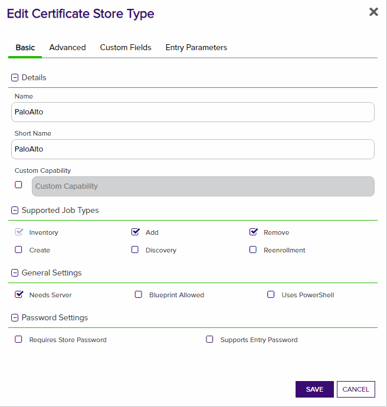

**Advanced Settings:**

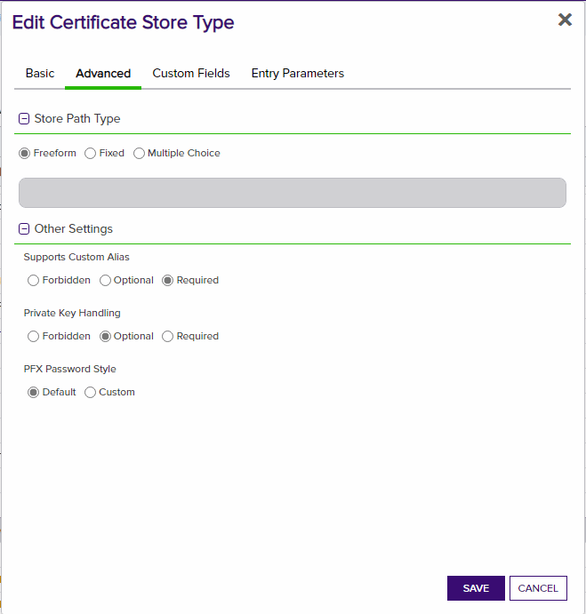

**Custom Fields:**

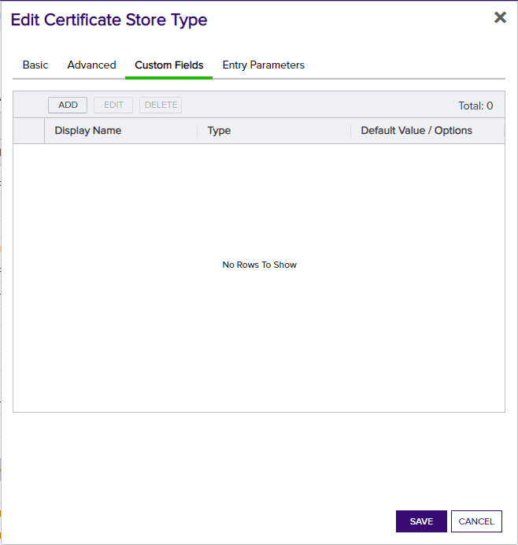

**Entry Params:**

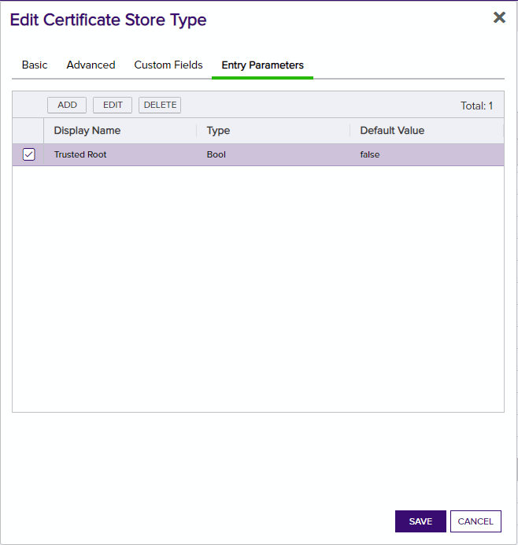

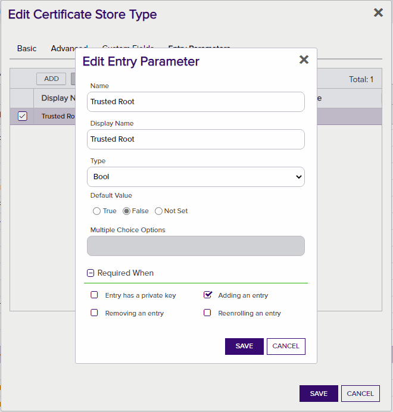

**2. Register the PaloAlto Orchestrator with Keyfactor**
See Keyfactor InstallingKeyfactorOrchestrators.pdf Documentation.  Get from your Keyfactor contact/representative.

**3. Create a Palo Alto Certificate Store within Keyfactor Command**

In Keyfactor Command create a new Certificate Store similar to the one below

#### STORE CONFIGURATION 
CONFIG ELEMENT	|DESCRIPTION
----------------|---------------
Category	|The type of certificate store to be configured. Select category based on the display name configured above "PaloAlto".
Container	|This is a logical grouping of like stores. This configuration is optional and does not impact the functionality of the store.
Client Machine	|The hostname of the PA-VM Firewall.  Sample is "keyfactorpa.eastus2.cloudapp.azure.com".
Store Path	|device
Orchestrator	|This is the orchestrator server registered with the appropriate capabilities to manage this certificate store type. 
Inventory Schedule	|The interval that the system will use to report on what certificates are currently in the store. 
Use SSL	|This should be checked.
User	|This is not necessary.
Password |This is the API Key obtained from the Palo Alto PA-VM Firewall Device.  This will have to be obtained by making the following API Call.

*API Key Generation*
`
curl -k -X GET 'https://<firewall>/api/?type=keygen&user=<username>&password=<password>'
`
*** 

#### Usage

**Adding New Certificate**

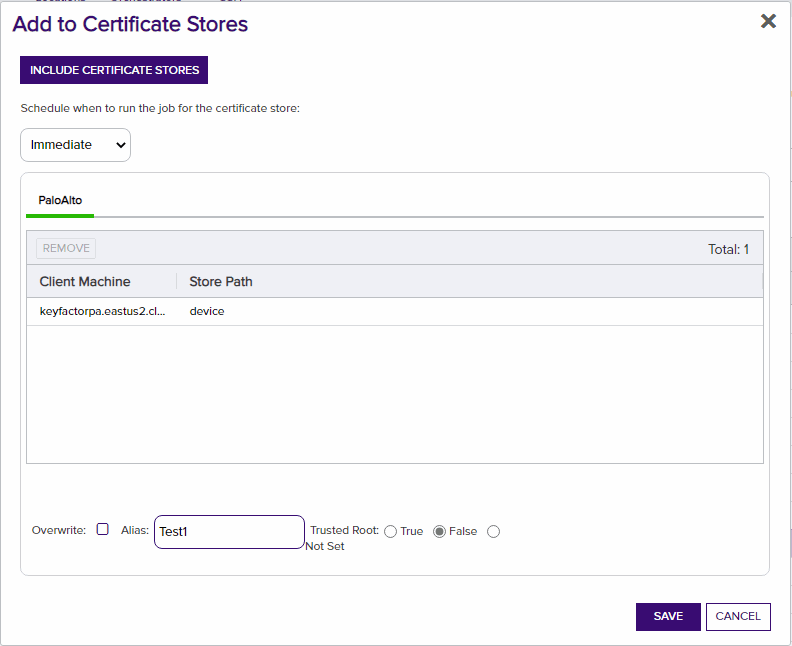

*** 

**Adding New Certificate With Trusted Root**

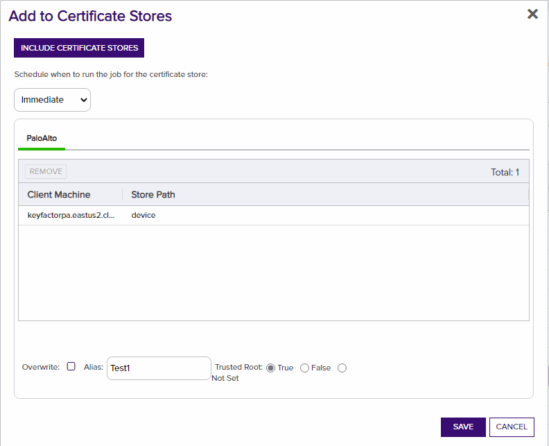

*** 

**Replace Certficate**

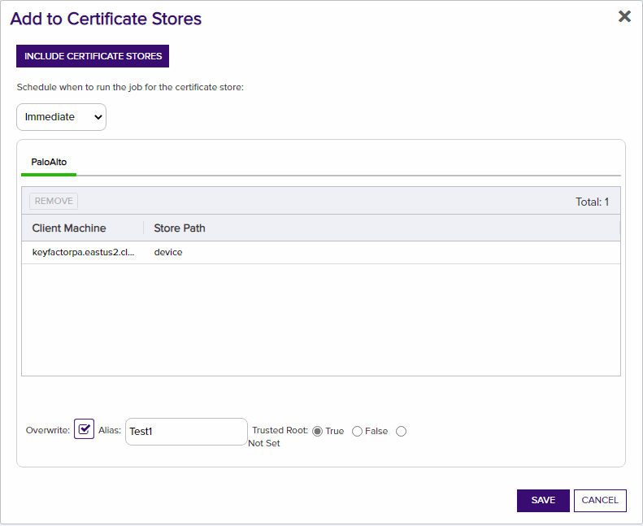

*** 

**Remove Certficate**

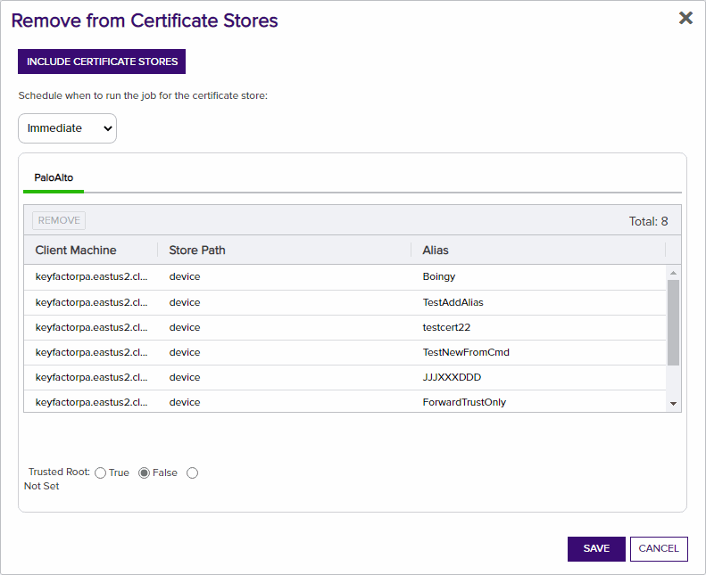

*** 

**Inventory Locations**

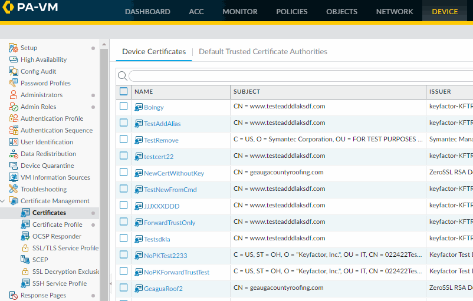

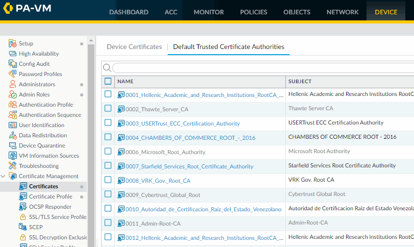

