<h1 align="center" style="border-bottom: none">
    Palo Alto Universal Orchestrator Extension
</h1>

<p align="center">
  <!-- Badges -->

<a href="https://github.com/Keyfactor/paloalto-firewall-orchestrator/releases"></a>


</p>

<p align="center">
  <!-- TOC -->
  <a href="#support">
    <b>Support</b>
  </a>
  ·
  <a href="#installation">
    <b>Installation</b>
  </a>
  ·
  <a href="#license">
    <b>License</b>
  </a>
  ·
  <a href="https://github.com/orgs/Keyfactor/repositories?q=orchestrator">
    <b>Related Integrations</b>
  </a>
</p>

## Overview

The Palo Alto Orchestrator Extension is an integration that can replace and inventory certificates on either a Panoroama instance or Firewall Instance, depending on the configuration.  The certificate store types that can be managed in the current version are: 

* PaloAlto - See [Test Cases](#test-cases) For Specific Use Cases that are supported.

## Compatibility

This integration is compatible with Keyfactor Universal Orchestrator version 10.4 and later.

## Support

The Palo Alto Universal Orchestrator extension is supported by Keyfactor. If you require support for any issues or have feature request, please open a support ticket by either contacting your Keyfactor representative or via the Keyfactor Support Portal at https://support.keyfactor.com.

> If you want to contribute bug fixes or additional enhancements, use the **[Pull requests](../../pulls)** tab.

## Requirements & Prerequisites

Before installing the Palo Alto Universal Orchestrator extension, we recommend that you install [kfutil](https://github.com/Keyfactor/kfutil). Kfutil is a command-line tool that simplifies the process of creating store types, installing extensions, and instantiating certificate stores in Keyfactor Command.


## PaloAlto Certificate Store Type

To use the Palo Alto Universal Orchestrator extension, you **must** create the PaloAlto Certificate Store Type. This only needs to happen _once_ per Keyfactor Command instance.


#### Supported Operations

| Operation    | Is Supported |
|--------------|--------------|
| Add          | ✅ Checked |
| Remove       | ✅ Checked |
| Discovery    | 🔲 Unchecked |
| Reenrollment | 🔲 Unchecked |
| Create       | 🔲 Unchecked |

#### Store Type Creation

##### Using kfutil:
`kfutil` is a custom CLI for the Keyfactor Command API and can be used to create certificate store types.
For more information on [kfutil](https://github.com/Keyfactor/kfutil) check out the [docs](https://github.com/Keyfactor/kfutil?tab=readme-ov-file#quickstart)

   <details><summary>Click to expand PaloAlto kfutil details</summary>

   ##### Using online definition from GitHub:
   This will reach out to GitHub and pull the latest store-type definition
   ```shell
   # PaloAlto
   kfutil store-types create PaloAlto
   ```

   ##### Offline creation using integration-manifest file:
   If required, it is possible to create store types from the [integration-manifest.json](./integration-manifest.json) included in this repo.
   You would first download the [integration-manifest.json](./integration-manifest.json) and then run the following command
   in your offline environment.
   ```shell
   kfutil store-types create --from-file integration-manifest.json
   ```
   </details>

#### Manual Creation
Below are instructions on how to create the PaloAlto store type manually in
the Keyfactor Command Portal

   <details><summary>Click to expand manual PaloAlto details</summary>

   Create a store type called `PaloAlto` with the attributes in the tables below:

   ##### Basic Tab
   | Attribute | Value | Description |
   | --------- | ----- | ----- |
   | Name | PaloAlto | Display name for the store type (may be customized) |
   | Short Name | PaloAlto | Short display name for the store type |
   | Capability | PaloAlto | Store type name orchestrator will register with. Check the box to allow entry of value |
   | Supports Add | ✅ Checked | Indicates that the Store Type supports Management Add |
   | Supports Remove | ✅ Checked | Indicates that the Store Type supports Management Remove |
   | Supports Discovery | 🔲 Unchecked | Indicates that the Store Type supports Discovery |
   | Supports Reenrollment | 🔲 Unchecked | Indicates that the Store Type supports Reenrollment |
   | Supports Create | 🔲 Unchecked | Indicates that the Store Type supports store creation |
   | Needs Server | ✅ Checked | Determines if a target server name is required when creating store |
   | Blueprint Allowed | 🔲 Unchecked | Determines if store type may be included in an Orchestrator blueprint |
   | Uses PowerShell | 🔲 Unchecked | Determines if underlying implementation is PowerShell |
   | Requires Store Password | 🔲 Unchecked | Enables users to optionally specify a store password when defining a Certificate Store. |
   | Supports Entry Password | 🔲 Unchecked | Determines if an individual entry within a store can have a password. |

   The Basic tab should look like this:

   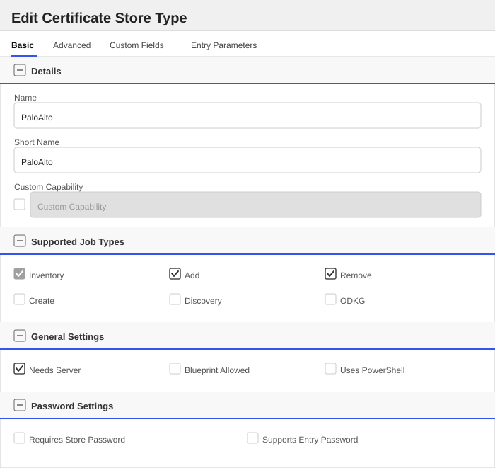

   ##### Advanced Tab
   | Attribute | Value | Description |
   | --------- | ----- | ----- |
   | Supports Custom Alias | Required | Determines if an individual entry within a store can have a custom Alias. |
   | Private Key Handling | Optional | This determines if Keyfactor can send the private key associated with a certificate to the store. |
   | PFX Password Style | Default | 'Default' - PFX password is randomly generated, 'Custom' - PFX password may be specified when the enrollment job is created (Requires the Allow Custom Password application setting to be enabled.) |

   The Advanced tab should look like this:

   

   > For Keyfactor **Command versions 24.4 and later**, a Certificate Format dropdown is available with PFX and PEM options. Ensure that **PFX** is selected, as this determines the format of new and renewed certificates sent to the Orchestrator during a Management job. Currently, all Keyfactor-supported Orchestrator extensions support only PFX.

   ##### Custom Fields Tab
   Custom fields operate at the certificate store level and are used to control how the orchestrator connects to the remote target server containing the certificate store to be managed. The following custom fields should be added to the store type:

   | Name | Display Name | Description | Type | Default Value/Options | Required |
   | ---- | ------------ | ---- | --------------------- | -------- | ----------- |
   | ServerUsername | Server Username | Palo Alto or Panorama Api User. (or valid PAM key if the username is stored in a KF Command configured PAM integration). | Secret |  | 🔲 Unchecked |
   | ServerPassword | Server Password | Palo Alto or Panorama Api Password. (or valid PAM key if the username is stored in a KF Command configured PAM integration). | Secret |  | 🔲 Unchecked |
   | ServerUseSsl | Use SSL | Should be true, http is not supported. | Bool | true | ✅ Checked |
   | DeviceGroup | Device Group | A semicolon delimited list of Device Groups that Panorama will push changes to (i.e. 'Group 1', 'Group 1;Group 2', or 'Group 1; Group 2', etc.). | String |  | 🔲 Unchecked |
   | InventoryTrustedCerts | Inventory Trusted Certs | If false, will not inventory default trusted certs, saves time. | Bool | false | ✅ Checked |
   | TemplateStack | Template Stack | A semicolon delimited list of Template Stacks used for device push of certificates via Template (i.e. `Stack 1`, `Stack 1;Stack2`, or `Stack 1; Stack 2`, etc.). | String |  | 🔲 Unchecked |
   | PushFailureBehavior | Push Failure Behavior | Controls the job result when Panorama fails to commit to a device group, template, or template stack. 'Failure' will fail the management job and trigger a retry, while 'Warning' records the failure message but marks the job as completed. | MultipleChoice | Failure,Warning | 🔲 Unchecked |

   The Custom Fields tab should look like this:

   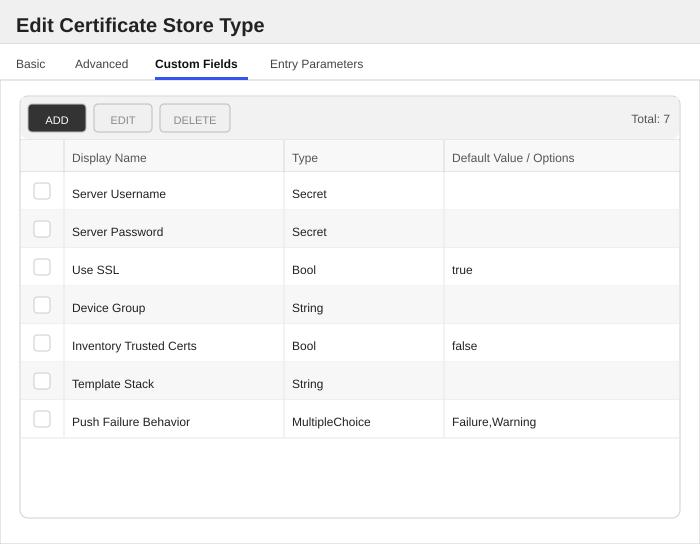

   ###### Server Username
   Palo Alto or Panorama Api User. (or valid PAM key if the username is stored in a KF Command configured PAM integration).


   > [!IMPORTANT]
   > This field is created by the `Needs Server` on the Basic tab, do not create this field manually.


   ###### Server Password
   Palo Alto or Panorama Api Password. (or valid PAM key if the username is stored in a KF Command configured PAM integration).


   > [!IMPORTANT]
   > This field is created by the `Needs Server` on the Basic tab, do not create this field manually.


   ###### Use SSL
   Should be true, http is not supported.

   
   


   ###### Device Group
   A semicolon delimited list of Device Groups that Panorama will push changes to (i.e. 'Group 1', 'Group 1;Group 2', or 'Group 1; Group 2', etc.).

   
   


   ###### Inventory Trusted Certs
   If false, will not inventory default trusted certs, saves time.

   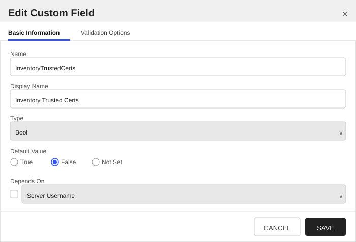
   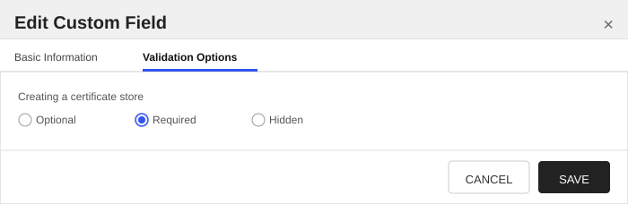


   ###### Template Stack
   A semicolon delimited list of Template Stacks used for device push of certificates via Template (i.e. `Stack 1`, `Stack 1;Stack2`, or `Stack 1; Stack 2`, etc.).

   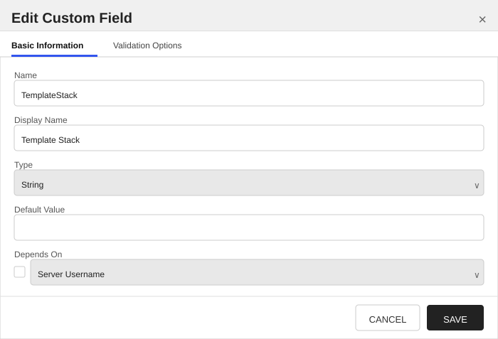
   


   ###### Push Failure Behavior
   Controls the job result when Panorama fails to commit to a device group, template, or template stack. 'Failure' will fail the management job and trigger a retry, while 'Warning' records the failure message but marks the job as completed.

   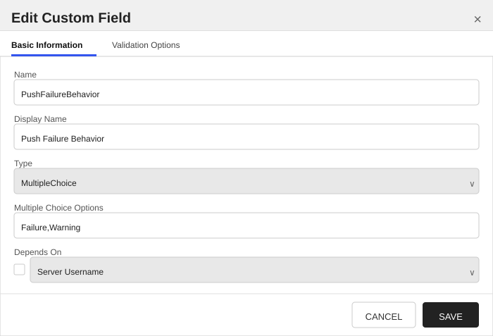
   


   </details>

## Installation

1. **Download the latest Palo Alto Universal Orchestrator extension from GitHub.**

    Navigate to the [Palo Alto Universal Orchestrator extension GitHub version page](https://github.com/Keyfactor/paloalto-firewall-orchestrator/releases/latest). Refer to the compatibility matrix below to determine which asset should be downloaded. Then, click the corresponding asset to download the zip archive.

   | Universal Orchestrator Version | Latest .NET version installed on the Universal Orchestrator server | `rollForward` condition in `Orchestrator.runtimeconfig.json` | `paloalto-firewall-orchestrator` .NET version to download |
   | --------- | ----------- | ----------- | ----------- |
   | Older than `11.0.0` | | | `net6.0` |
   | Between `11.0.0` and `11.5.1` (inclusive) | `net6.0` | | `net6.0` |
   | Between `11.0.0` and `11.5.1` (inclusive) | `net8.0` | `Disable` | `net6.0` |
   | Between `11.0.0` and `11.5.1` (inclusive) | `net8.0` | `LatestMajor` | `net8.0` |
   | Between `11.6.0` and `24.x` | `net8.0` | | `net8.0` |
   | `25.0` _and_ newer | `net10.0` | | `net10.0` |

    Unzip the archive containing extension assemblies to a known location.

    > **Note** If you don't see an asset with a corresponding .NET version, you should always assume that it was compiled for `net10.0`.

2. **Locate the Universal Orchestrator extensions directory.**

    * **Default on Windows** - `C:\Program Files\Keyfactor\Keyfactor Orchestrator\extensions`
    * **Default on Linux** - `/opt/keyfactor/orchestrator/extensions`

3. **Create a new directory for the Palo Alto Universal Orchestrator extension inside the extensions directory.**

    Create a new directory called `paloalto-firewall-orchestrator`.
    > The directory name does not need to match any names used elsewhere; it just has to be unique within the extensions directory.

4. **Copy the contents of the downloaded and unzipped assemblies from __step 2__ to the `paloalto-firewall-orchestrator` directory.**

5. **Restart the Universal Orchestrator service.**

    Refer to [Starting/Restarting the Universal Orchestrator service](https://software.keyfactor.com/Core-OnPrem/Current/Content/InstallingAgents/NetCoreOrchestrator/StarttheService.htm).

6. **(optional) PAM Integration**

    The Palo Alto Universal Orchestrator extension is compatible with all supported Keyfactor PAM extensions to resolve PAM-eligible secrets. PAM extensions running on Universal Orchestrators enable secure retrieval of secrets from a connected PAM provider.

    To configure a PAM provider, [reference the Keyfactor Integration Catalog](https://keyfactor.github.io/integrations-catalog/content/pam) to select an extension and follow the associated instructions to install it on the Universal Orchestrator (remote).

> The above installation steps can be supplemented by the [official Command documentation](https://software.keyfactor.com/Core-OnPrem/Current/Content/InstallingAgents/NetCoreOrchestrator/CustomExtensions.htm?Highlight=extensions).

## Defining Certificate Stores

### Store Creation

#### Manually with the Command UI

<details><summary>Click to expand details</summary>

1. **Navigate to the _Certificate Stores_ page in Keyfactor Command.**

    Log into Keyfactor Command, toggle the _Locations_ dropdown, and click _Certificate Stores_.

2. **Add a Certificate Store.**

    Click the Add button to add a new Certificate Store. Use the table below to populate the **Attributes** in the **Add** form.

   | Attribute | Description |
   | --------- | ----------- |
   | Category | Select "PaloAlto" or the customized certificate store name from the previous step. |
   | Container | Optional container to associate certificate store with. |
   | Client Machine | Either the Panorama or Palo Alto Firewall URI or IP address. |
   | Store Path | The Store Path field should be reviewed in the store path explanation section.  It varies depending on configuration. |
   | Orchestrator | Select an approved orchestrator capable of managing `PaloAlto` certificates. Specifically, one with the `PaloAlto` capability. |
   | ServerUsername | Palo Alto or Panorama Api User. (or valid PAM key if the username is stored in a KF Command configured PAM integration). |
   | ServerPassword | Palo Alto or Panorama Api Password. (or valid PAM key if the username is stored in a KF Command configured PAM integration). |
   | ServerUseSsl | Should be true, http is not supported. |
   | DeviceGroup | A semicolon delimited list of Device Groups that Panorama will push changes to (i.e. 'Group 1', 'Group 1;Group 2', or 'Group 1; Group 2', etc.). |
   | InventoryTrustedCerts | If false, will not inventory default trusted certs, saves time. |
   | TemplateStack | A semicolon delimited list of Template Stacks used for device push of certificates via Template (i.e. `Stack 1`, `Stack 1;Stack2`, or `Stack 1; Stack 2`, etc.). |
   | PushFailureBehavior | Controls the job result when Panorama fails to commit to a device group, template, or template stack. 'Failure' will fail the management job and trigger a retry, while 'Warning' records the failure message but marks the job as completed. |

</details>

#### Using kfutil CLI

<details><summary>Click to expand details</summary>

1. **Generate a CSV template for the PaloAlto certificate store**

    ```shell
    kfutil stores import generate-template --store-type-name PaloAlto --outpath PaloAlto.csv
    ```
2. **Populate the generated CSV file**

    Open the CSV file, and reference the table below to populate parameters for each **Attribute**.

   | Attribute | Description |
   | --------- | ----------- |
   | Category | Select "PaloAlto" or the customized certificate store name from the previous step. |
   | Container | Optional container to associate certificate store with. |
   | Client Machine | Either the Panorama or Palo Alto Firewall URI or IP address. |
   | Store Path | The Store Path field should be reviewed in the store path explanation section.  It varies depending on configuration. |
   | Orchestrator | Select an approved orchestrator capable of managing `PaloAlto` certificates. Specifically, one with the `PaloAlto` capability. |
   | Properties.ServerUsername | Palo Alto or Panorama Api User. (or valid PAM key if the username is stored in a KF Command configured PAM integration). |
   | Properties.ServerPassword | Palo Alto or Panorama Api Password. (or valid PAM key if the username is stored in a KF Command configured PAM integration). |
   | Properties.ServerUseSsl | Should be true, http is not supported. |
   | Properties.DeviceGroup | A semicolon delimited list of Device Groups that Panorama will push changes to (i.e. 'Group 1', 'Group 1;Group 2', or 'Group 1; Group 2', etc.). |
   | Properties.InventoryTrustedCerts | If false, will not inventory default trusted certs, saves time. |
   | Properties.TemplateStack | A semicolon delimited list of Template Stacks used for device push of certificates via Template (i.e. `Stack 1`, `Stack 1;Stack2`, or `Stack 1; Stack 2`, etc.). |
   | Properties.PushFailureBehavior | Controls the job result when Panorama fails to commit to a device group, template, or template stack. 'Failure' will fail the management job and trigger a retry, while 'Warning' records the failure message but marks the job as completed. |

3. **Import the CSV file to create the certificate stores**

    ```shell
    kfutil stores import csv --store-type-name PaloAlto --file PaloAlto.csv
    ```

</details>

#### PAM Provider Eligible Fields
<details><summary>Attributes eligible for retrieval by a PAM Provider on the Universal Orchestrator</summary>

If a PAM provider was installed _on the Universal Orchestrator_ in the [Installation](#Installation) section, the following parameters can be configured for retrieval _on the Universal Orchestrator_.

   | Attribute | Description |
   | --------- | ----------- |
   | ServerUsername | Palo Alto or Panorama Api User. (or valid PAM key if the username is stored in a KF Command configured PAM integration). |
   | ServerPassword | Palo Alto or Panorama Api Password. (or valid PAM key if the username is stored in a KF Command configured PAM integration). |

Please refer to the **Universal Orchestrator (remote)** usage section ([PAM providers on the Keyfactor Integration Catalog](https://keyfactor.github.io/integrations-catalog/content/pam)) for your selected PAM provider for instructions on how to load attributes orchestrator-side.
> Any secret can be rendered by a PAM provider _installed on the Keyfactor Command server_. The above parameters are specific to attributes that can be fetched by an installed PAM provider running on the Universal Orchestrator server itself.

</details>

> The content in this section can be supplemented by the [official Command documentation](https://software.keyfactor.com/Core-OnPrem/Current/Content/ReferenceGuide/Certificate%20Stores.htm?Highlight=certificate%20store).


## Release 2.5.1 Update on Alias Constraints
**Important Note** For management jobs, the alias provided for the job is validated to ensure the length of the alias is not longer than Panorama / Firewall allows. For Panorama, alias length **must not** be more than 31 characters. For Firewall, alias length **must not** be more than 63 characters. If your store path points to Panorama, even if you are pushing the certificate to Firewall, you must keep alias length to at most 31 characters. Please see the [Panorama documentation](https://docs.paloaltonetworks.com/ngfw/administration/certificate-management/obtain-certificates/generate-certificate#generate-certificate-pan-os) for more information on certificate name length.

If the alias length exceeds the maximum length, you will receive a job failure with the following error message:
```
Certificate alias 'alias' is too long, it must not be more than 31 characters. Current length: 32.
```

## Release 2.2 Update on Entry Params
**Important Note** Entry params are no longer used.  This version of the extension will only update certs on existing bindings and not add a cert to a new binding location.  This was done to simplify the process since there are so many binding locations and reference issues.

**Important Note** Please review the new path considerations in the section below.  It explains how the paths work for Panorama and the Firewalls.  `'locahost.localdomain'` will always be that `constant value` do not make that **anything else!**.

## Release 2.5.2 Update on Panorama Commits
> [!IMPORTANT]
>
> The 2.5.2 release updates commit behavior to update commits (device group / template / template stack) to return a Warning instead of an Error. Commits that were unsuccessful will be logged and noted in the job status message. Please ensure any failed commits are manually handled to prevent an unintended outage.

## Commit Behavior

### Push Failure Behavior

When a Panorama management job completes, the integration performs a two-phase commit:

1. **Phase 1 — Commit to Panorama**: Saves the candidate configuration changes to Panorama's running config. This phase always returns a **Failure** result if unsuccessful, regardless of any store configuration, and the job will be retried by Keyfactor.

2. **Phase 2 — Push to devices**: Pushes the committed configuration from Panorama out to managed firewalls via the configured device groups, templates, and/or template stacks. The behavior when this phase fails is controlled by the **Push Failure Behavior** store property.

The **Push Failure Behavior** store property accepts two values:

| Value | Job Result | Retry Triggered? | When to Use |
|---|---|---|---|
| `Failure` *(default)* | Failure | Yes | Use in most environments. Ensures the push to managed firewalls is confirmed before the job is marked complete. If the push fails, Keyfactor will automatically retry the job. |
| `Warning` | Warning | No | Use when push failures are expected or tolerable — for example, in environments where Panorama commits are slow, device groups are intermittently unreachable, or where retrying the management job would cause unintended side effects. The failure message is still recorded in the job history. |

> [!IMPORTANT]
> Setting Push Failure Behavior to `Warning` means a failed push to a device group, template, or template stack **will not trigger a retry**. The certificate will be saved in Panorama's configuration, but managed firewalls may not receive the updated certificate until the next successful push. Ensure you have a plan to verify or manually trigger delivery in these cases.

If the Push Failure Behavior property is absent or blank, the integration defaults to `Failure`.

### Commit Timeout

When Panorama processes a commit asynchronously, it returns a job ID. The integration polls that job until it reaches a terminal state (success or failure). Polling uses exponential backoff, starting at 10 seconds and capping at 90 seconds between polls.

If a commit job does not complete within **60 minutes**, the integration stops polling and the management job returns a **Failure**. This timeout exists to prevent jobs from hanging indefinitely due to a stuck or queued Panorama job. If you observe frequent timeouts, check Panorama's job queue for backlogs or increase commit concurrency limits in your Panorama configuration.

## STORE PATH DETAILS AND API SECURITY CONSIDERATIONS
<details>
<summary>Store Path Permutations</summary>

### Store Path Quick Reference

The store path tells the integration where certificates live in the PAN-OS configuration tree and which device (Firewall or Panorama) is being managed. Choose the path format that matches your topology.

| Format | Example | Endpoint | Scope | Phase 2 Push? |
|---|---|---|---|---|
| `/config/shared` | `/config/shared` | Firewall | Shared across all vsys on the device | No |
| Firewall vsys | `/config/devices/entry[@name='localhost.localdomain']/vsys/entry[@name='vsys1']` | Firewall | Single virtual system | No |
| Panorama template (shared) | `/config/devices/entry[@name='localhost.localdomain']/template/entry[@name='MyTemplate']/config/shared` | Panorama | Template shared scope | Yes — template, and device group / template stack if configured |
| Panorama template (vsys) | `/config/devices/entry/template/entry[@name='MyTemplate']/config/devices/entry/vsys/entry[@name='vsys1']` | Panorama | Template + specific vsys | Yes — template, and device group / template stack if configured |
| `/config/panorama` | `/config/panorama` | Panorama | Panorama administrative certificates | No |

**Key points:**
- `/config/shared` targets the local Firewall only. Querying this path against a Panorama instance will return no certificates.
- Panorama paths trigger a two-phase commit: the certificate is first saved to Panorama, then pushed to managed firewalls. Firewall paths only commit locally.
- The `localhost.localdomain` device name is a constant — do not substitute another value.
- Panorama alias length is limited to 31 characters; Firewall allows up to 63.

### Store Path Explanation
**Important Note** The store path permutations are show below

#### FIREWALL SHARED SYSTEM PATH
_________________________________
**Path Example** /config/shared

**/config**:
This indicates that the path is within the configuration section of the firewall device. It contains all the configuration settings and parameters for the device.

**/shared**:
This section specifies that the path is within the shared settings. Shared settings are common configurations that can be used across multiple virtual systems (vsys) or contexts within the firewall.
_________________________________

#### FIREWALL VIRTUAL SYSTEM PATH
_________________________________
**Path Example**: /config/devices/entry[@name='localhost.localdomain']/vsys/entry[@name='vsys1']

**Note** `'locahost.localdomain'` will always be that `constant value` do not make that **anything else!**.

**/config**:
This indicates that the path is within the configuration section of the firewall device. It contains all the configuration settings and parameters for the device.

**/devices**:
This part specifies that the configuration relates to devices. In the context of a single firewall, this generally refers to the firewall itself.

**/entry[@name='localhost.localdomain']**:
Note `'locahost.localdomain'` will always be that `constant value` do not make that **anything else!**.  The entry tag with the attribute @name='localhost.localdomain' identifies a specific device by its name. In this case, it refers to the device named "localhost.localdomain," which is a default or placeholder name for the firewall device.

**/vsys**:
This section specifies that the path is within the virtual systems (vsys) section. Virtual systems allow multiple virtualized instances of firewall configurations within a single physical firewall.

**/entry[@name='vsys1']**:
The entry tag with the attribute @name='vsys1' identifies a specific virtual system by its name. In this case, it refers to a virtual system named "vsys1."
_________________________________

#### PANORAMA SHARED TEMPLATE PATH
_________________________________
**Path Example**: /config/devices/entry[@name='localhost.localdomain']/template/entry[@name='CertificatesTemplate']/config/shared

**Note** `'locahost.localdomain'` will always be that `constant value` do not make that **anything else!**.

**/config**:
This section indicates that the path is within the configuration section of the Panorama device. It contains all the configuration settings and parameters for the device.

**/devices**:
This part specifies that the configuration relates to devices managed by Panorama. Panorama can manage multiple devices, such as firewalls.

**/entry[@name='localhost.localdomain']**:
Note `'locahost.localdomain'` will always be that `constant value` do not make that **anything else!**.  The entry tag with the attribute @name='localhost.localdomain' identifies a specific device by its name. In this case, it refers to the device named "localhost.localdomain," which is a default or placeholder name for the device.

**/template**:
This section indicates that the path is within the templates section. Templates in Panorama are used to define configuration settings that can be applied to multiple devices.

**/entry[@name='CertificatesTemplate']**:
The entry tag with the attribute @name='CertificatesTemplate' identifies a specific template by its name. In this case, it refers to a template named "CertificatesTemplate."

**/config/shared**:
This part of the path indicates that the configuration settings within this template are shared settings. Shared settings are common configurations that can be used across multiple devices or contexts within the Panorama management system.
_________________________________

#### PANORAMA VIRTUAL SYSTEM PATH
__________________________________
**Path Example**: /config/devices/entry/template/entry[@name='CertificatesTemplate']/config/devices/entry/vsys/entry[@name='vsys2']

**/config**:
This indicates that the path is within the configuration section of the Panorama device. It contains all the configuration settings and parameters for the device.

**/devices**:
This part specifies that the configuration relates to devices managed by Panorama. Panorama can manage multiple devices, such as firewalls.

**/entry**:
This is a generic entry point under devices. However, since it does not have a @name attribute specified at this level, it applies to the broader device category.

**/template**:
This section indicates that the path is within the templates section. Templates in Panorama are used to define configuration settings that can be applied to multiple devices.

**/entry[@name='CertificatesTemplate']**:
The entry tag with the attribute @name='CertificatesTemplate' identifies a specific template by its name. In this case, it refers to a template named "CertificatesTemplate."

**/config/devices**:
This part of the path specifies that the configuration settings within this template apply to devices.

**/entry**:
This again specifies a generic entry point under devices in the context of the template. This would typically be further defined by specific device attributes, but here it leads to the virtual systems (vsys) section.

**/vsys**:
This section specifies that the path is within the virtual systems (vsys) section. Virtual systems allow multiple virtualized instances of firewall configurations within a single physical firewall.

**/entry[@name='vsys2']**:
The entry tag with the attribute @name='vsys2' identifies a specific virtual system by its name. In this case, it refers to a virtual system named "vsys2."
__________________________________

#### PANORAMA LEVEL
__________________________________
**Path Example**: /config/panorama

**/config**:
This indicates that the path is within the configuration section of the Panorama device. It contains all the configuration settings and parameters for the device.

**/panorama**:
This section specifies that the path is within the Panorama-specific configuration settings. This part of the configuration contains settings that are specific to the Panorama management system itself, rather than the devices it manages.
__________________________________

</details>

<details>
<summary>API User Setup Permissions in Panorama or Firewall Required</summary>

Tab          |  Security Items	
--------------|--------------------------
Xml Api       |Report,Log,Configuration,Operational Requests,Commit,Export,Import
Rest Api      |Objects/Devices,Panorama/Scheduled Config Push,Panorama/Templates,Panorama/Template Stacks,Panorama/Device Groups,System/Configuration,Plugins/Plugins
*** 

</details>

## Integration Tests

This project includes an [Integration Test](./PaloAlto.IntegrationTests) suite to help run the [test cases](#test-cases) below. Here are the steps to run the integration tests:

- Make sure you have .NET 6 or above installed
- Inside the Integration Tests directory, copy the `.env.test.example` to `.env.test` within the same directory.
- If needed, update the Properties of the file to "Copy always" to the output directory. This ensures the `.env.test` file is visible to the test runner.
- Inside your IDE of choice (Rider / Visual Studio), run the selected tests or run all tests.

## Test Cases
<details>
<summary>Firewall, Panorama Template and Panorama Level</summary>

Case Number|Case Name|Store Path|Enrollment Params|Expected Results|Passed|Screenshots
-------|----------|------------------|--------------------|----------------------------|----|--------
TC1|Firewall Enroll No Bindings|/config/shared|**Alias**:<br>www.certandchain.com<br>**Overwrite**:<br>false|Cert and Chain Installed on Firewall|True|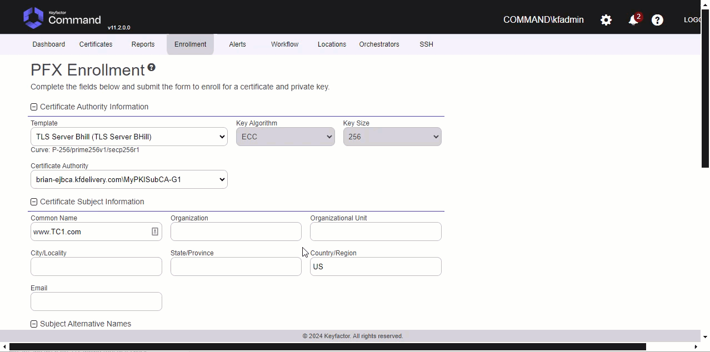
TC1a|Firewall Enroll Template Stack|/config/shared|**Alias**:<br>www.tc1a.com<br>**Overwrite**:<br>false|Error Stating Template Stacks Not Used for Firewall|True|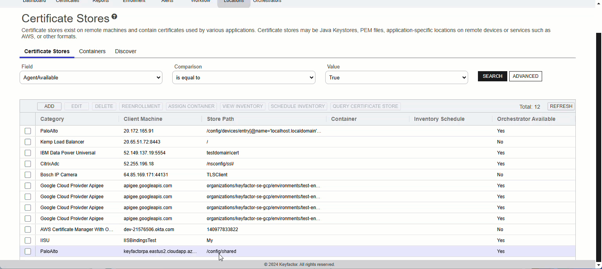
TC2|Firewall Replace No Bindings|/config/shared|**Alias**:<br>www.certandchain.com<br>**Overwrite**:<br>true|Cert and Chain Installed on Firewall|True|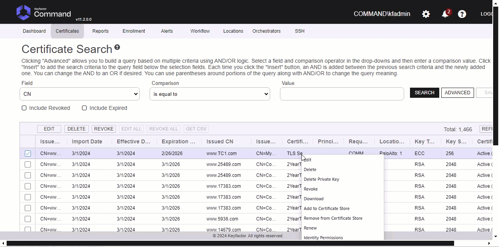
TC3|Firewall Remove Bound Certificate|/config/shared|**Alias**:<br>0.13757535891685202<br>**Overwrite**:<br>false|Cert will **not** be removed because bound|True|
TC4|Firewall Enroll Bindings|/config/shared|**Alias**:0.13757535891685202<br>**Overwrite**:<br>false|Will not replace cert since Overwrite=false|True|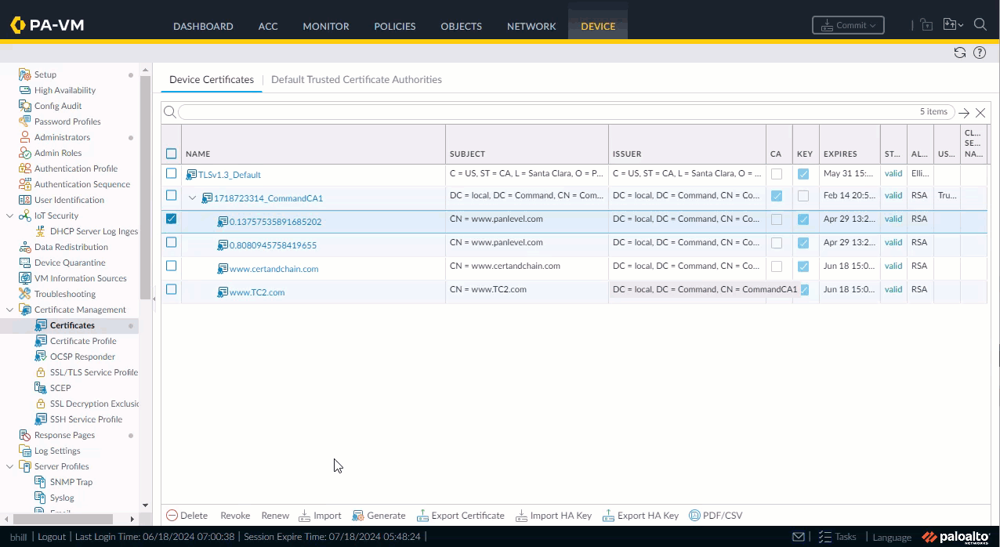
TC5|Firewall Replace Bound Certificate|/config/shared|**Alias**:0.13757535891685202<br>**Overwrite**:<br>true|Will replace cert bindings get automatically updated since Overwrite=true|True|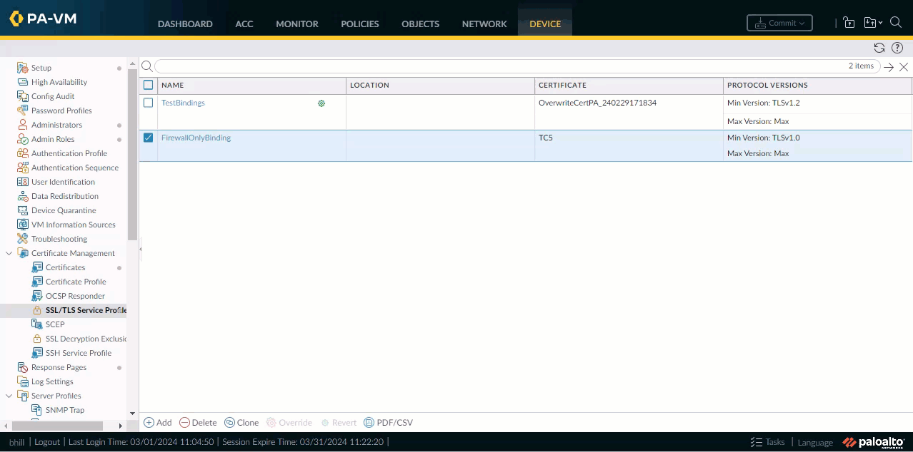
TC6|Firewall Inventory|/config/shared|N/A|Inventory will finish and certs from shared location inventoried.|True|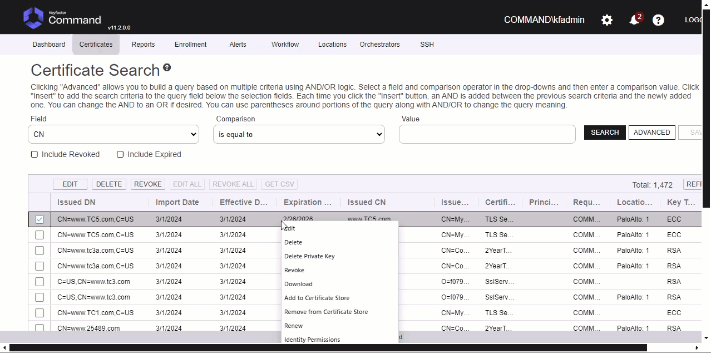
TC6a|Firewall Inventory No Trusted Certs|/config/shared|N/A|Inventory will finish no Trusted Certs and certs from shared location inventoried.|True|
TC7|Firewall Inventory With Virtual System|/config/devices/entry[@name='localhost.localdomain']/vsys/entry[@name='vsys1']|N/A|Will Inventory all certificates from vsys1 on firewall|True|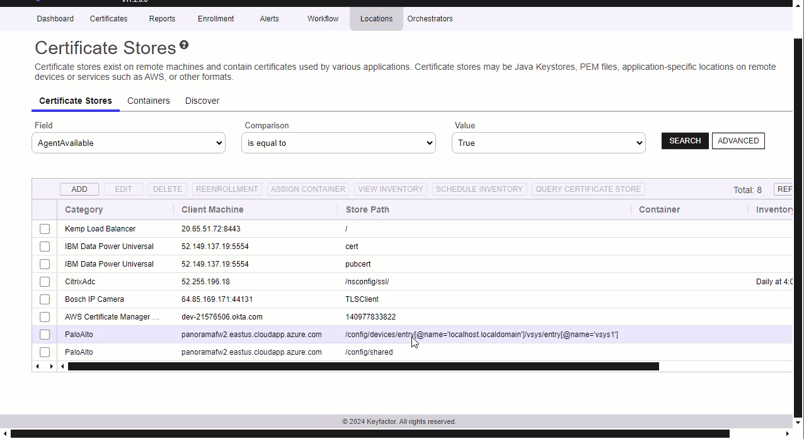
TC8|Firewall Enroll cert and chain to Virtual System|/config/devices/entry[@name='localhost.localdomain']/vsys/entry[@name='vsys1']|**Alias**:<br>www.ejbcacertandchain.com|Cert is installed along with chain.|True|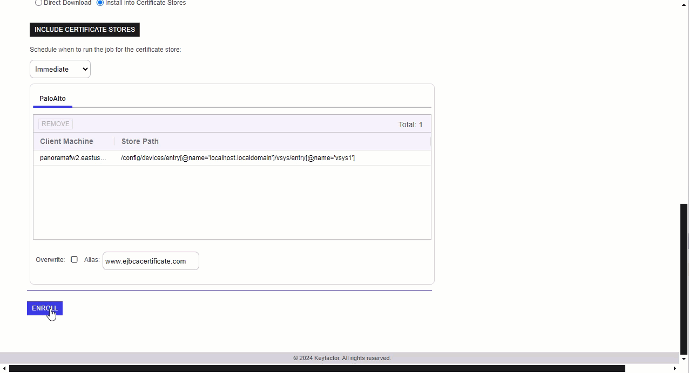
TC9|Firewall Remove unbound cert from Virtual System|/config/devices/entry[@name='localhost.localdomain']/vsys/entry[@name='vsys1']|N/A|Will remove cert from test case 8 from Firewall Virtual System|True|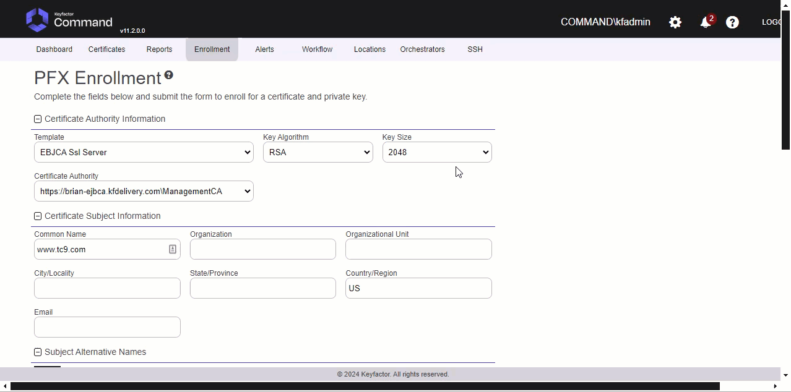
TC10|Firewall Remove bound cert from Virtual System|/config/devices/entry[@name='localhost.localdomain']/vsys/entry[@name='vsys1']|**Alias**:<br>0.8168##|Cert will not be removed because it is bound.|True|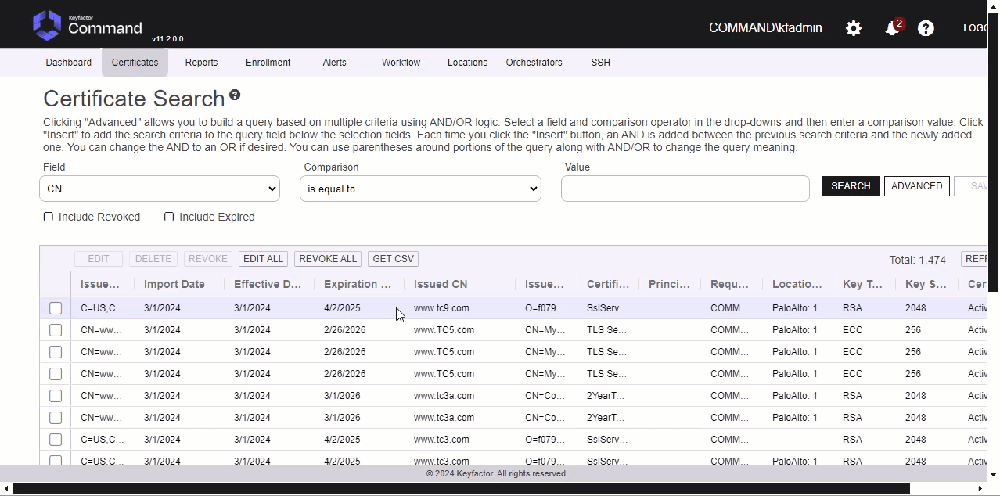
TC11|Firewall Replace without Overwrite on Virtual System|/config/devices/entry[@name='localhost.localdomain']/vsys/entry[@name='vsys1']|**Alias**:<br>0.8168##<br>**Overwrite**:<br>true|User is warned Overwrite needs checked.|True|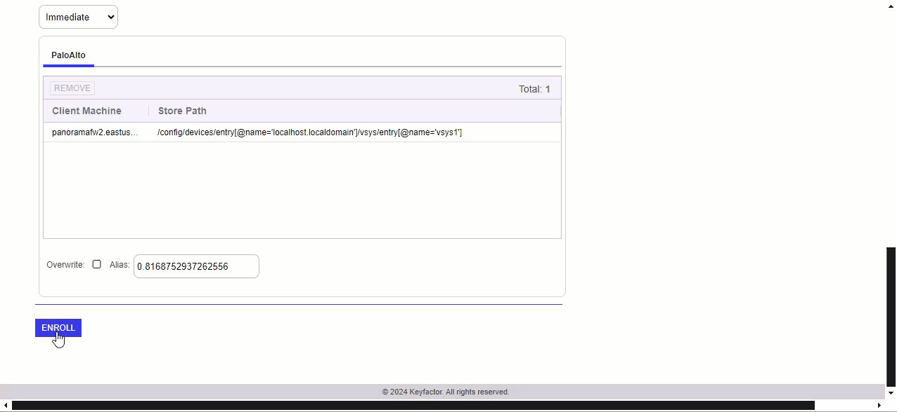
TC12|Firewall Renew cert on Shared and Virtual System|/config/devices/entry[@name='localhost.localdomain']/vsys/entry[@name='vsys1'] and /config/shared|**Alias**:<br>www.renewtester.com|Cert renewed on vsys and shared locations|True|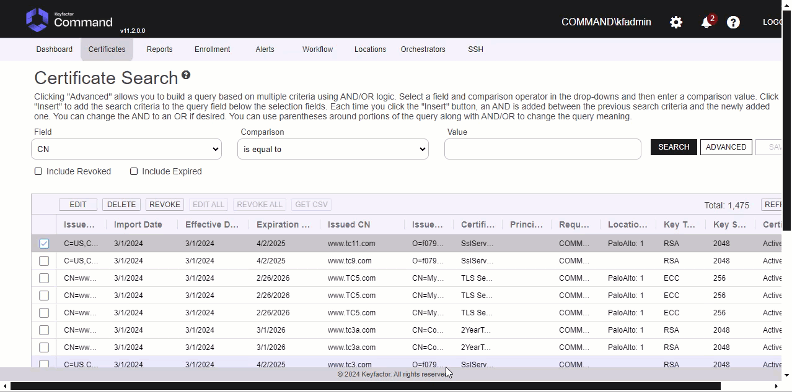
TC13|Firewall Replace bound cert on Virtual System|/config/devices/entry[@name='localhost.localdomain']/vsys/entry[@name='vsys1']|**Alias**:<br>0.8168##<br>**Overwrite**:<br>true|Cert will be replaced and binding updated on vsys.|True|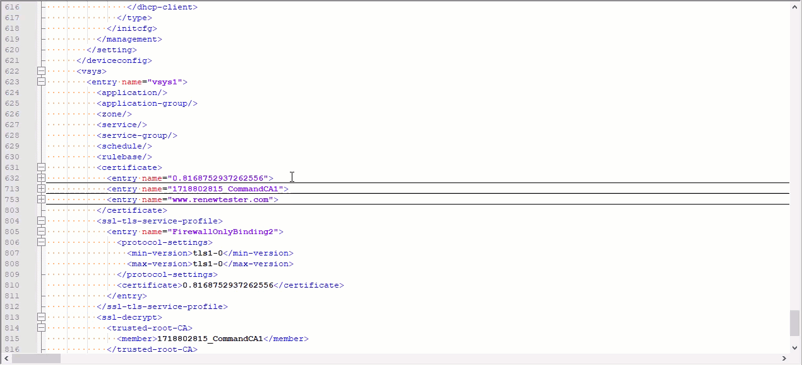
TC14|Panorama Template Enroll Certificate|/config/devices/entry[@name='localhost.localdomain']/template/entry[@name='CertificatesTemplate']/config/shared|**Alias**:<br>www.pantemptc1.com|Certificate is enrolled to shared location for template|True|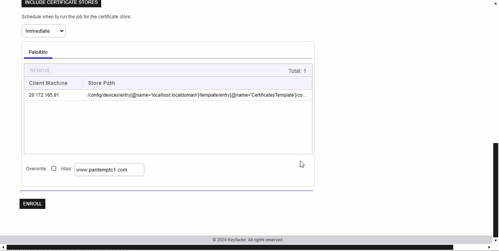
TC14a|Panorama Invalid Template Stack|/config/devices/entry[@name='localhost.localdomain']/template/entry[@name='CertificatesTemplate']/config/shared|**Alias**:<br>www.tc14a.com|Error Occurs with list of valid Template Stacks To Use|True|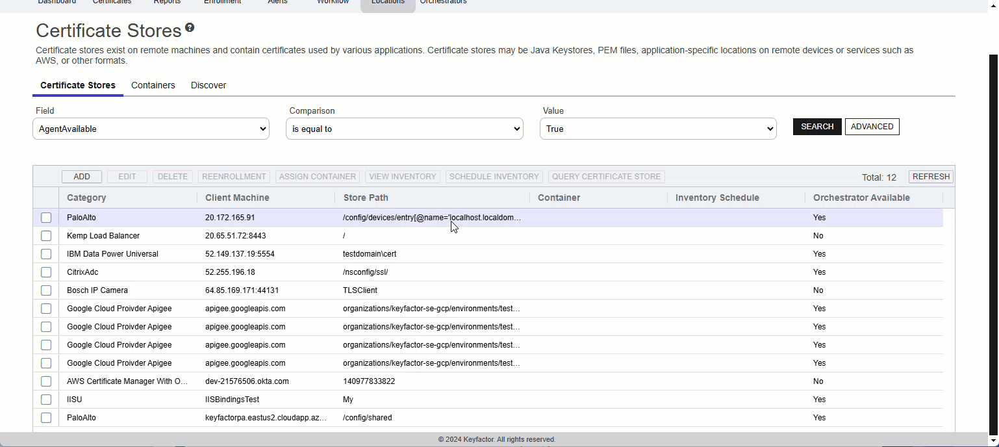
TC15|Panorama Template Replace Certificate|/config/devices/entry[@name='localhost.localdomain']/template/entry[@name='CertificatesTemplate']/config/shared|**Alias**:<br>www.pantemptc1.com<br>**Overwrite**:<br>true|Certificate is replaced in shared location for template|True|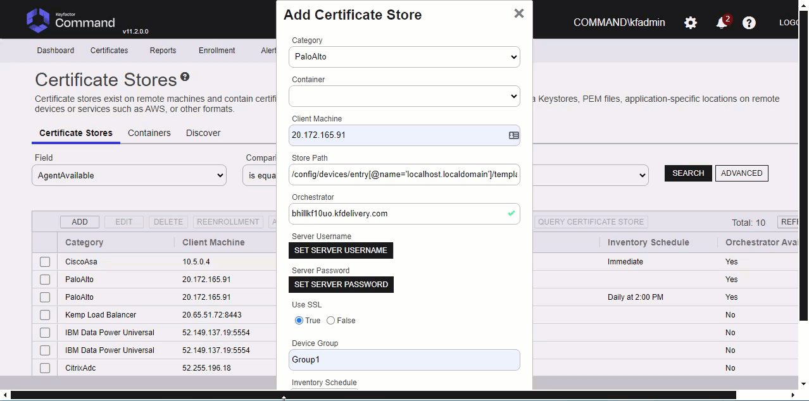
TC16|Panorama Template Remove unbound Certificate|/config/devices/entry[@name='localhost.localdomain']/template/entry[@name='CertificatesTemplate']/config/shared|**Alias**:<br>www.pantemptc1.com|Certificate is removed from shared location for template|True|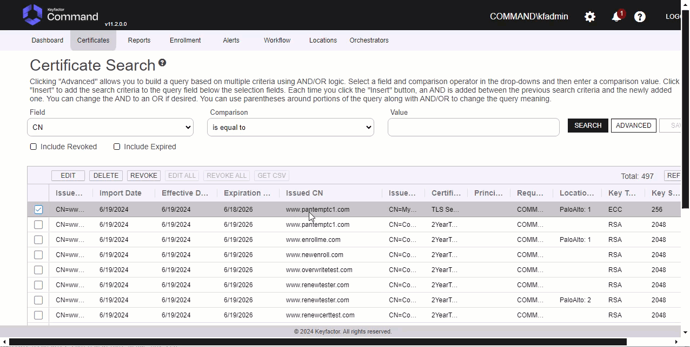
TC16a|Panorama Template Stack Push|/config/devices/entry[@name='localhost.localdomain']/template/entry[@name='CertificatesTemplate']/config/shared|**Alias**:<br>www.tc16a.com|Certificate pushed to Template and Template Stack|True|
TC16c|Panorama Multiple Device Group Push|/config/devices/entry[@name='localhost.localdomain']/template/entry[@name='CertificatesTemplate']/config/shared|**Alias**:<br>com.example.devicegroup|Certificate pushed to Template and Device Groups|True|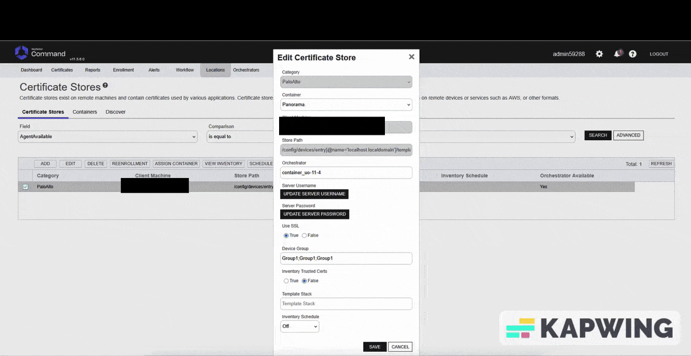
TC17|Panorama Template Replace bound Certificate|/config/devices/entry[@name='localhost.localdomain']/template/entry[@name='CertificatesTemplate']/config/shared|**Alias**:<br>LongNameTest<br>**Overwrite**:<br>true|Certificate is replaced, binding updated in shared location for template|True|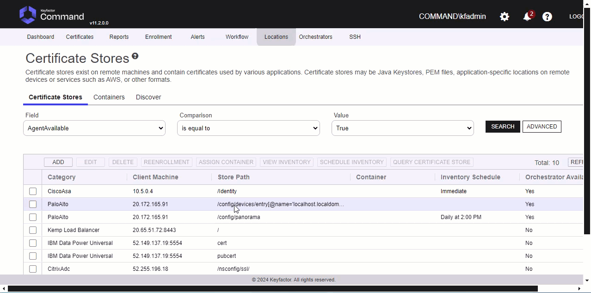
TC18|Panorama Template Remove bound Certificate|/config/devices/entry[@name='localhost.localdomain']/template/entry[@name='CertificatesTemplate']/config/shared|**Alias**:<br>LongNameTest|Certificate is not removed because it is bound|True|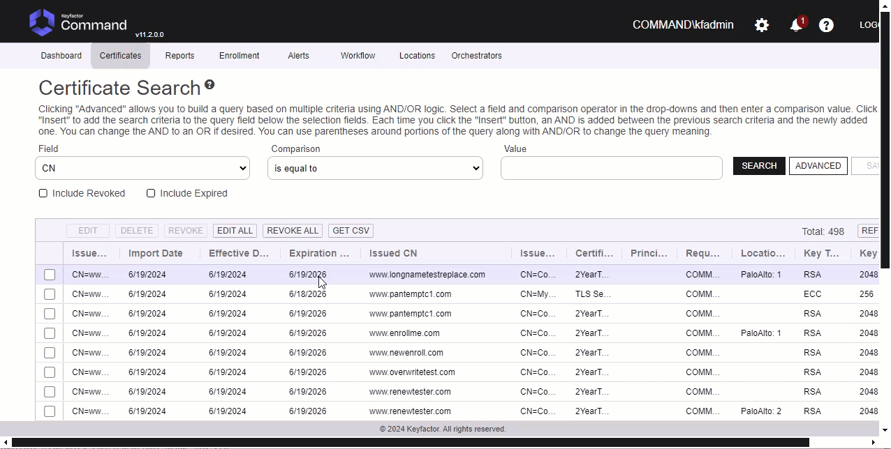
TC18b|Panorama Template Remove multiple device groups bound Certificate|/config/devices/entry[@name='localhost.localdomain']/template/entry[@name='CertificatesTemplate']/config/shared|**Alias**:<br>com.example.devicegroup|Certificate is removed|True|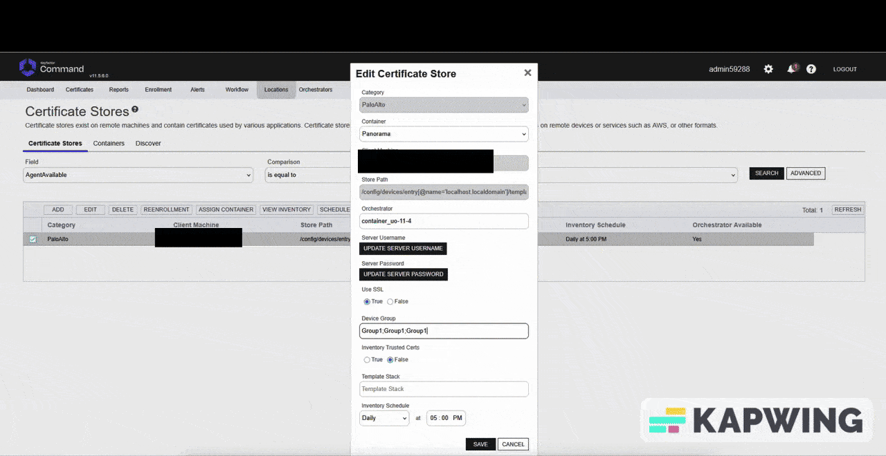
TC19|Panorama Template Shared Inventory|/config/devices/entry[@name='localhost.localdomain']/template/entry[@name='CertificatesTemplate']/config/shared|N/A|Certificates are inventoried from this location|True|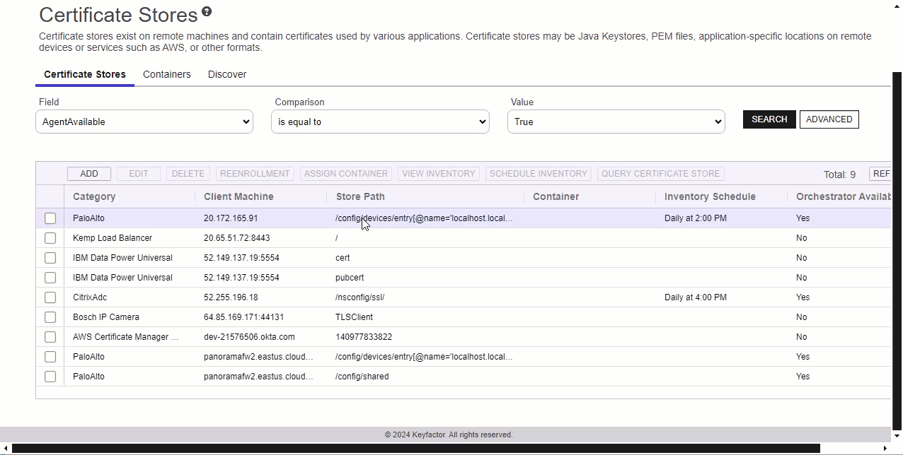
TC20|Panorama Template Virtual System Inventory|/config/devices/entry/template/entry[@name='CertificatesTemplate']/config/devices/entry/vsys/entry[@name='vsys2']|N/A|Certificates are inventoried from this template vsys location|True|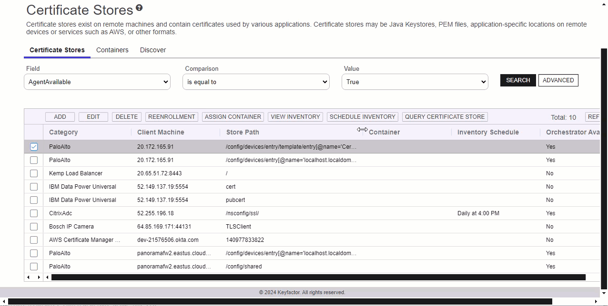
TC21|Panorama Template Virtual System Enroll Certificate|/config/devices/entry/template/entry[@name='CertificatesTemplate']/config/devices/entry/vsys/entry[@name='vsys2']|**Alias**:<br>www.vsys2enroll.com|Certificate is enrolled to vsys2 location for template|True|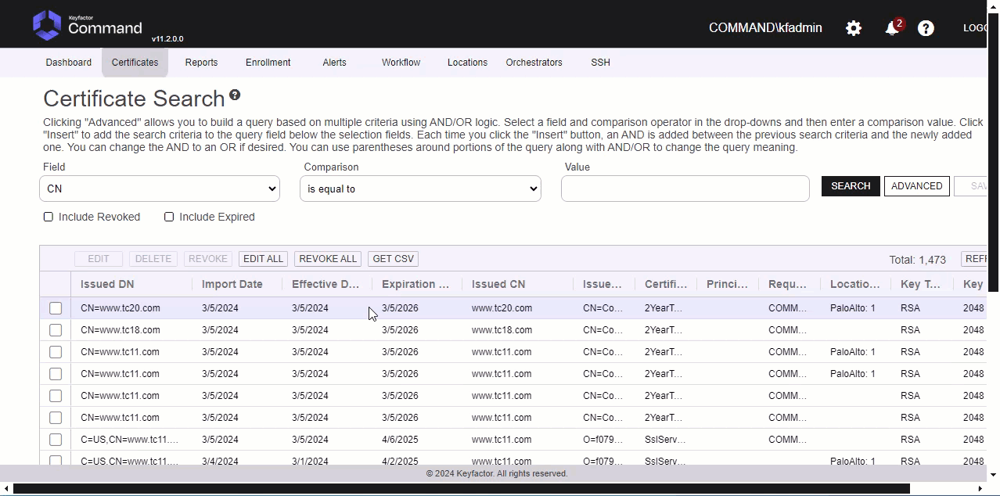
TC21a|Panorama Level Inventory No Trusted Certs|/config/panorama|N/A|Certificates are inventoried from this location No Trusted Certs|True|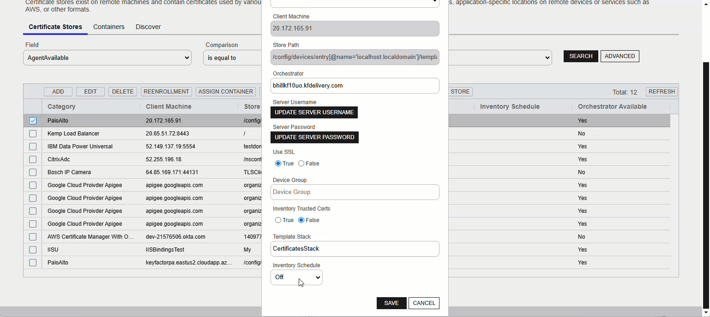
TC22|Panorama Template Virtual System Replace unbound Certificate|/config/devices/entry/template/entry[@name='CertificatesTemplate']/config/devices/entry/vsys/entry[@name='vsys2']|**Alias**:<br>www.vsys2enroll.com|Certificate is replaced in vsys2 location for template|True|
TC23|Panorama Template Virtual System Remove unbound Certificate|/config/devices/entry/template/entry[@name='CertificatesTemplate']/config/devices/entry/vsys/entry[@name='vsys2']|**Alias**:<br>www.vsys2enroll.com|Certificate is removed in vsys2 location for template|True|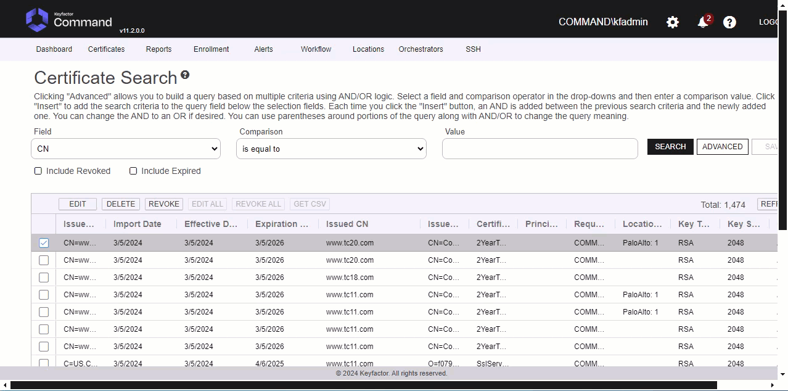
TC24|Panorama Template Virtual System Renew bound Certificate|/config/devices/entry/template/entry[@name='CertificatesTemplate']/config/devices/entry/vsys/entry[@name='vsys2']|**Alias**:<br>www.vsys2enroll.com|Certificate is renewed, binding updated in vsys2 location for template|True|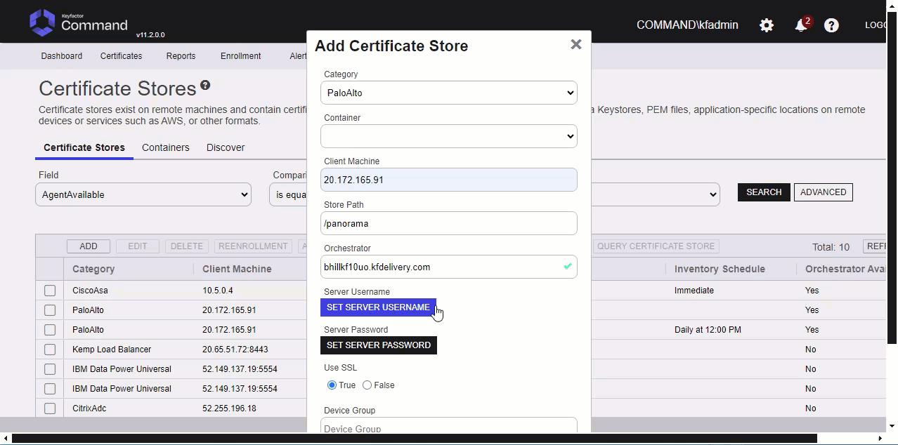
TC25|Panorama Level Inventory|/config/panorama|N/A|Certificates are inventoried from this location|True|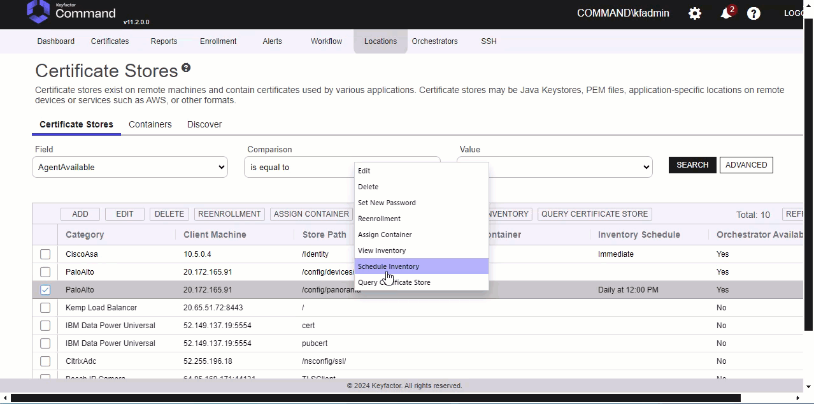
TC26|Panorama Level Enroll Cert and Chain|/config/panorama|**Alias**:<br>www.panlevelcertandchain.com|Panorama Level Install Cert and Chain|True|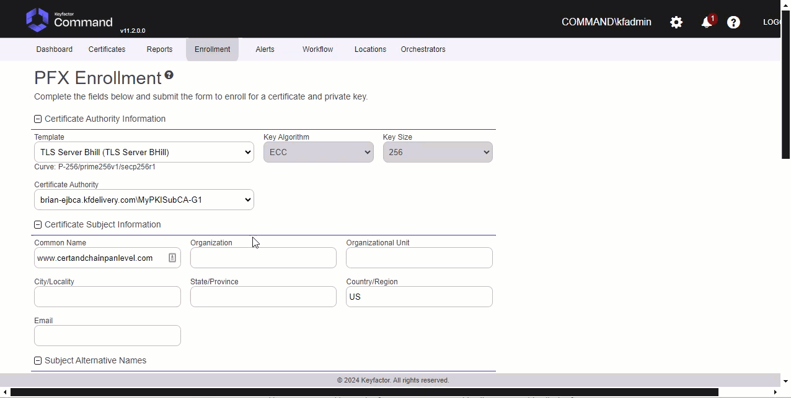
TC27|Panorama Level Enroll Cert overwrite warning|/config/panorama|**Alias**:<br>www.panlevelcertandchain.com<br>**Overwrite**:<br>false|Cert is not installed warned Overwrite is needed|True|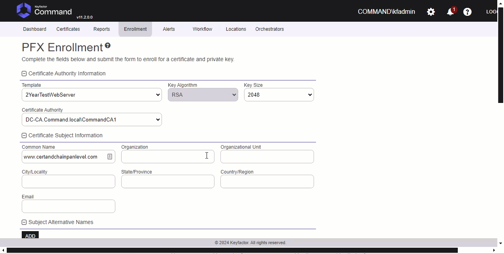
TC28|Panorama Level Replace Cert|/config/panorama|**Alias**:<br>www.panlevelcertandchain.com<br>**Overwrite**:<br>true|Cert is replaced because Overwrite was used|True|
TC29|Panorama Level Remove  unbound Cert|/config/panorama|N/A|Cert is removed because not bound|True|
TC30|Panorama Level Replace bound Cert|/config/panorama|**Alias**:<br>PanoramaNoPK<br>**Overwrite**:<br>true|Cert is replaced, binding updated|True|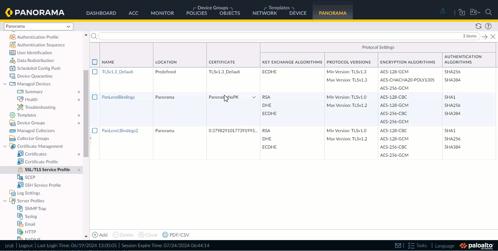
TC31|Firewall previous version cert store settings|/config/shared|**Alias**:<br>www.extraparams.com<br>**Overwrite**:<br>false|Cert is still installed because it ignores extra params|True|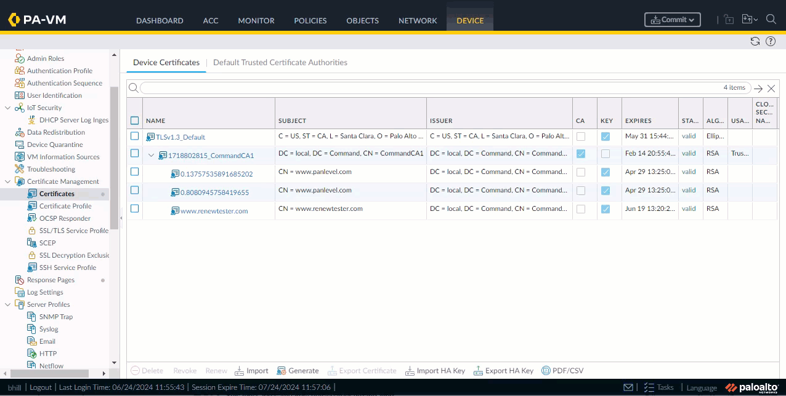
</details>

## License

Apache License 2.0, see [LICENSE](LICENSE).

## Related Integrations

See all [Keyfactor Universal Orchestrator extensions](https://github.com/orgs/Keyfactor/repositories?q=orchestrator).
