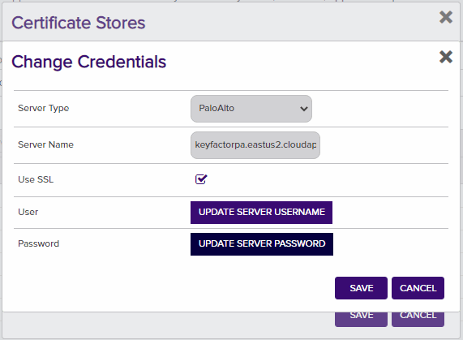

# Palo Alto PA-VM Firewall

Palo Alto PA-VM Firewall Orchestrator for Add, Remove and Inventory.

#### Integration status: Production - Ready for use in production environments.

## About the Keyfactor Universal Orchestrator Capability

This repository contains a Universal Orchestrator Capability which is a plugin to the Keyfactor Universal Orchestrator. Within the Keyfactor Platform, Orchestrators are used to manage “certificate stores” &mdash; collections of certificates and roots of trust that are found within and used by various applications.

The Universal Orchestrator is part of the Keyfactor software distribution and is available via the Keyfactor customer portal. For general instructions on installing Capabilities, see the “Keyfactor Command Orchestrator Installation and Configuration Guide” section of the Keyfactor documentation. For configuration details of this specific Capability, see below in this readme.

The Universal Orchestrator is the successor to the Windows Orchestrator. This Capability plugin only works with the Universal Orchestrator and does not work with the Windows Orchestrator.


## Support for Palo Alto PA-VM Firewall

Palo Alto PA-VM Firewall is supported by Keyfactor for Keyfactor customers. If you have a support issue, please open a support ticket with your Keyfactor representative.

###### To report a problem or suggest a new feature, use the **[Issues](../../issues)** tab. If you want to contribute actual bug fixes or proposed enhancements, use the **[Pull requests](../../pulls)** tab.
___


---


## Keyfactor Version Supported

The minimum version of the Keyfactor Universal Orchestrator Framework needed to run this version of the extension is 10.1

## Platform Specific Notes

The Keyfactor Universal Orchestrator may be installed on either Windows or Linux based platforms. The certificate operations supported by a capability may vary based what platform the capability is installed on. The table below indicates what capabilities are supported based on which platform the encompassing Universal Orchestrator is running.
| Operation | Win | Linux |
|-----|-----|------|
|Supports Management Add|&check; |  |
|Supports Management Remove|&check; |  |
|Supports Create Store|  |  |
|Supports Discovery|  |  |
|Supports Renrollment|&check; |  |
|Supports Inventory|&check; |  |


## PAM Integration

This orchestrator extension has the ability to connect to a variety of supported PAM providers to allow for the retrieval of various client hosted secrets right from the orchestrator server itself.  This eliminates the need to set up the PAM integration on Keyfactor Command which may be in an environment that the client does not want to have access to their PAM provider.

The secrets that this orchestrator extension supports for use with a PAM Provider are:

|Name|Description|
|----|-----------|
|ServerPassword|Key obtained from Palo Alto API to authenticate the server hosting the store|


It is not necessary to implement all of the secrets available to be managed by a PAM provider.  For each value that you want managed by a PAM provider, simply enter the key value inside your specific PAM provider that will hold this value into the corresponding field when setting up the certificate store, discovery job, or API call.

Setting up a PAM provider for use involves adding an additional section to the manifest.json file for this extension as well as setting up the PAM provider you will be using.  Each of these steps is specific to the PAM provider you will use and are documented in the specific GitHub repo for that provider.  For a list of Keyfactor supported PAM providers, please reference the [Keyfactor Integration Catalog](https://keyfactor.github.io/integrations-catalog/content/pam).


### Register the PAM Provider

A PAM Provider needs to be registered on the Universal Orchestrator in the same way other extensions are. Create a folder for the specific PAM Provider to be added, and place the contents of the PAM Provider into the folder. There needs to be a manifest.json with the PAM Provider.

After a manifest.json is added, the final step for configuration is setting the "provider-level" parameters for the PAM Provider. These are also known as the "initialization-level" parameters. These need to be placed in a json file that gets loaded by the Orchestrator by default. 

example manifest.json for MY-PROVIDER-NAME
```
{
    "extensions": {
        "Keyfactor.Platform.Extensions.IPAMProvider": {
            "PAMProviders.MY-PROVIDER-NAME.PAMProvider": {
                "assemblyPath": "my-pam-provider.dll",
                "TypeFullName": "Keyfactor.Extensions.Pam.MyPamProviderClass"
            }
        }
    },
    "Keyfactor:PAMProviders:MY-PROVIDER-NAME:InitializationInfo": {
        "InitParam1": "InitValue1",
        "InitParam2": "InitValue2"
    }
}
```


---


**Palo Alto Orchestrator Device Configuration**

**Overview**

The Palo Alto Orchestrator remotely manages certificates on either the Palo Alto PA-VM Firewall Device or the Panorama.  If using Panorama, it will push changes to all the devices from Panorama.

This agent implements three job types – Inventory, Management Add, and Management Remove. Below are the steps necessary to configure this Orchestrator.  It supports adding certificates with or without private keys.

NOTE: Palo Alto does not support incremental certificate inventory. If you have large numbers of certificates in your environment it is recommended to limit the frequency of inventory jobs to 30 minutes or more.

**1. Create the New Certificate Store Type for either the PA-VM Firewall Device or Panorama**

In Keyfactor Command create a new Certificate Store Type similar to the one below:

#### STORE TYPE CONFIGURATION
SETTING TAB  |  CONFIG ELEMENT	| DESCRIPTION
------|-----------|------------------
Basic |Name	|Descriptive name for the Store Type.  PaloAlto can be used.
Basic |Short Name	|The short name that identifies the registered functionality of the orchestrator. Must be PaloAlto
Basic |Custom Capability|You can leave this unchecked and use the default.
Basic |Job Types	|Inventory, Add, and Remove are the supported job types. 
Basic |Needs Server	|Must be checked
Basic |Blueprint Allowed	|Unchecked
Basic |Requires Store Password	|Determines if a store password is required when configuring an individual store.  This must be unchecked.
Basic |Supports Entry Password	|Determined if an individual entry within a store can have a password.  This must be unchecked.
Advanced |Store Path Type| Determines how the user will enter the store path when setting up the cert store.  Freeform
Advanced |Supports Custom Alias	|Determines if an individual entry within a store can have a custom Alias.  This must be Required
Advanced |Private Key Handling |Determines how the orchestrator deals with private keys.  Optional
Advanced |PFX Password Style |Determines password style for the PFX Password. Default

#### CUSTOM FIELDS FOR STORE TYPE
NAME          |  DISPLAY NAME	| TYPE | DEFAULT VALUE | DEPENDS ON | REQUIRED |DESCRIPTION
--------------|-----------------|-------|--------------|-------------|---------|--------------
ServerUsername|Server Username  |Secret |              |Unchecked    |Yes       |Palo Alto Api User Name
ServerPassword|Server Password  |Secret |              |Unchecked    |Yes       |Palo Alto Api Password
ServerUseSsl  |Use SSL          |Bool   |True          |Unchecked    |Yes       |Requires SSL Connection
DeviceGroup   |Device Group     |String |              |Unchecked    |No        |Device Group on Panorama that changes will be pushed to.

#### ENTRY PARAMETERS FOR STORE TYPE
NAME          |  DISPLAY NAME	| TYPE           | DEFAULT VALUE | DEPENDS ON | REQUIRED WHEN |DESCRIPTION
--------------|-----------------|----------------|-------------- |-------------|---------------|--------------
Trusted Root  |Trusted Root     |Bool            |False          |Unchecked    |Adding an Entry|Will set the certificate as Trusted Root in Panorama or on the Firewall
TlsMinVersion |TLS Min Version  |Multiple Choice |              |Unchecked    |Yes           |Palo Alto Api Password
ServerUseSsl  |Use SSL          |Bool   |True          |Unchecked    |Yes           |Requires SSL Connection
DeviceGroup   |Device Group     |String |              |Unchecked    |No            |Device Group on Panorama that changes will be pushed to

Entry Parameters|Display Name| Trusted Root
Entry Parameters|Type|Boolean
Entry Parameters|Default Value|false
Entry Parameters|Required When|Adding an Entry


**2. Register the PaloAlto Orchestrator with Keyfactor**
See Keyfactor InstallingKeyfactorOrchestrators.pdf Documentation.  Get from your Keyfactor contact/representative.

**3. Create a Palo Alto Certificate Store within Keyfactor Command**

In Keyfactor Command create a new Certificate Store similar to the one below




#### STORE CONFIGURATION 
CONFIG ELEMENT	|DESCRIPTION
----------------|---------------
Category	|The type of certificate store to be configured. Select category based on the display name configured above "PaloAlto".
Container	|This is a logical grouping of like stores. This configuration is optional and does not impact the functionality of the store.
Client Machine	|The hostname of the PA-VM Firewall.  Sample is "keyfactorpa.eastus2.cloudapp.azure.com".
Store Path	|device
Orchestrator	|This is the orchestrator server registered with the appropriate capabilities to manage this certificate store type. 
Inventory Schedule	|The interval that the system will use to report on what certificates are currently in the store. 
Use SSL	|This should be checked.
User	|This is not necessary.
Password |This is the API Key obtained from the Palo Alto PA-VM Firewall Device.  This will have to be obtained by making the following API Call.

*** 

#### TEST CASES
Case Number|Store Path|GroupName|Case Name|Enrollment Params|Expected Results|Passed|Screenshot
----|-------|---------|---------------|------------------------------------|--------------|----------------|-------------------------
PAN-01|CertificatesTemplate|Group1|Install New Cert No Bindings Deploy to Firewall|**Alias:** TC1<br/>**BindingName:**<br/>**TLSMinVersion:**:<br/>**TlsMaxVersion:**<br/>**TrustedRoot:**:False<br/>**Overwrite:**False|Install Cert Deploy To Devices Warn About Bindings|True|  
PAN-02|CertificatesTemplate|Group1|Install New Cert No Bindings Deploy to Firewall Trusted Root|**Alias:** TCPAN02<br/>**BindingName:**<br/>**TLSMinVersion:**:<br/>**TlsMaxVersion:**<br/>**TrustedRoot:**:True<br/>**Overwrite:**False|Install Cert Deploy To Devices Warn About Bindings and Cert is Trusted Root|True|  
PAN-03|CertificatesTemplate|Group1|Install New Cert With Bindings Deploy to Firewall **not** Trusted Root|**Alias:** TCPAN03<br/>**BindingName:**TestBindings<br/>**TLSMinVersion:**:tls1-2<br/>**TlsMaxVersion:**max<br/>**TrustedRoot:**:False<br/>**Overwrite:**False|Install Cert Deploy To Devices and Bind To Tls Profile|True|   
PAN-04|CertificatesTemplate|Group1|Install New Cert With Bindings Deploy to Firewall Trusted Root|**Alias:** PANTC04<br/>**BindingName:**TestBindings<br/>**TLSMinVersion:**:tls1-2<br/>**TlsMaxVersion:**max<br/>**TrustedRoot:**:True<br/>**Overwrite:**False|Install Cert Deploy To Devices and Bind To Tls Profile cert is Trusted Root|True|   
PAN-05|CertificatesTemplate|Group1|Overwrite Bound Certificate **Without** Overwrite Flag|**Alias:** PANTC04<br/>**BindingName:**TestBindings<br/>**TLSMinVersion:**:tls1-2<br/>**TlsMaxVersion:**max<br/>**TrustedRoot:**:True<br/>**Overwrite:**False|Keyfactor will not allow this without overwrite flag and will throw error|True|
PAN-06|CertificatesTemplate|Group1|Overwrite Bound Certificate **With** Overwrite Flag|**Alias:** PANTC04<br/>**BindingName:**TestBindings<br/>**TLSMinVersion:**:tls1-2<br/>**TlsMaxVersion:**max<br/>**TrustedRoot:**:True<br/>**Overwrite:**True|Error Is Returned because private keys don't match|True|
PAN-07|CertificatesTemplate|Group1|Overwrite Unbound Certificate **With** Overwrite Flag|**Alias:** TCPAN02<br/>**BindingName:**<br/>**TLSMinVersion:**:<br/>**TlsMaxVersion:**<br/>**TrustedRoot:**:False<br/>**Overwrite:**True|Certificate will be replaced in Panorama|True|


