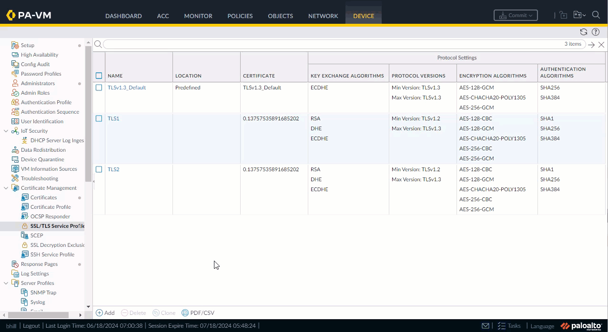
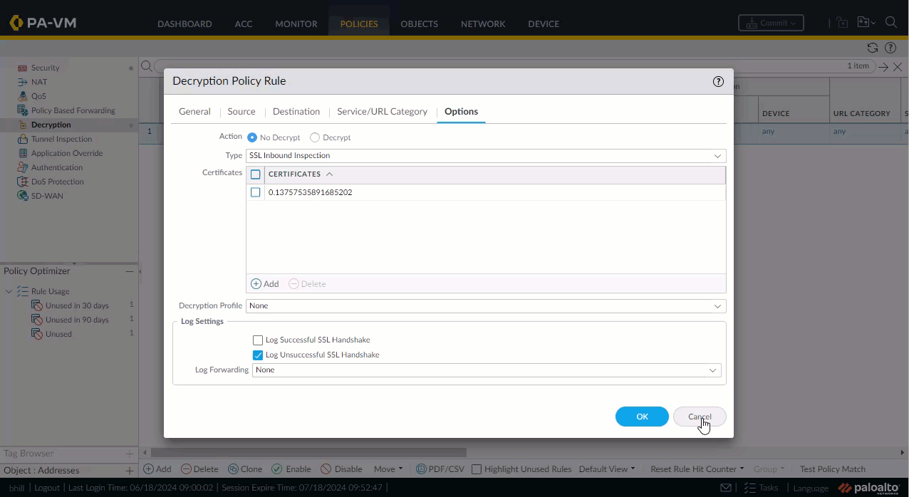
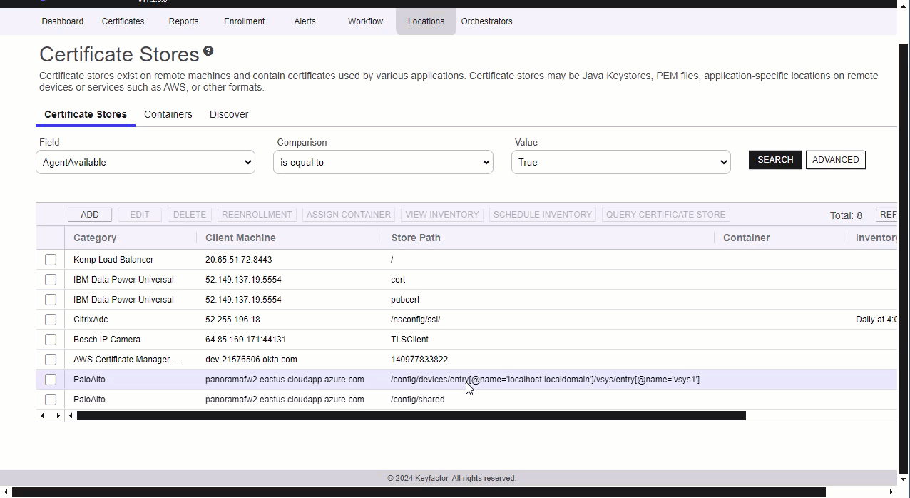
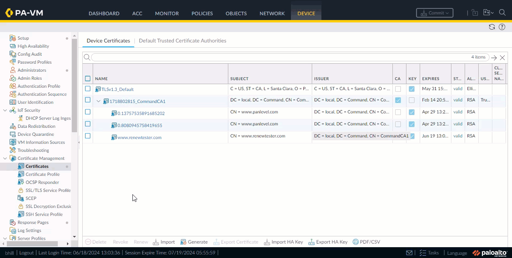
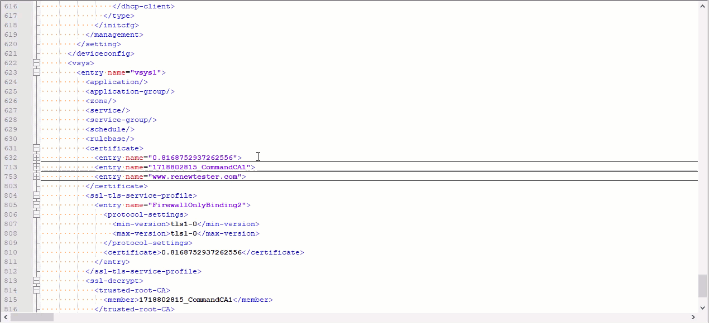
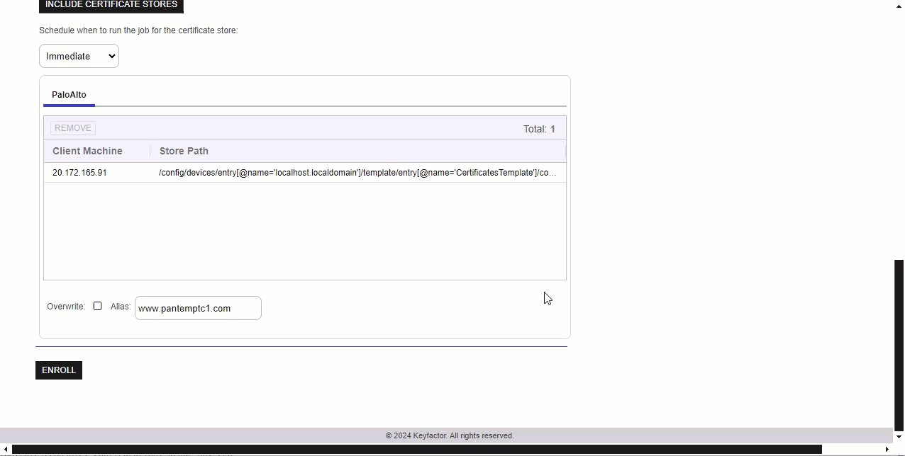
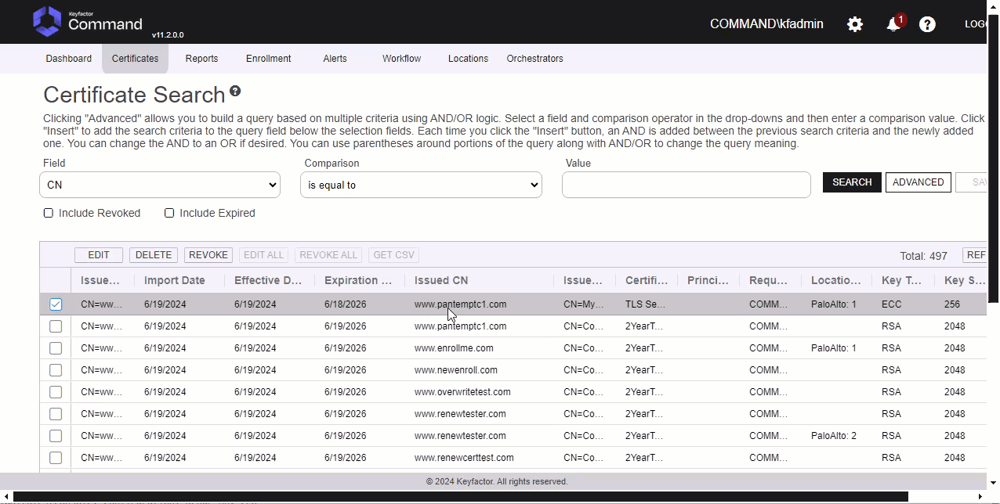
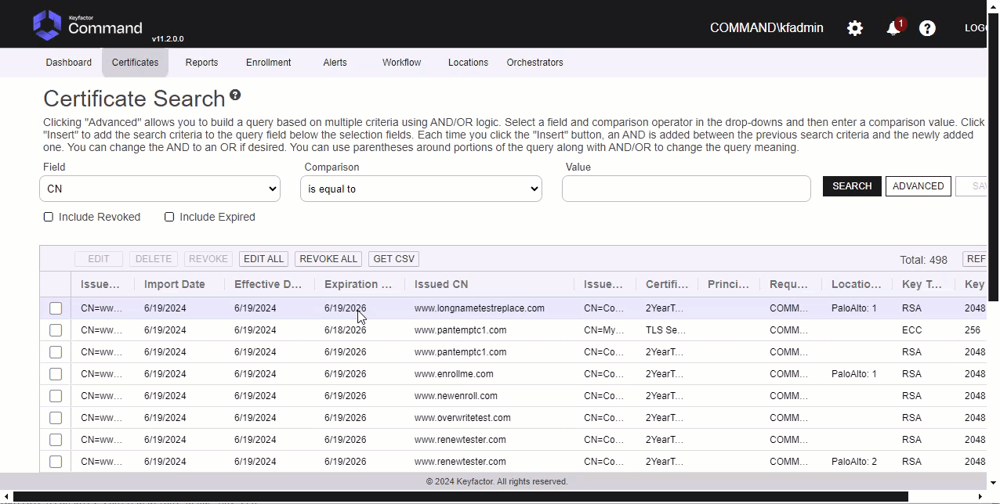
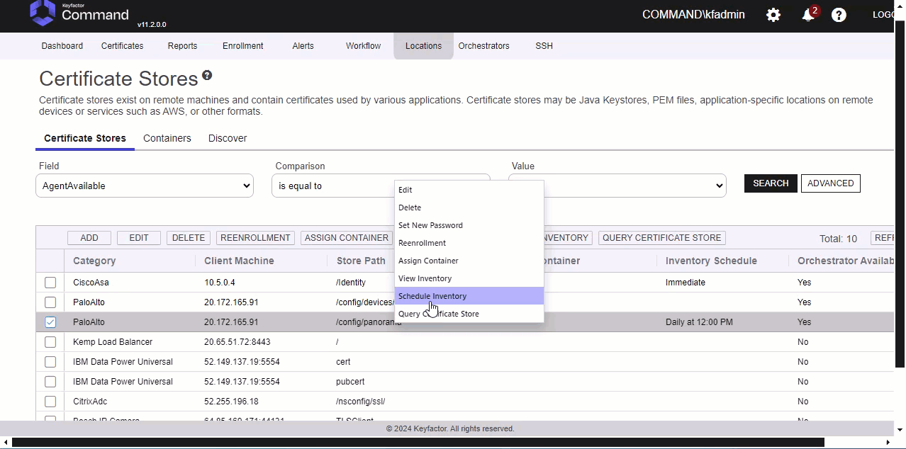

# Palo Alto Orchestrator

The Palo Alto Orchestrator remotely manages certificates on either the Palo Alto PA-VM Firewall Device or the Panorama.  If using Panorama, it will push changes to all the devices from Panorama.  It supports adding certificates with or without private keys.  Palo Alto does not support incremental certificate inventory. If you have large numbers of certificates in your environment it is recommended to limit the frequency of inventory jobs to 30 minutes or more.

#### Integration status: Production - Ready for use in production environments.

## About the Keyfactor Universal Orchestrator Extension

This repository contains a Universal Orchestrator Extension which is a plugin to the Keyfactor Universal Orchestrator. Within the Keyfactor Platform, Orchestrators are used to manage “certificate stores” &mdash; collections of certificates and roots of trust that are found within and used by various applications.

The Universal Orchestrator is part of the Keyfactor software distribution and is available via the Keyfactor customer portal. For general instructions on installing Extensions, see the “Keyfactor Command Orchestrator Installation and Configuration Guide” section of the Keyfactor documentation. For configuration details of this specific Extension see below in this readme.

The Universal Orchestrator is the successor to the Windows Orchestrator. This Orchestrator Extension plugin only works with the Universal Orchestrator and does not work with the Windows Orchestrator.

## Support for Palo Alto Orchestrator

Palo Alto Orchestrator is supported by Keyfactor for Keyfactor customers. If you have a support issue, please open a support ticket via the Keyfactor Support Portal at https://support.keyfactor.com

###### To report a problem or suggest a new feature, use the **[Issues](../../issues)** tab. If you want to contribute actual bug fixes or proposed enhancements, use the **[Pull requests](../../pulls)** tab.

---

## Keyfactor Version Supported

The minimum version of the Keyfactor Universal Orchestrator Framework needed to run this version of the extension is 10.1

## Platform Specific Notes

The Keyfactor Universal Orchestrator may be installed on either Windows or Linux based platforms. The certificate operations supported by a capability may vary based what platform the capability is installed on. The table below indicates what capabilities are supported based on which platform the encompassing Universal Orchestrator is running.
| Operation | Win | Linux |
|-----|-----|------|
|Supports Management Add|&check; |  |
|Supports Management Remove|&check; |  |
|Supports Create Store|  |  |
|Supports Discovery|  |  |
|Supports Renrollment|  |  |
|Supports Inventory|&check; |  |

## PAM Integration

This orchestrator extension has the ability to connect to a variety of supported PAM providers to allow for the retrieval of various client hosted secrets right from the orchestrator server itself.  This eliminates the need to set up the PAM integration on Keyfactor Command which may be in an environment that the client does not want to have access to their PAM provider.

The secrets that this orchestrator extension supports for use with a PAM Provider are:

|Name|Description|
|----|-----------|
|ServerPassword|Key obtained from Palo Alto API to authenticate the server hosting the store|

It is not necessary to use a PAM Provider for all of the secrets available above. If a PAM Provider should not be used, simply enter in the actual value to be used, as normal.

If a PAM Provider will be used for one of the fields above, start by referencing the [Keyfactor Integration Catalog](https://keyfactor.github.io/integrations-catalog/content/pam). The GitHub repo for the PAM Provider to be used contains important information such as the format of the `json` needed. What follows is an example but does not reflect the `json` values for all PAM Providers as they have different "instance" and "initialization" parameter names and values.

General PAM Provider Configuration

### Example PAM Provider Setup

To use a PAM Provider to resolve a field, in this example the __Server Password__ will be resolved by the `Hashicorp-Vault` provider, first install the PAM Provider extension from the [Keyfactor Integration Catalog](https://keyfactor.github.io/integrations-catalog/content/pam) on the Universal Orchestrator.

Next, complete configuration of the PAM Provider on the UO by editing the `manifest.json` of the __PAM Provider__ (e.g. located at extensions/Hashicorp-Vault/manifest.json). The "initialization" parameters need to be entered here:

~~~ json
  "Keyfactor:PAMProviders:Hashicorp-Vault:InitializationInfo": {
    "Host": "http://127.0.0.1:8200",
    "Path": "v1/secret/data",
    "Token": "xxxxxx"
  }
~~~

After these values are entered, the Orchestrator needs to be restarted to pick up the configuration. Now the PAM Provider can be used on other Orchestrator Extensions.

### Use the PAM Provider
With the PAM Provider configured as an extenion on the UO, a `json` object can be passed instead of an actual value to resolve the field with a PAM Provider. Consult the [Keyfactor Integration Catalog](https://keyfactor.github.io/integrations-catalog/content/pam) for the specific format of the `json` object.

To have the __Server Password__ field resolved by the `Hashicorp-Vault` provider, the corresponding `json` object from the `Hashicorp-Vault` extension needs to be copied and filed in with the correct information:

~~~ json
{"Secret":"my-kv-secret","Key":"myServerPassword"}
~~~

This text would be entered in as the value for the __Server Password__, instead of entering in the actual password. The Orchestrator will attempt to use the PAM Provider to retrieve the __Server Password__. If PAM should not be used, just directly enter in the value for the field.

 

---

## CERT STORE SETUP AND GENERAL PERMISSIONS

	
Cert Store Type Configuration

	
In Keyfactor Command create a new Certificate Store Type similar to the one below:

#### STORE TYPE CONFIGURATION
SETTING TAB  |  CONFIG ELEMENT	| DESCRIPTION
------|-----------|------------------
Basic |Name	|Descriptive name for the Store Type.  PaloAlto can be used.
Basic |Short Name	|The short name that identifies the registered functionality of the orchestrator. Must be PaloAlto
Basic |Custom Capability|You can leave this unchecked and use the default.
Basic |Job Types	|Inventory, Add, and Remove are the supported job types. 
Basic |Needs Server	|Must be checked
Basic |Blueprint Allowed	|Unchecked
Basic |Requires Store Password	|Determines if a store password is required when configuring an individual store.  This must be unchecked.
Basic |Supports Entry Password	|Determined if an individual entry within a store can have a password.  This must be unchecked.
Advanced |Store Path Type| Determines how the user will enter the store path when setting up the cert store.  Freeform
Advanced |Supports Custom Alias	|Determines if an individual entry within a store can have a custom Alias.  This must be Required
Advanced |Private Key Handling |Determines how the orchestrator deals with private keys.  Optional
Advanced |PFX Password Style |Determines password style for the PFX Password. Default

#### CUSTOM FIELDS FOR STORE TYPE
NAME          |  DISPLAY NAME	| TYPE | DEFAULT VALUE | DEPENDS ON | REQUIRED |DESCRIPTION
--------------|-----------------|-------|--------------|-------------|---------|--------------
ServerUsername|Server Username  |Secret |              |Unchecked    |Yes       |Palo Alto Api User Name
ServerPassword|Server Password  |Secret |              |Unchecked    |Yes       |Palo Alto Api Password
ServerUseSsl  |Use SSL          |Bool   |True          |Unchecked    |Yes       |Requires SSL Connection
DeviceGroup   |Device Group     |String |              |Unchecked    |No        |Device Group on Panorama that changes will be pushed to.

#### ENTRY PARAMETERS FOR STORE TYPE
NAME          |  DISPLAY NAME	| TYPE           | DEFAULT VALUE | DEPENDS ON | REQUIRED WHEN |DESCRIPTION
--------------|-----------------|----------------|-------------- |-------------|---------------|--------------
TlsMinVersion |TLS Min Version  |Multiple Choice |               |Unchecked    |No             |Min TLS Version for the Binding (,tls1-0,tls1-1,tls1-2) note first multiple choice item is empty
TlsMaxVersion |TLS Max Version  |Multiple Choice |               |Unchecked    |No             |Max TLS Version for the Binding (,tls1-0,tls1-1,tls1-2,max) note first multiple choice item is empty
TlsProfileName|TLS Profile Name |String          |               |Unchecked    |No             |Name of the binding to deploy certificate to
ServerUseSsl  |Use SSL          |Bool            |True           |Unchecked    |Yes            |Requires SSL Connection

PaloAlto Certificate Store

In Keyfactor Command, navigate to Certificate Stores from the Locations Menu.  Click the Add button to create a new Certificate Store using the settings defined below.

#### STORE CONFIGURATION 
CONFIG ELEMENT	|DESCRIPTION
----------------|---------------
Category	|The type of certificate store to be configured. Select category based on the display name configured above "PaloAlto".
Container	|This is a logical grouping of like stores. This configuration is optional and does not impact the functionality of the store.
Client Machine	|The hostname of the Panorama or Firewall.  Sample is "palourl.cloudapp.azure.com".
Store Path	| **Panorama Level Certs:** /config/panorama **Firewall Certs:** /config/shared **Panorama Template Certs:** /config /devices /entry[@name='localhost.localdomain'] /template /entry[@name='CertificatesTemplate'] /config /shared  if using Panorama Templates where 'CertificateTemplate' is the actual name of the template
Orchestrator	|This is the orchestrator server registered with the appropriate capabilities to manage this certificate store type. 
Inventory Schedule	|The interval that the system will use to report on what certificates are currently in the store. 
Use SSL	|This should be checked.
User	|ApiUser Setup for either Panorama or the Firewall Device
Password |Api Password Setup for the user above

API User Setup Permissions in Panorama or Firewall Required

Tab          |  Security Items	
--------------|--------------------------
Xml Api       |Report,Log,Configuration,Operational Requests,Commit,Export,Import
Rest Api      |Objects/Devices,Panorama/Scheduled Config Push,Panorama/Templates,Panorama/Template Stacks,Panorama/Device Groups,System/Configuration,Plugins/Plugins
*** 

## Test Cases

Firewall, Panorama Template and Panorama Level

Case Number|Case Name|Store Path|Enrollment Params|Expected Results|Passed|Screenshots
-------|----------|------------------|--------------------|----------------------------|----|--------
TC1|Firewall Enroll No Bindings|/config/shared|**Alias**: www.certandchain.com **Overwrite**: false|Cert and Chain Installed on Firewall|True|
TC2|Firewall Replace No Bindings|/config/shared|**Alias**: www.certandchain.com **Overwrite**: true|Cert and Chain Installed on Firewall|True|
TC2|Firewall Remove No Bindings|/config/shared|**Alias**: TC1|Cert Removed From Firewall|True|
TC3|Firewall Enroll Bindings|/config/shared|**Alias**: TC3 **TLS Min Version**: tls1-0 **TLS Max Version**: max **TLS Profile Name**: FirewallOnlyBinding|Cert added to Firewall and Bound to TLS Profile|True|
TC4|Firewall Remove Bound Certificate|/config/shared|N/A|Will not Remove Bound certificate Error Occurs|True|
TC5|Firewall One Click Renew Bound Cert|/config/shared|N/A|Renews cert create with new name bind.  Leave old one around.|True|
TC6|Firewall Configure Renew Bound Cert|/config/shared|N/A|Renews cert create with new name bind.  Leave old one around.|True|
TC7|Firewall Invalid Store Path|/config|N/A|Errors out with Invalid path.|True|
TC8|Firewall Inventory|/config/shared|N/A|Job Completes with Inventory of certificates from Firewall.|True|
TC9|Panorama Template Enroll No Bindings|/config /devices /entry[@name= 'localhost.localdomain'] /template /entry[@name= 'CertificatesTemplate'] /config /shared|**Alias**: TC9|Cert and Chain Installed on Panorama Template and pushed to the firewall.|True|
TC10|Panorama Template Remove No Bindings|/config /devices /entry[@name= 'localhost.localdomain'] /template /entry[@name= 'CertificatesTemplate'] /config /shared|**Alias**: TC9|Cert Removed From Panorama and pushed to firewalls|True|
TC11|Panorama Template Enroll Bindings|/config /devices /entry[@name= 'localhost.localdomain'] /template/entry[@name= 'CertificatesTemplate'] /config /shared|**Alias**: TC11 **TLS Min Version**: tls1-0 **TLS Max Version**: max **TLS Profile Name**: TestBindings|Cert added to Pan Template, Bound to TLS Profile and pushed to firewalls|True|
TC12|Panorama Template Remove Bound Certificate|/config /devices /entry[@name= 'localhost.localdomain'] /template /entry[@name= 'CertificatesTemplate'] /config/ shared|N/A|Will Not Remove Certificate because it is bound.  Error will show.|True|
TC13|Panorama Template One Click Renew Bound Cert|/config /devices /entry[@name= 'localhost.localdomain'] /template /entry[@name= 'CertificatesTemplate'] /config/ shared|N/A|Renews cert create with new name bind.  Leave old one around.  Push to Firewalls|True|
TC14|Panorama Template Configure Renew Bound Cert|/config /devices /entry[@name= 'localhost.localdomain'] /template /entry[@name= 'CertificatesTemplate'] /config/ shared|N/A|Renews cert create with new name bind.  Leave old one around.|True|
TC15|Panorama Template Invalid **Template** in Store Path|/config /devices /entry[@name= 'localhost.localdomain'] /template /entry[@name= 'CertificatesTemplate1'] /config/ shared|N/A|Errors out saying template does not exist|True|
TC16|Panorama Template Invalid Store Path|/config /devices[@name= 'CertificatesTemplate1'] /config /shared|N/A|Errors out saying invalid path|True|
TC17|Panorama Template Inventory|/config /devices /entry [@name= 'localhost.localdomain'] /template /entry[@name= 'CertificatesTemplate'] /config / shared|N/A|Job Completes with Inventory of certificates from Panorama Template.|True|
TC18|Panorama Enroll No Bindings|/config/panorama|**Alias**: TC18|Cert and Chain Installed on Panorama|True|
TC19|Panorama Remove No Bindings|/config/panorama|**Alias**: TC19|Cert Removed From Panorama|True|
TC20|Panorama Add Bindings|/config/panorama|**Alias**: TC20 **TLS Min Version**: tls1-0 **TLS Max Version**: max **TLS Profile Name**: PanLevelBindings|Cert added to Panorama and Bound to TLS Profile|True|
TC21|Panorama Remove Bound Certificate|/config/panorama|N/A|Will not Remove Bound certificate Error Occurs|True|
TC22|Panorama One Click Renew Bound Cert|/config/panorama|N/A|Renews cert create with new name bind.  Leave old one around.|True|
TC23|Panorama Configure Renew Bound Cert|/config/panorama|N/A|Renews cert create with new name bind.  Leave old one around.|True|
TC24|Panorama Invalid Store Path|/panorama|N/A|Errors out with Invalid path.|True|
TC25|Panorama Inventory|/config/panorama|N/A|Job Completes with Inventory of certificates from Panorama.|True|

