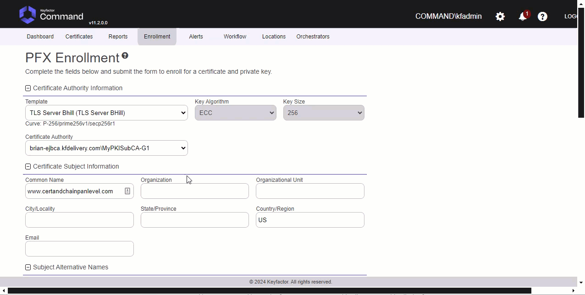
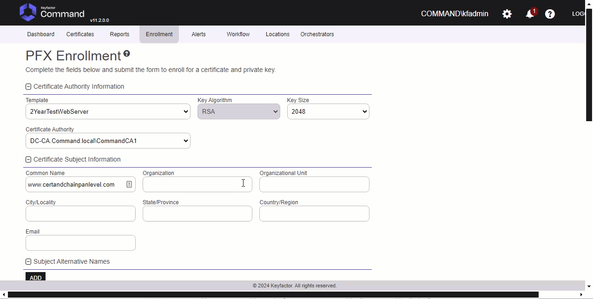
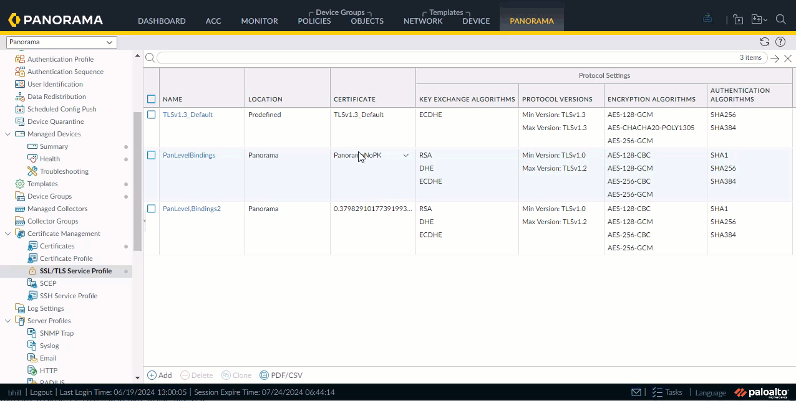
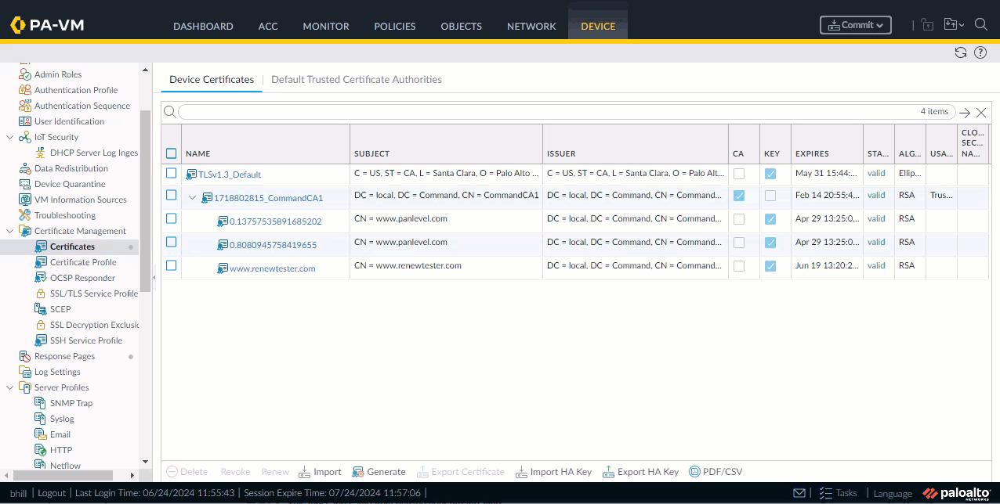

<h1 align="center" style="border-bottom: none">
    Palo Alto Universal Orchestrator Extension
</h1>

<p align="center">
  <!-- Badges -->

<a href="https://github.com/Keyfactor/paloalto-firewall-orchestrator/releases"></a>


</p>

<p align="center">
  <!-- TOC -->
  <a href="#support">
    <b>Support</b>
  </a>
  ·
  <a href="#installation">
    <b>Installation</b>
  </a>
  ·
  <a href="#license">
    <b>License</b>
  </a>
  ·
  <a href="https://github.com/orgs/Keyfactor/repositories?q=orchestrator">
    <b>Related Integrations</b>
  </a>
</p>

## Overview

TODO Overview is a required section


### PaloAlto
TODO Global Store Type Section is an optional section. If this section doesn't seem necessary on initial glance, please delete it. Refer to the docs on [Confluence](https://keyfactor.atlassian.net/wiki/x/SAAyHg) for more info


TODO Overview is a required section

## Compatibility

This integration is compatible with Keyfactor Universal Orchestrator version 10.4 and later.

## Support
The Palo Alto Universal Orchestrator extension is supported by Keyfactor for Keyfactor customers. If you have a support issue, please open a support ticket with your Keyfactor representative. If you have a support issue, please open a support ticket via the Keyfactor Support Portal at https://support.keyfactor.com. 
 
> To report a problem or suggest a new feature, use the **[Issues](../../issues)** tab. If you want to contribute actual bug fixes or proposed enhancements, use the **[Pull requests](../../pulls)** tab.

## Requirements & Prerequisites

Before installing the Palo Alto Universal Orchestrator extension, we recommend that you install [kfutil](https://github.com/Keyfactor/kfutil). Kfutil is a command-line tool that simplifies the process of creating store types, installing extensions, and instantiating certificate stores in Keyfactor Command.


### PaloAlto Requirements
TODO Global Store Type Section is an optional section. If this section doesn't seem necessary on initial glance, please delete it. Refer to the docs on [Confluence](https://keyfactor.atlassian.net/wiki/x/SAAyHg) for more info


TODO Requirements is an optional section. If this section doesn't seem necessary on initial glance, please delete it. Refer to the docs on [Confluence](https://keyfactor.atlassian.net/wiki/x/SAAyHg) for more info


## Create the PaloAlto Certificate Store Type

To use the Palo Alto Universal Orchestrator extension, you **must** create the PaloAlto Certificate Store Type. This only needs to happen _once_ per Keyfactor Command instance.


TODO Global Store Type Section is an optional section. If this section doesn't seem necessary on initial glance, please delete it. Refer to the docs on [Confluence](https://keyfactor.atlassian.net/wiki/x/SAAyHg) for more info


* **Create PaloAlto using kfutil**:

    ```shell
    # PaloAlto
    kfutil store-types create PaloAlto
    ```

* **Create PaloAlto manually in the Command UI**:
    <details><summary>Create PaloAlto manually in the Command UI</summary>

    Create a store type called `PaloAlto` with the attributes in the tables below:

    #### Basic Tab
    | Attribute | Value | Description |
    | --------- | ----- | ----- |
    | Name | PaloAlto | Display name for the store type (may be customized) |
    | Short Name | PaloAlto | Short display name for the store type |
    | Capability | PaloAlto | Store type name orchestrator will register with. Check the box to allow entry of value |
    | Supports Add | ✅ Checked | Check the box. Indicates that the Store Type supports Management Add |
    | Supports Remove | ✅ Checked | Check the box. Indicates that the Store Type supports Management Remove |
    | Supports Discovery | 🔲 Unchecked |  Indicates that the Store Type supports Discovery |
    | Supports Reenrollment | 🔲 Unchecked |  Indicates that the Store Type supports Reenrollment |
    | Supports Create | 🔲 Unchecked |  Indicates that the Store Type supports store creation |
    | Needs Server | ✅ Checked | Determines if a target server name is required when creating store |
    | Blueprint Allowed | 🔲 Unchecked | Determines if store type may be included in an Orchestrator blueprint |
    | Uses PowerShell | 🔲 Unchecked | Determines if underlying implementation is PowerShell |
    | Requires Store Password | 🔲 Unchecked | Enables users to optionally specify a store password when defining a Certificate Store. |
    | Supports Entry Password | 🔲 Unchecked | Determines if an individual entry within a store can have a password. |

    The Basic tab should look like this:

    

    #### Advanced Tab
    | Attribute | Value | Description |
    | --------- | ----- | ----- |
    | Supports Custom Alias | Required | Determines if an individual entry within a store can have a custom Alias. |
    | Private Key Handling | Optional | This determines if Keyfactor can send the private key associated with a certificate to the store. Required because IIS certificates without private keys would be invalid. |
    | PFX Password Style | Default | 'Default' - PFX password is randomly generated, 'Custom' - PFX password may be specified when the enrollment job is created (Requires the Allow Custom Password application setting to be enabled.) |

    The Advanced tab should look like this:

    

    #### Custom Fields Tab
    Custom fields operate at the certificate store level and are used to control how the orchestrator connects to the remote target server containing the certificate store to be managed. The following custom fields should be added to the store type:

    | Name | Display Name | Description | Type | Default Value/Options | Required |
    | ---- | ------------ | ---- | --------------------- | -------- | ----------- |
    | ServerUsername | Server Username | Palo Alto or Panorama Api User. (or valid PAM key if the username is stored in a KF Command configured PAM integration). | Secret |  | 🔲 Unchecked |
    | ServerPassword | Server Password | Palo Alto or Panorama Api Password. (or valid PAM key if the username is stored in a KF Command configured PAM integration). | Secret |  | 🔲 Unchecked |
    | ServerUseSsl | Use SSL | Should be true, http is not supported. | Bool | true | ✅ Checked |
    | DeviceGroup | Device Group | Device Group on Panorama that changes will be pushed to. | String |  | 🔲 Unchecked |
    | InventoryTrustedCerts | Inventory Trusted Certs | If false, will not inventory default trusted certs, saves time. | Bool | false | ✅ Checked |
    | TemplateStack | Template Stack | Template stack used for device push of certificates via Template. | String |  | 🔲 Unchecked |

    The Custom Fields tab should look like this:

    


    </details>

## Installation

1. **Download the latest Palo Alto Universal Orchestrator extension from GitHub.** 

    Navigate to the [Palo Alto Universal Orchestrator extension GitHub version page](https://github.com/Keyfactor/paloalto-firewall-orchestrator/releases/latest). Refer to the compatibility matrix below to determine whether the `net6.0` or `net8.0` asset should be downloaded. Then, click the corresponding asset to download the zip archive.
    | Universal Orchestrator Version | Latest .NET version installed on the Universal Orchestrator server | `rollForward` condition in `Orchestrator.runtimeconfig.json` | `paloalto-firewall-orchestrator` .NET version to download |
    | --------- | ----------- | ----------- | ----------- |
    | Older than `11.0.0` | | | `net6.0` |
    | Between `11.0.0` and `11.5.1` (inclusive) | `net6.0` | | `net6.0` | 
    | Between `11.0.0` and `11.5.1` (inclusive) | `net8.0` | `Disable` | `net6.0` | 
    | Between `11.0.0` and `11.5.1` (inclusive) | `net8.0` | `LatestMajor` | `net8.0` | 
    | `11.6` _and_ newer | `net8.0` | | `net8.0` |

    Unzip the archive containing extension assemblies to a known location.

    > **Note** If you don't see an asset with a corresponding .NET version, you should always assume that it was compiled for `net6.0`.

2. **Locate the Universal Orchestrator extensions directory.**

    * **Default on Windows** - `C:\Program Files\Keyfactor\Keyfactor Orchestrator\extensions`
    * **Default on Linux** - `/opt/keyfactor/orchestrator/extensions`
    
3. **Create a new directory for the Palo Alto Universal Orchestrator extension inside the extensions directory.**
        
    Create a new directory called `paloalto-firewall-orchestrator`.
    > The directory name does not need to match any names used elsewhere; it just has to be unique within the extensions directory.

4. **Copy the contents of the downloaded and unzipped assemblies from __step 2__ to the `paloalto-firewall-orchestrator` directory.**

5. **Restart the Universal Orchestrator service.**

    Refer to [Starting/Restarting the Universal Orchestrator service](https://software.keyfactor.com/Core-OnPrem/Current/Content/InstallingAgents/NetCoreOrchestrator/StarttheService.htm).


6. **(optional) PAM Integration** 

    The Palo Alto Universal Orchestrator extension is compatible with all supported Keyfactor PAM extensions to resolve PAM-eligible secrets. PAM extensions running on Universal Orchestrators enable secure retrieval of secrets from a connected PAM provider.

    To configure a PAM provider, [reference the Keyfactor Integration Catalog](https://keyfactor.github.io/integrations-catalog/content/pam) to select an extension, and follow the associated instructions to install it on the Universal Orchestrator (remote).


> The above installation steps can be supplimented by the [official Command documentation](https://software.keyfactor.com/Core-OnPrem/Current/Content/InstallingAgents/NetCoreOrchestrator/CustomExtensions.htm?Highlight=extensions).


## Defining Certificate Stores


TODO Global Store Type Section is an optional section. If this section doesn't seem necessary on initial glance, please delete it. Refer to the docs on [Confluence](https://keyfactor.atlassian.net/wiki/x/SAAyHg) for more info

TODO Certificate Store Configuration is an optional section. If this section doesn't seem necessary on initial glance, please delete it. Refer to the docs on [Confluence](https://keyfactor.atlassian.net/wiki/x/SAAyHg) for more info


> The content in this section can be supplimented by the [official Command documentation](https://software.keyfactor.com/Core-OnPrem/Current/Content/ReferenceGuide/Certificate%20Stores.htm?Highlight=certificate%20store).


## Discovering Certificate Stores with the Discovery Job

### PaloAlto Discovery Job
TODO Global Store Type Section is an optional section. If this section doesn't seem necessary on initial glance, please delete it. Refer to the docs on [Confluence](https://keyfactor.atlassian.net/wiki/x/SAAyHg) for more info


TODO Discovery Job Configuration is an optional section. If this section doesn't seem necessary on initial glance, please delete it. Refer to the docs on [Confluence](https://keyfactor.atlassian.net/wiki/x/SAAyHg) for more info


## Release 2.2 Update on Entry Params
**Important Note** Entry params are no longer used.  This version of the extension will only update certs on existing bindings and not add a cert to a new binding location.  This was done to simplify the process since there are so many binding locations and reference issues.

**Important Note** Please review the new path considerations in the section below.  It explains how the paths work for Panorama and the Firewalls.  `'locahost.localdomain'` will always be that `constant value` do not make that **anything else!**.

## STORE PATH DETAILS AND API SECURITY CONSIDERATIONS
<details>
<summary>Store Path Permutations</summary>

### Store Path Explanation
**Important Note** The store path permutations are show below

#### FIREWALL SHARED SYSTEM PATH
_________________________________
**Path Example** /config/shared

**/config**:
This indicates that the path is within the configuration section of the firewall device. It contains all the configuration settings and parameters for the device.

**/shared**:
This section specifies that the path is within the shared settings. Shared settings are common configurations that can be used across multiple virtual systems (vsys) or contexts within the firewall.
_________________________________

#### FIREWALL VIRTUAL SYSTEM PATH
_________________________________
**Path Example**: /config/devices/entry[@name='localhost.localdomain']/vsys/entry[@name='vsys1']

**Note** `'locahost.localdomain'` will always be that `constant value` do not make that **anything else!**.

**/config**:
This indicates that the path is within the configuration section of the firewall device. It contains all the configuration settings and parameters for the device.

**/devices**:
This part specifies that the configuration relates to devices. In the context of a single firewall, this generally refers to the firewall itself.

**/entry[@name='localhost.localdomain']**:
Note `'locahost.localdomain'` will always be that `constant value` do not make that **anything else!**.  The entry tag with the attribute @name='localhost.localdomain' identifies a specific device by its name. In this case, it refers to the device named "localhost.localdomain," which is a default or placeholder name for the firewall device.

**/vsys**:
This section specifies that the path is within the virtual systems (vsys) section. Virtual systems allow multiple virtualized instances of firewall configurations within a single physical firewall.

**/entry[@name='vsys1']**:
The entry tag with the attribute @name='vsys1' identifies a specific virtual system by its name. In this case, it refers to a virtual system named "vsys1."
_________________________________

#### PANORAMA SHARED TEMPLATE PATH
_________________________________
**Path Example**: /config/devices/entry[@name='localhost.localdomain']/template/entry[@name='CertificatesTemplate']/config/shared

**Note** `'locahost.localdomain'` will always be that `constant value` do not make that **anything else!**.

**/config**:
This section indicates that the path is within the configuration section of the Panorama device. It contains all the configuration settings and parameters for the device.

**/devices**:
This part specifies that the configuration relates to devices managed by Panorama. Panorama can manage multiple devices, such as firewalls.

**/entry[@name='localhost.localdomain']**:
Note `'locahost.localdomain'` will always be that `constant value` do not make that **anything else!**.  The entry tag with the attribute @name='localhost.localdomain' identifies a specific device by its name. In this case, it refers to the device named "localhost.localdomain," which is a default or placeholder name for the device.

**/template**:
This section indicates that the path is within the templates section. Templates in Panorama are used to define configuration settings that can be applied to multiple devices.

**/entry[@name='CertificatesTemplate']**:
The entry tag with the attribute @name='CertificatesTemplate' identifies a specific template by its name. In this case, it refers to a template named "CertificatesTemplate."

**/config/shared**:
This part of the path indicates that the configuration settings within this template are shared settings. Shared settings are common configurations that can be used across multiple devices or contexts within the Panorama management system.
_________________________________

#### PANORAMA VIRTUAL SYSTEM PATH
__________________________________
**Path Example**: /config/devices/entry/template/entry[@name='CertificatesTemplate']/config/devices/entry/vsys/entry[@name='vsys2']

**/config**:
This indicates that the path is within the configuration section of the Panorama device. It contains all the configuration settings and parameters for the device.

**/devices**:
This part specifies that the configuration relates to devices managed by Panorama. Panorama can manage multiple devices, such as firewalls.

**/entry**:
This is a generic entry point under devices. However, since it does not have a @name attribute specified at this level, it applies to the broader device category.

**/template**:
This section indicates that the path is within the templates section. Templates in Panorama are used to define configuration settings that can be applied to multiple devices.

**/entry[@name='CertificatesTemplate']**:
The entry tag with the attribute @name='CertificatesTemplate' identifies a specific template by its name. In this case, it refers to a template named "CertificatesTemplate."

**/config/devices**:
This part of the path specifies that the configuration settings within this template apply to devices.

**/entry**:
This again specifies a generic entry point under devices in the context of the template. This would typically be further defined by specific device attributes, but here it leads to the virtual systems (vsys) section.

**/vsys**:
This section specifies that the path is within the virtual systems (vsys) section. Virtual systems allow multiple virtualized instances of firewall configurations within a single physical firewall.

**/entry[@name='vsys2']**:
The entry tag with the attribute @name='vsys2' identifies a specific virtual system by its name. In this case, it refers to a virtual system named "vsys2."
__________________________________

#### PANORAMA LEVEL
__________________________________
**Path Example**: /config/panorama

**/config**:
This indicates that the path is within the configuration section of the Panorama device. It contains all the configuration settings and parameters for the device.

**/panorama**:
This section specifies that the path is within the Panorama-specific configuration settings. This part of the configuration contains settings that are specific to the Panorama management system itself, rather than the devices it manages.
__________________________________

</details>

<details>
<summary>API User Setup Permissions in Panorama or Firewall Required</summary>

Tab          |  Security Items	
--------------|--------------------------
Xml Api       |Report,Log,Configuration,Operational Requests,Commit,Export,Import
Rest Api      |Objects/Devices,Panorama/Scheduled Config Push,Panorama/Templates,Panorama/Template Stacks,Panorama/Device Groups,System/Configuration,Plugins/Plugins
*** 

</details>

## Test Cases
<details>
<summary>Firewall, Panorama Template and Panorama Level</summary>

Case Number|Case Name|Store Path|Enrollment Params|Expected Results|Passed|Screenshots
-------|----------|------------------|--------------------|----------------------------|----|--------
TC1|Firewall Enroll No Bindings|/config/shared|**Alias**:<br>www.certandchain.com<br>**Overwrite**:<br>false|Cert and Chain Installed on Firewall|True|
TC1a|Firewall Enroll Template Stack|/config/shared|**Alias**:<br>www.tc1a.com<br>**Overwrite**:<br>false|Error Stating Template Stacks Not Used for Firewall|True|
TC2|Firewall Replace No Bindings|/config/shared|**Alias**:<br>www.certandchain.com<br>**Overwrite**:<br>true|Cert and Chain Installed on Firewall|True|
TC3|Firewall Remove Bound Certificate|/config/shared|**Alias**:<br>0.13757535891685202<br>**Overwrite**:<br>false|Cert will **not** be removed because bound|True|
TC4|Firewall Enroll Bindings|/config/shared|**Alias**:0.13757535891685202<br>**Overwrite**:<br>false|Will not replace cert since Overwrite=false|True|
TC5|Firewall Replace Bound Certificate|/config/shared|**Alias**:0.13757535891685202<br>**Overwrite**:<br>true|Will replace cert bindings get automatically updated since Overwrite=true|True|
TC6|Firewall Inventory|/config/shared|N/A|Inventory will finish and certs from shared location inventoried.|True|
TC6a|Firewall Inventory No Trusted Certs|/config/shared|N/A|Inventory will finish no Trusted Certs and certs from shared location inventoried.|True|
TC7|Firewall Inventory With Virtual System|/config/devices/entry[@name='localhost.localdomain']/vsys/entry[@name='vsys1']|N/A|Will Inventory all certificates from vsys1 on firewall|True|
TC8|Firewall Enroll cert and chain to Virtual System|/config/devices/entry[@name='localhost.localdomain']/vsys/entry[@name='vsys1']|**Alias**:<br>www.ejbcacertandchain.com|Cert is installed along with chain.|True|
TC9|Firewall Remove unbound cert from Virtual System|/config/devices/entry[@name='localhost.localdomain']/vsys/entry[@name='vsys1']|N/A|Will remove cert from test case 8 from Firewall Virtual System|True|
TC10|Firewall Remove bound cert from Virtual System|/config/devices/entry[@name='localhost.localdomain']/vsys/entry[@name='vsys1']|**Alias**:<br>0.8168##|Cert will not be removed because it is bound.|True|
TC11|Firewall Replace without Overwrite on Virtual System|/config/devices/entry[@name='localhost.localdomain']/vsys/entry[@name='vsys1']|**Alias**:<br>0.8168##<br>**Overwrite**:<br>true|User is warned Overwrite needs checked.|True|
TC12|Firewall Renew cert on Shared and Virtual System|/config/devices/entry[@name='localhost.localdomain']/vsys/entry[@name='vsys1'] and /config/shared|**Alias**:<br>www.renewtester.com|Cert renewed on vsys and shared locations|True|
TC13|Firewall Replace bound cert on Virtual System|/config/devices/entry[@name='localhost.localdomain']/vsys/entry[@name='vsys1']|**Alias**:<br>0.8168##<br>**Overwrite**:<br>true|Cert will be replaced and binding updated on vsys.|True|
TC14|Panorama Template Enroll Certificate|/config/devices/entry[@name='localhost.localdomain']/template/entry[@name='CertificatesTemplate']/config/shared|**Alias**:<br>www.pantemptc1.com|Certificate is enrolled to shared location for template|True|
TC14a|Panorama Invalid Template Stack|/config/devices/entry[@name='localhost.localdomain']/template/entry[@name='CertificatesTemplate']/config/shared|**Alias**:<br>www.tc14a.com|Error Occurs with list of valid Template Stacks To Use|True|
TC15|Panorama Template Replace Certificate|/config/devices/entry[@name='localhost.localdomain']/template/entry[@name='CertificatesTemplate']/config/shared|**Alias**:<br>www.pantemptc1.com<br>**Overwrite**:<br>true|Certificate is replaced in shared location for template|True|
TC16|Panorama Template Remove unbound Certificate|/config/devices/entry[@name='localhost.localdomain']/template/entry[@name='CertificatesTemplate']/config/shared|**Alias**:<br>www.pantemptc1.com|Certificate is removed from shared location for template|True|
TC16a|Panorama Template Stack Push|/config/devices/entry[@name='localhost.localdomain']/template/entry[@name='CertificatesTemplate']/config/shared|**Alias**:<br>www.tc16a.com|Certificate pushed to Template and Template Stack|True|
TC17|Panorama Template Replace bound Certificate|/config/devices/entry[@name='localhost.localdomain']/template/entry[@name='CertificatesTemplate']/config/shared|**Alias**:<br>LongNameTest<br>**Overwrite**:<br>true|Certificate is replaced, binding updated in shared location for template|True|
TC18|Panorama Template Remove bound Certificate|/config/devices/entry[@name='localhost.localdomain']/template/entry[@name='CertificatesTemplate']/config/shared|**Alias**:<br>LongNameTest|Certificate is not removed because it is bound|True|
TC19|Panorama Template Shared Inventory|/config/devices/entry[@name='localhost.localdomain']/template/entry[@name='CertificatesTemplate']/config/shared|N/A|Certificates are inventoried from this location|True|
TC20|Panorama Template Virtual System Inventory|/config/devices/entry/template/entry[@name='CertificatesTemplate']/config/devices/entry/vsys/entry[@name='vsys2']|N/A|Certificates are inventoried from this template vsys location|True|
TC21|Panorama Template Virtual System Enroll Certificate|/config/devices/entry/template/entry[@name='CertificatesTemplate']/config/devices/entry/vsys/entry[@name='vsys2']|**Alias**:<br>www.vsys2enroll.com|Certificate is enrolled to vsys2 location for template|True|
TC21a|Panorama Level Inventory No Trusted Certs|/config/panorama|N/A|Certificates are inventoried from this location No Trusted Certs|True|
TC22|Panorama Template Virtual System Replace unbound Certificate|/config/devices/entry/template/entry[@name='CertificatesTemplate']/config/devices/entry/vsys/entry[@name='vsys2']|**Alias**:<br>www.vsys2enroll.com|Certificate is replaced in vsys2 location for template|True|
TC23|Panorama Template Virtual System Remove unbound Certificate|/config/devices/entry/template/entry[@name='CertificatesTemplate']/config/devices/entry/vsys/entry[@name='vsys2']|**Alias**:<br>www.vsys2enroll.com|Certificate is removed in vsys2 location for template|True|
TC24|Panorama Template Virtual System Renew bound Certificate|/config/devices/entry/template/entry[@name='CertificatesTemplate']/config/devices/entry/vsys/entry[@name='vsys2']|**Alias**:<br>www.vsys2enroll.com|Certificate is renewed, binding updated in vsys2 location for template|True|
TC25|Panorama Level Inventory|/config/panorama|N/A|Certificates are inventoried from this location|True|
TC26|Panorama Level Enroll Cert and Chain|/config/panorama|**Alias**:<br>www.panlevelcertandchain.com|Panorama Level Install Cert and Chain|True|
TC27|Panorama Level Enroll Cert overwrite warning|/config/panorama|**Alias**:<br>www.panlevelcertandchain.com<br>**Overwrite**:<br>false|Cert is not installed warned Overwrite is needed|True|
TC28|Panorama Level Replace Cert|/config/panorama|**Alias**:<br>www.panlevelcertandchain.com<br>**Overwrite**:<br>true|Cert is replaced because Overwrite was used|True|
TC29|Panorama Level Remove  unbound Cert|/config/panorama|N/A|Cert is removed because not bound|True|
TC30|Panorama Level Replace bound Cert|/config/panorama|**Alias**:<br>PanoramaNoPK<br>**Overwrite**:<br>true|Cert is replaced, binding updated|True|
TC31|Firewall previous version cert store settings|/config/shared|**Alias**:<br>www.extraparams.com<br>**Overwrite**:<br>false|Cert is still installed because it ignores extra params|True|
</details>


## License

Apache License 2.0, see [LICENSE](LICENSE).

## Related Integrations

See all [Keyfactor Universal Orchestrator extensions](https://github.com/orgs/Keyfactor/repositories?q=orchestrator).