## Release 2.2 Update on Entry Params
**Important Note** Entry params are no longer used.  This version of the extension will only update certs on existing bindings and not add a cert to a new binding location.  This was done to simplify the process since there are so many binding locations and reference issues.

**Important Note** Please review the new path considerations in the store section.  It explains how the paths work for Panorama and the Firewalls.  'locahost.localdomain' will always be that constant value.

## CERT STORE SETUP AND GENERAL PERMISSIONS

	
Cert Store Type Configuration

	
In Keyfactor Command create a new Certificate Store Type similar to the one below:

#### STORE TYPE CONFIGURATION
SETTING TAB  |  CONFIG ELEMENT	| DESCRIPTION
------|-----------|------------------
Basic |Name	|Descriptive name for the Store Type.  PaloAlto can be used.
Basic |Short Name	|The short name that identifies the registered functionality of the orchestrator. Must be PaloAlto
Basic |Custom Capability|You can leave this unchecked and use the default.
Basic |Job Types	|Inventory, Add, and Remove are the supported job types. 
Basic |Needs Server	|Must be checked
Basic |Blueprint Allowed	|Unchecked
Basic |Requires Store Password	|Determines if a store password is required when configuring an individual store.  This must be unchecked.
Basic |Supports Entry Password	|Determined if an individual entry within a store can have a password.  This must be unchecked.
Advanced |Store Path Type| Determines how the user will enter the store path when setting up the cert store.  Freeform
Advanced |Supports Custom Alias	|Determines if an individual entry within a store can have a custom Alias.  This must be Required
Advanced |Private Key Handling |Determines how the orchestrator deals with private keys.  Optional
Advanced |PFX Password Style |Determines password style for the PFX Password. Default

#### CUSTOM FIELDS FOR STORE TYPE
NAME          |  DISPLAY NAME	| TYPE | DEFAULT VALUE | DEPENDS ON | REQUIRED |DESCRIPTION
--------------|-----------------|-------|--------------|-------------|---------|--------------
ServerUsername|Server Username  |Secret |              |Unchecked    |Yes       |Palo Alto Api User Name
ServerPassword|Server Password  |Secret |              |Unchecked    |Yes       |Palo Alto Api Password
ServerUseSsl  |Use SSL          |Bool   |True          |Unchecked    |Yes       |Requires SSL Connection
DeviceGroup   |Device Group     |String |              |Unchecked    |No        |Device Group on Panorama that changes will be pushed to.

#### ENTRY PARAMETERS FOR STORE TYPE
The entry parameters for this version have been eliminated.  It will not longer support new bindings but will just update existing bindings when the certificate is replaced.

PaloAlto Certificate Store

In Keyfactor Command, navigate to Certificate Stores from the Locations Menu.  Click the Add button to create a new Certificate Store using the settings defined below.

#### STORE CONFIGURATION 
CONFIG ELEMENT	|DESCRIPTION
----------------|---------------
Category	|The type of certificate store to be configured. Select category based on the display name configured above "PaloAlto".
Container	|This is a logical grouping of like stores. This configuration is optional and does not impact the functionality of the store.
Client Machine	|The hostname of the Panorama or Firewall.  Sample is "palourl.cloudapp.azure.com".
Store Path	| See Store Path Explanation Section Below
Orchestrator	|This is the orchestrator server registered with the appropriate capabilities to manage this certificate store type. 
Inventory Schedule	|The interval that the system will use to report on what certificates are currently in the store. 
Use SSL	|This should be checked.
User	|ApiUser Setup for either Panorama or the Firewall Device
Password |Api Password Setup for the user above

### Store Path Explanation
**Important Note** The store path permutations are show below

#### FIREWALL SHARED SYSTEM PATH
_________________________________
**Path Example** /config/shared

**/config**:
This indicates that the path is within the configuration section of the firewall device. It contains all the configuration settings and parameters for the device.

**/shared**:
This section specifies that the path is within the shared settings. Shared settings are common configurations that can be used across multiple virtual systems (vsys) or contexts within the firewall.
_________________________________

#### FIREWALL VIRTUAL SYSTEM PATH
_________________________________
**Path Example**: /config/devices/entry[@name='localhost.localdomain']/vsys/entry[@name='vsys1']

**/config**:
This indicates that the path is within the configuration section of the firewall device. It contains all the configuration settings and parameters for the device.

**/devices**:
This part specifies that the configuration relates to devices. In the context of a single firewall, this generally refers to the firewall itself.

**/entry[@name='localhost.localdomain']**:
The entry tag with the attribute @name='localhost.localdomain' identifies a specific device by its name. In this case, it refers to the device named "localhost.localdomain," which is a default or placeholder name for the firewall device.

**/vsys**:
This section specifies that the path is within the virtual systems (vsys) section. Virtual systems allow multiple virtualized instances of firewall configurations within a single physical firewall.

**/entry[@name='vsys1']**:
The entry tag with the attribute @name='vsys1' identifies a specific virtual system by its name. In this case, it refers to a virtual system named "vsys1."
_________________________________

#### PANORAMA SHARED TEMPLATE PATH
_________________________________
**Path Example**: /config/devices/entry[@name='localhost.localdomain']/template/entry[@name='CertificatesTemplate']/config/shared

**/config**:
This section indicates that the path is within the configuration section of the Panorama device. It contains all the configuration settings and parameters for the device.

**/devices**:
This part specifies that the configuration relates to devices managed by Panorama. Panorama can manage multiple devices, such as firewalls.

**/entry[@name='localhost.localdomain']**:
The entry tag with the attribute @name='localhost.localdomain' identifies a specific device by its name. In this case, it refers to the device named "localhost.localdomain," which is a default or placeholder name for the device.

**/template**:
This section indicates that the path is within the templates section. Templates in Panorama are used to define configuration settings that can be applied to multiple devices.

**/entry[@name='CertificatesTemplate']**:
The entry tag with the attribute @name='CertificatesTemplate' identifies a specific template by its name. In this case, it refers to a template named "CertificatesTemplate."

**/config/shared**:
This part of the path indicates that the configuration settings within this template are shared settings. Shared settings are common configurations that can be used across multiple devices or contexts within the Panorama management system.
_________________________________

#### PANORAMA VIRTUAL SYSTEM PATH
__________________________________
**Path Example**: /config/devices/entry/template/entry[@name='CertificatesTemplate']/config/devices/entry/vsys/entry[@name='vsys2']

**/config**:
This indicates that the path is within the configuration section of the Panorama device. It contains all the configuration settings and parameters for the device.

**/devices**:
This part specifies that the configuration relates to devices managed by Panorama. Panorama can manage multiple devices, such as firewalls.

**/entry**:
This is a generic entry point under devices. However, since it does not have a @name attribute specified at this level, it applies to the broader device category.

**/template**:
This section indicates that the path is within the templates section. Templates in Panorama are used to define configuration settings that can be applied to multiple devices.

**/entry[@name='CertificatesTemplate']**:
The entry tag with the attribute @name='CertificatesTemplate' identifies a specific template by its name. In this case, it refers to a template named "CertificatesTemplate."

**/config/devices**:
This part of the path specifies that the configuration settings within this template apply to devices.

**/entry**:
This again specifies a generic entry point under devices in the context of the template. This would typically be further defined by specific device attributes, but here it leads to the virtual systems (vsys) section.

**/vsys**:
This section specifies that the path is within the virtual systems (vsys) section. Virtual systems allow multiple virtualized instances of firewall configurations within a single physical firewall.

**/entry[@name='vsys2']**:
The entry tag with the attribute @name='vsys2' identifies a specific virtual system by its name. In this case, it refers to a virtual system named "vsys2."
__________________________________

#### PANORAMA LEVEL
__________________________________
**Path Example**: /config/panorama

**/config**:
This indicates that the path is within the configuration section of the Panorama device. It contains all the configuration settings and parameters for the device.

**/panorama**:
This section specifies that the path is within the Panorama-specific configuration settings. This part of the configuration contains settings that are specific to the Panorama management system itself, rather than the devices it manages.
__________________________________

API User Setup Permissions in Panorama or Firewall Required

Tab          |  Security Items	
--------------|--------------------------
Xml Api       |Report,Log,Configuration,Operational Requests,Commit,Export,Import
Rest Api      |Objects/Devices,Panorama/Scheduled Config Push,Panorama/Templates,Panorama/Template Stacks,Panorama/Device Groups,System/Configuration,Plugins/Plugins
*** 

## Test Cases

Firewall, Panorama Template and Panorama Level

Case Number|Case Name|Store Path|Enrollment Params|Expected Results|Passed|Screenshots
-------|----------|------------------|--------------------|----------------------------|----|--------
TC1|Firewall Enroll No Bindings|/config/shared|**Alias**: www.certandchain.com **Overwrite**: false|Cert and Chain Installed on Firewall|True|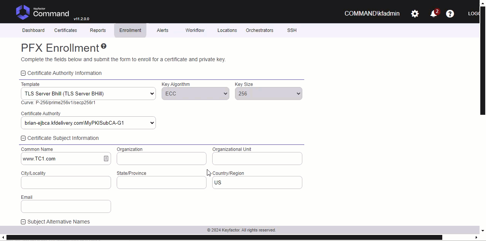
TC2|Firewall Replace No Bindings|/config/shared|**Alias**: www.certandchain.com **Overwrite**: true|Cert and Chain Installed on Firewall|True|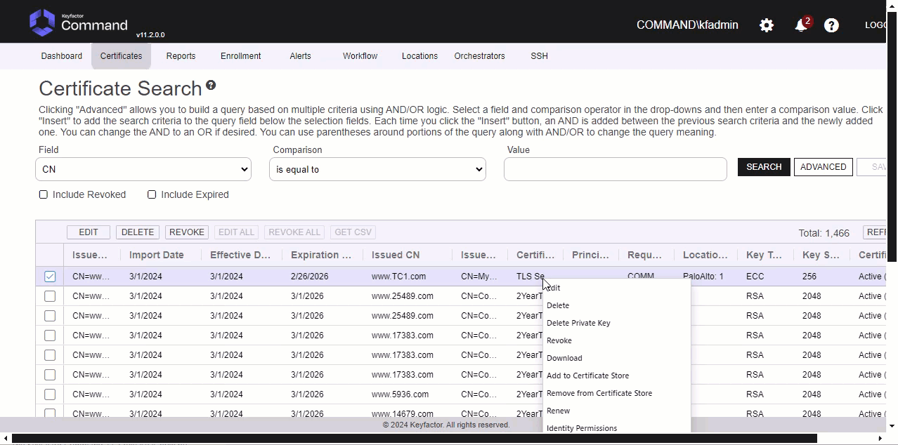
TC3|Firewall Remove Bound Certificate|/config/shared|**Alias**: 0.13757535891685202 **Overwrite**: false|Cert will **not** be removed because bound|True|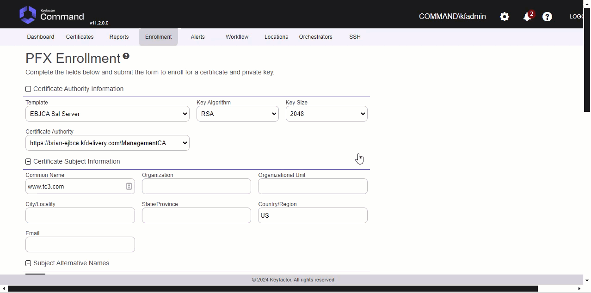
TC4|Firewall Enroll Bindings|/config/shared|**Alias**:0.13757535891685202 **Overwrite**: false|Will not replace cert since Overwrite=false|True|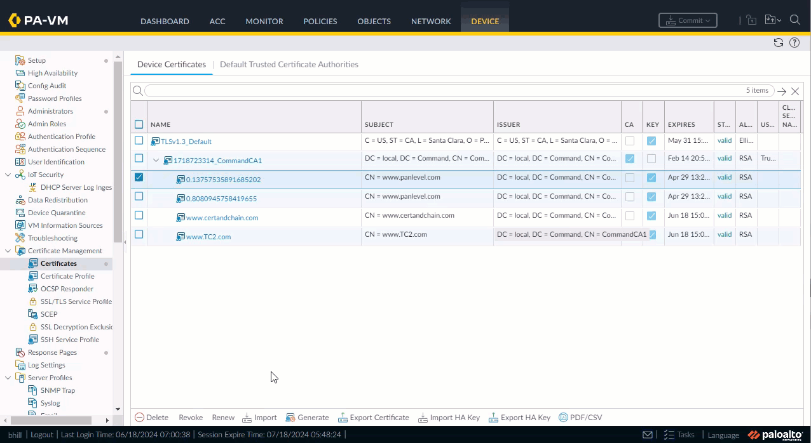
TC5|Firewall Replace Bound Certificate|/config/shared|**Alias**:0.13757535891685202 **Overwrite**: true|Will replace cert bindings get automatically updated since Overwrite=true|True|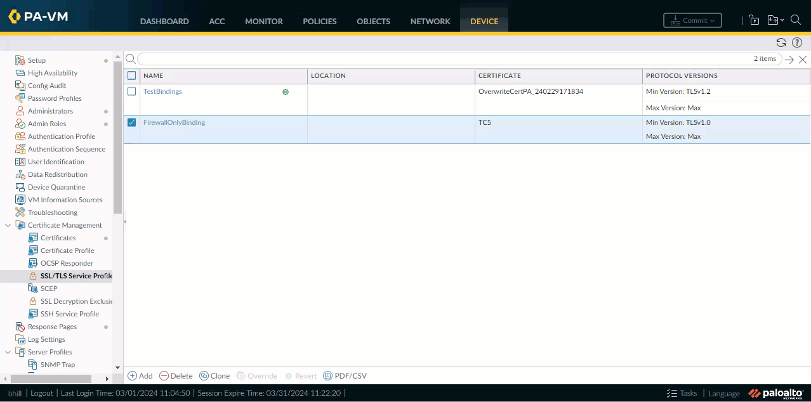
TC6|Firewall Inventory|/config/shared|N/A|Inventory will finish and certs from shared location inventoried.|True|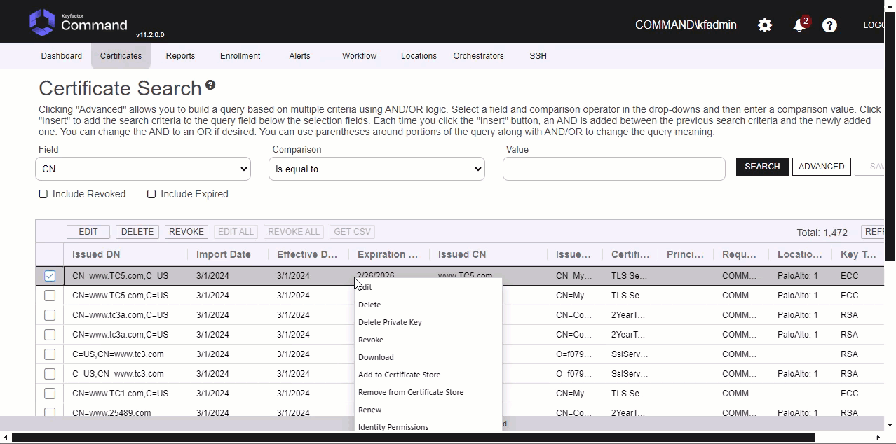
TC7|Firewall Inventory With Virtual System|/config/devices/entry[@name='localhost.localdomain']/vsys/entry[@name='vsys1']|N/A|Will Inventory all certificates from vsys1 on firewall|True|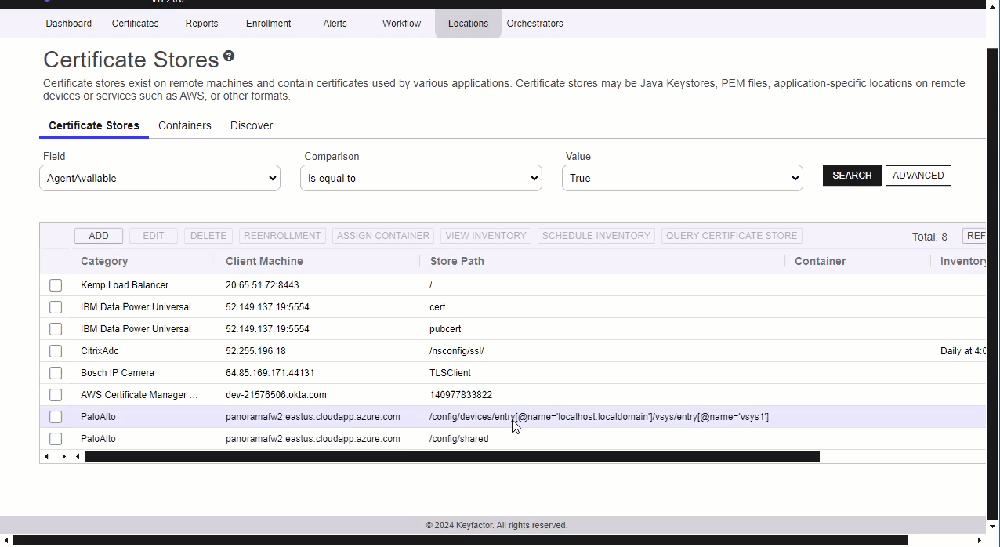
TC8|Firewall Enroll cert and chain to Virtual System|/config/devices/entry[@name='localhost.localdomain']/vsys/entry[@name='vsys1']|**Alias**: www.ejbcacertandchain.com|Cert is installed along with chain.|True|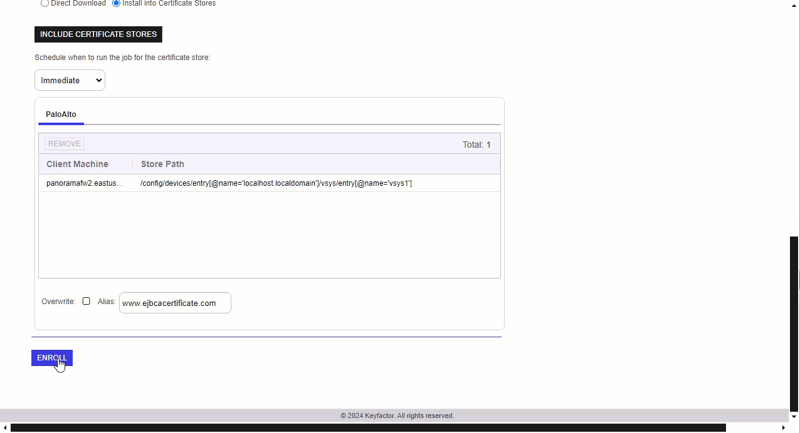
TC9|Firewall Remove unbound cert from Virtual System|/config/devices/entry[@name='localhost.localdomain']/vsys/entry[@name='vsys1']|N/A|Will remove cert from test case 8 from Firewall Virtual System|True|
TC10|Firewall Remove bound cert from Virtual System|/config/devices/entry[@name='localhost.localdomain']/vsys/entry[@name='vsys1']|**Alias**: 0.8168##|Cert will not be removed because it is bound.|True|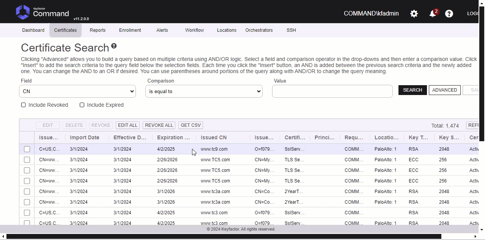
TC11|Firewall Replace without Overwrite on Virtual System|/config/devices/entry[@name='localhost.localdomain']/vsys/entry[@name='vsys1']|**Alias**: 0.8168## **Overwrite**: true|User is warned Overwrite needs checked.|True|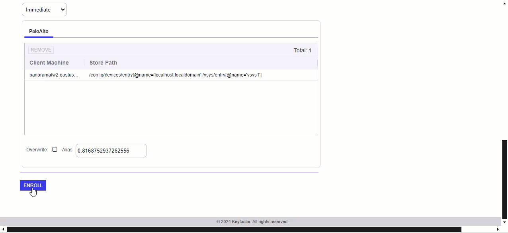
TC12|Firewall Renew cert on Shared and Virtual System|/config/devices/entry[@name='localhost.localdomain']/vsys/entry[@name='vsys1'] and /config/shared|**Alias**: www.renewtester.com|Cert renewed on vsys and shared locations|True|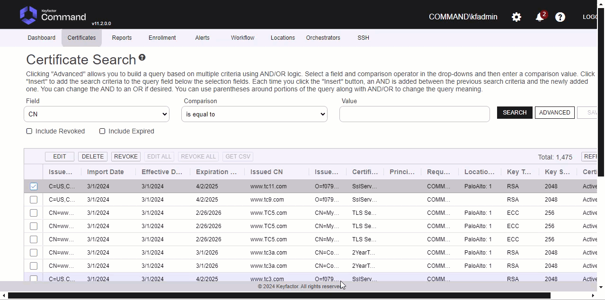
TC13|Firewall Replace bound cert on Virtual System|/config/devices/entry[@name='localhost.localdomain']/vsys/entry[@name='vsys1']|**Alias**: 0.8168## **Overwrite**: true|Cert will be replaced and binding updated on vsys.|True|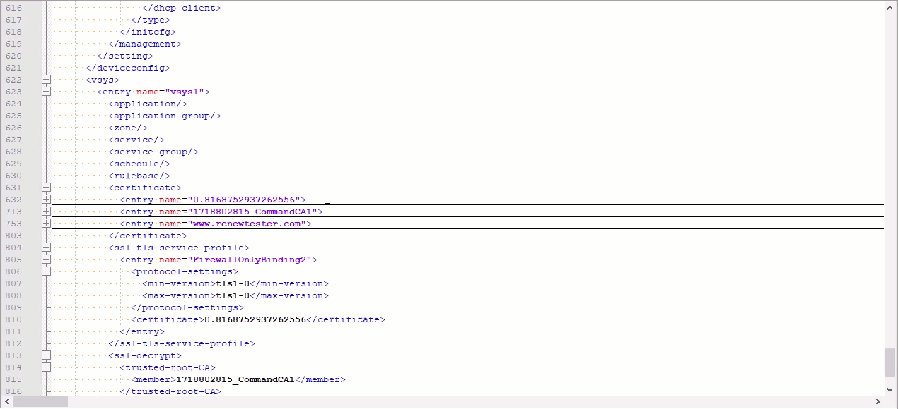
TC14|Panorama Template Enroll Certificate|/config/devices/entry[@name='localhost.localdomain']/template/entry[@name='CertificatesTemplate']/config/shared|**Alias**: www.pantemptc1.com|Certificate is enrolled to shared location for template|True|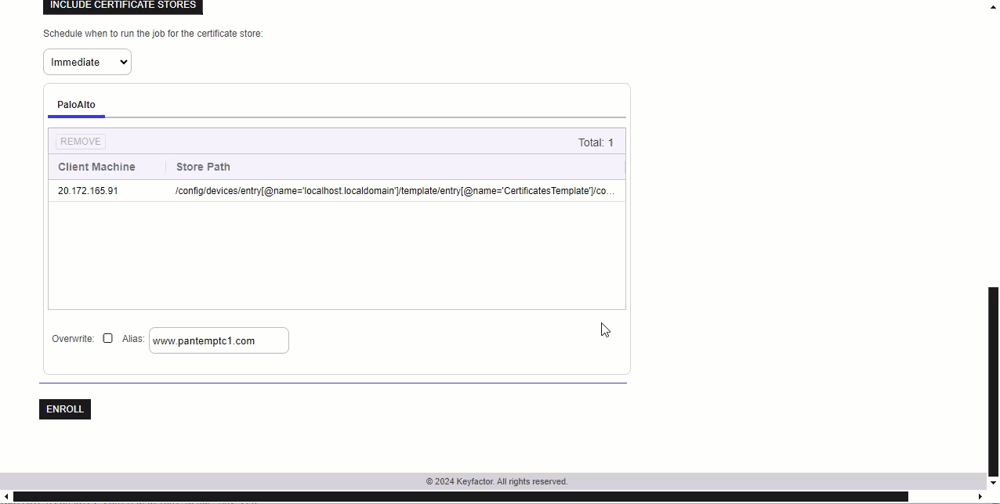
TC15|Panorama Template Replace Certificate|/config/devices/entry[@name='localhost.localdomain']/template/entry[@name='CertificatesTemplate']/config/shared|**Alias**: www.pantemptc1.com **Overwrite**: true|Certificate is replaced in shared location for template|True|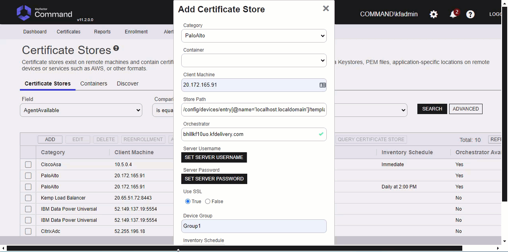
TC16|Panorama Template Remove unbound Certificate|/config/devices/entry[@name='localhost.localdomain']/template/entry[@name='CertificatesTemplate']/config/shared|**Alias**: www.pantemptc1.com|Certificate is removed from shared location for template|True|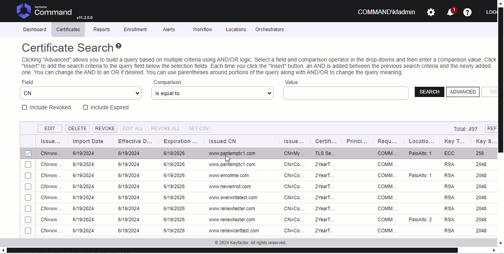
TC17|Panorama Template Replace bound Certificate|/config/devices/entry[@name='localhost.localdomain']/template/entry[@name='CertificatesTemplate']/config/shared|**Alias**: LongNameTest **Overwrite**: true|Certificate is replaced, binding updated in shared location for template|True|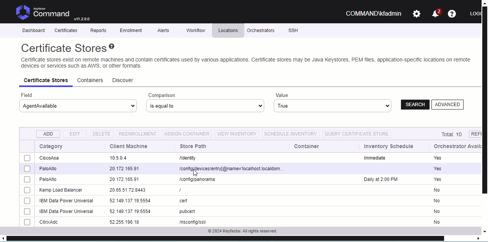
TC18|Panorama Template Remove bound Certificate|/config/devices/entry[@name='localhost.localdomain']/template/entry[@name='CertificatesTemplate']/config/shared|**Alias**: LongNameTest|Certificate is not removed because it is bound|True|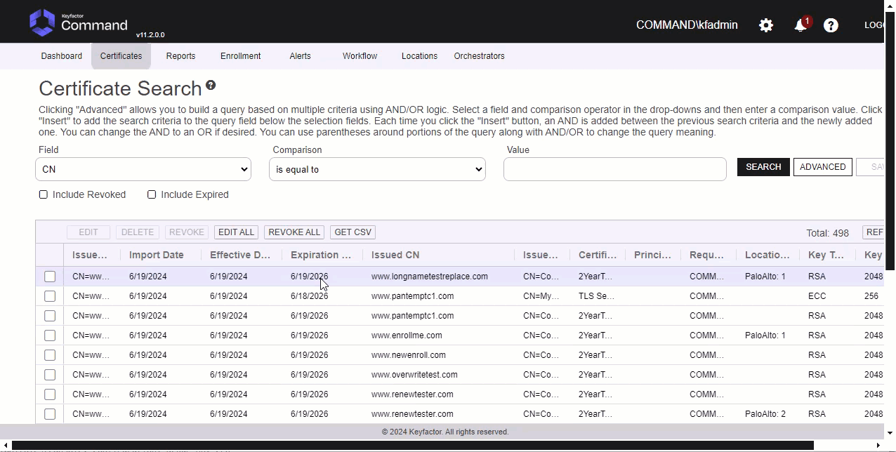
TC19|Panorama Template Shared Inventory|/config/devices/entry[@name='localhost.localdomain']/template/entry[@name='CertificatesTemplate']/config/shared|N/A|Certificates are inventoried from this location|True|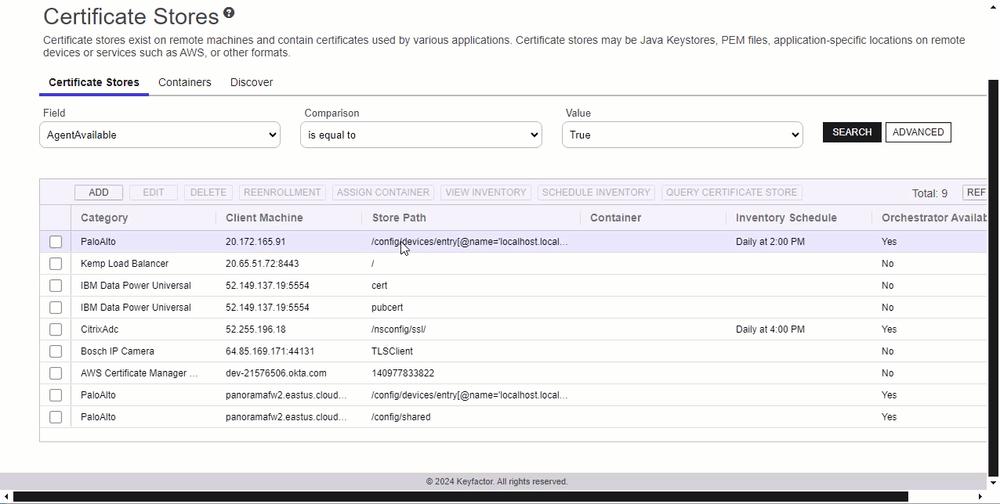
TC20|Panorama Template Virtual System Inventory|/config/devices/entry/template/entry[@name='CertificatesTemplate']/config/devices/entry/vsys/entry[@name='vsys2']|N/A|Certificates are inventoried from this template vsys location|True|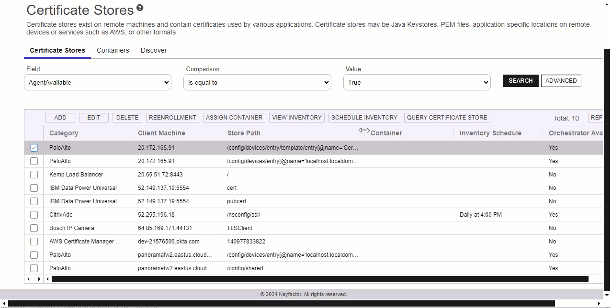
TC21|Panorama Template Virtual System Enroll Certificate|/config/devices/entry/template/entry[@name='CertificatesTemplate']/config/devices/entry/vsys/entry[@name='vsys2']|**Alias**: www.vsys2enroll.com|Certificate is enrolled to vsys2 location for template|True|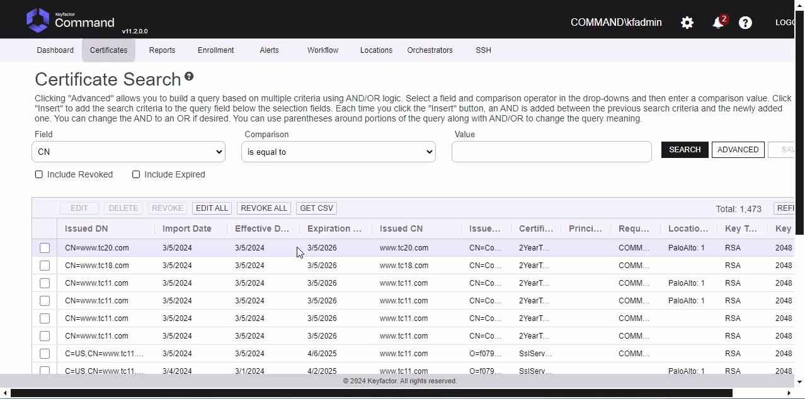
TC22|Panorama Template Virtual System Replace unbound Certificate|/config/devices/entry/template/entry[@name='CertificatesTemplate']/config/devices/entry/vsys/entry[@name='vsys2']|**Alias**: www.vsys2enroll.com|Certificate is replaced in vsys2 location for template|True|
TC23|Panorama Template Virtual System Remove unbound Certificate|/config/devices/entry/template/entry[@name='CertificatesTemplate']/config/devices/entry/vsys/entry[@name='vsys2']|**Alias**: www.vsys2enroll.com|Certificate is removed in vsys2 location for template|True|
TC24|Panorama Template Virtual System Renew bound Certificate|/config/devices/entry/template/entry[@name='CertificatesTemplate']/config/devices/entry/vsys/entry[@name='vsys2']|**Alias**: www.vsys2enroll.com|Certificate is renewed, binding updated in vsys2 location for template|True|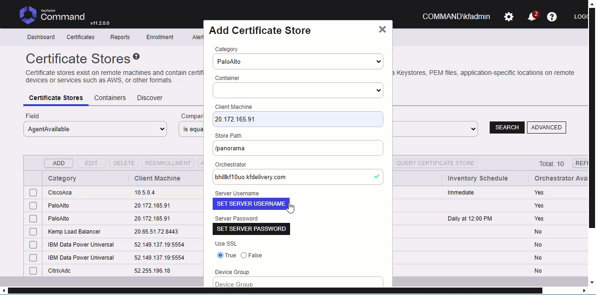
TC25|Panorama Level Inventory|/config/panorama|N/A|Certificates are inventoried from this location|True|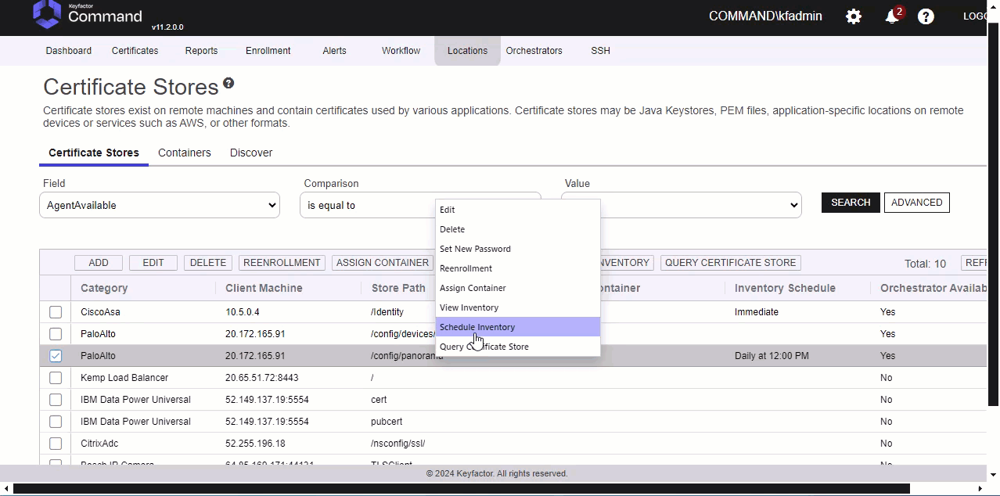
TC26|Panorama Level Enroll Cert and Chain|/config/panorama|**Alias**: www.panlevelcertandchain.com|Panorama Level Install Cert and Chain|True|
TC27|Panorama Level Enroll Cert overwrite warning|/config/panorama|**Alias**: www.panlevelcertandchain.com **Overwrite**: false|Cert is not installed warned Overwrite is needed|True|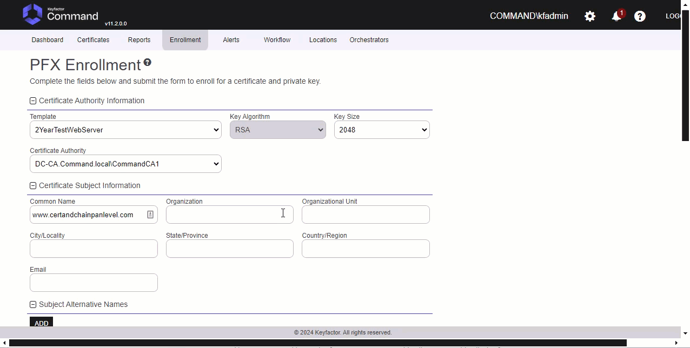
TC28|Panorama Level Replace Cert|/config/panorama|**Alias**: www.panlevelcertandchain.com **Overwrite**: true|Cert is replaced because Overwrite was used|True|
TC29|Panorama Level Remove  unbound Cert|/config/panorama|N/A|Cert is removed because not bound|True|
TC30|Panorama Level Replace bound Cert|/config/panorama|**Alias**: PanoramaNoPK **Overwrite**: true|Cert is replaced, binding updated|True|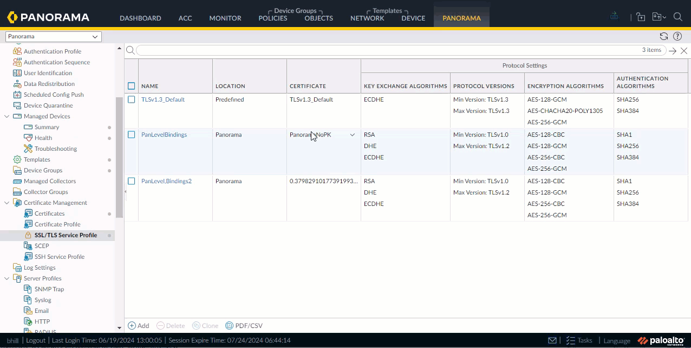
TC31|Firewall previous version cert store settings|/config/shared|**Alias**: www.extraparams.com **Overwrite**: false|Cert is still installed because it ignores extra params|True|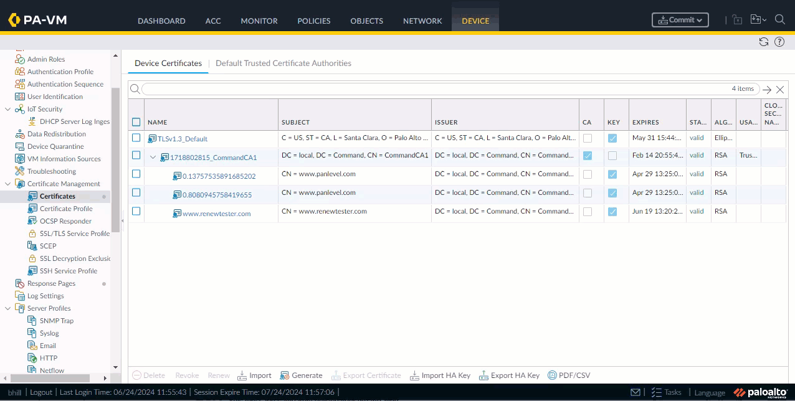

