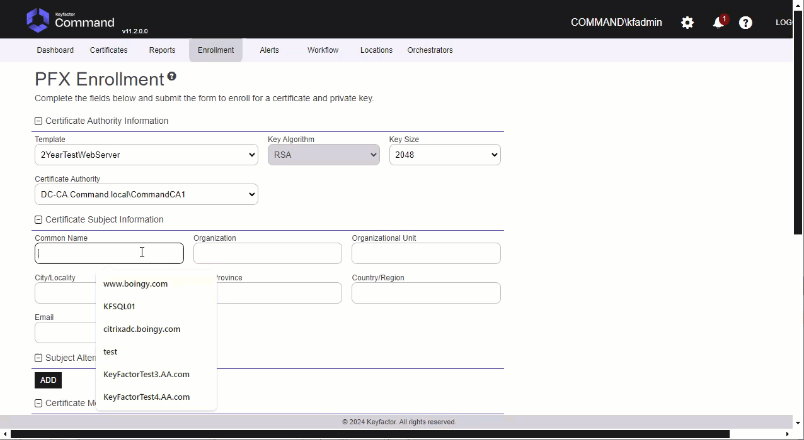
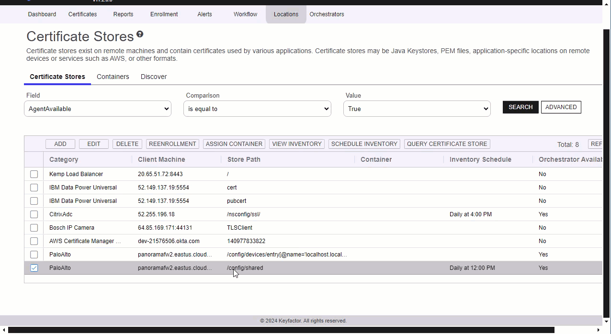
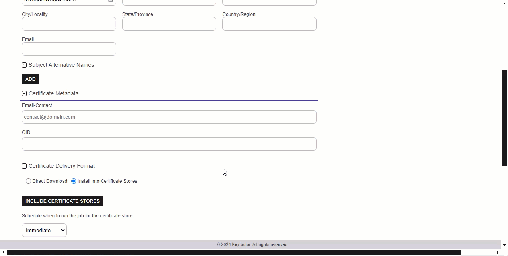

## CERT STORE SETUP AND GENERAL PERMISSIONS

	
Cert Store Type Configuration

	
In Keyfactor Command create a new Certificate Store Type similar to the one below:

#### STORE TYPE CONFIGURATION
SETTING TAB  |  CONFIG ELEMENT	| DESCRIPTION
------|-----------|------------------
Basic |Name	|Descriptive name for the Store Type.  PaloAlto can be used.
Basic |Short Name	|The short name that identifies the registered functionality of the orchestrator. Must be PaloAlto
Basic |Custom Capability|You can leave this unchecked and use the default.
Basic |Job Types	|Inventory, Add, and Remove are the supported job types. 
Basic |Needs Server	|Must be checked
Basic |Blueprint Allowed	|Unchecked
Basic |Requires Store Password	|Determines if a store password is required when configuring an individual store.  This must be unchecked.
Basic |Supports Entry Password	|Determined if an individual entry within a store can have a password.  This must be unchecked.
Advanced |Store Path Type| Determines how the user will enter the store path when setting up the cert store.  Freeform
Advanced |Supports Custom Alias	|Determines if an individual entry within a store can have a custom Alias.  This must be Required
Advanced |Private Key Handling |Determines how the orchestrator deals with private keys.  Optional
Advanced |PFX Password Style |Determines password style for the PFX Password. Default

#### CUSTOM FIELDS FOR STORE TYPE
NAME          |  DISPLAY NAME	| TYPE | DEFAULT VALUE | DEPENDS ON | REQUIRED |DESCRIPTION
--------------|-----------------|-------|--------------|-------------|---------|--------------
ServerUsername|Server Username  |Secret |              |Unchecked    |Yes       |Palo Alto Api User Name
ServerPassword|Server Password  |Secret |              |Unchecked    |Yes       |Palo Alto Api Password
ServerUseSsl  |Use SSL          |Bool   |True          |Unchecked    |Yes       |Requires SSL Connection
DeviceGroup   |Device Group     |String |              |Unchecked    |No        |Device Group on Panorama that changes will be pushed to.

#### ENTRY PARAMETERS FOR STORE TYPE
The entry parameters for this version have been eliminated.  It will not longer support new bindings but will just update existing bindings when the certificate is replaced.

PaloAlto Certificate Store

In Keyfactor Command, navigate to Certificate Stores from the Locations Menu.  Click the Add button to create a new Certificate Store using the settings defined below.

#### STORE CONFIGURATION 
CONFIG ELEMENT	|DESCRIPTION
----------------|---------------
Category	|The type of certificate store to be configured. Select category based on the display name configured above "PaloAlto".
Container	|This is a logical grouping of like stores. This configuration is optional and does not impact the functionality of the store.
Client Machine	|The hostname of the Panorama or Firewall.  Sample is "palourl.cloudapp.azure.com".
Store Path	| **Panorama Level Certs:** /config/panorama **Firewall Certs:** /config/shared **Panorama Template Certs:** /config /devices /entry[@name='localhost.localdomain'] /template /entry[@name='CertificatesTemplate'] /config /shared  if using Panorama Templates where 'CertificateTemplate' is the actual name of the template
Orchestrator	|This is the orchestrator server registered with the appropriate capabilities to manage this certificate store type. 
Inventory Schedule	|The interval that the system will use to report on what certificates are currently in the store. 
Use SSL	|This should be checked.
User	|ApiUser Setup for either Panorama or the Firewall Device
Password |Api Password Setup for the user above

API User Setup Permissions in Panorama or Firewall Required

Tab          |  Security Items	
--------------|--------------------------
Xml Api       |Report,Log,Configuration,Operational Requests,Commit,Export,Import
Rest Api      |Objects/Devices,Panorama/Scheduled Config Push,Panorama/Templates,Panorama/Template Stacks,Panorama/Device Groups,System/Configuration,Plugins/Plugins
*** 

## Test Cases

Firewall, Panorama Template and Panorama Level

Case Number|Case Name|Store Path|Enrollment Params|Expected Results|Passed|Screenshots
-------|----------|------------------|--------------------|----------------------------|----|--------
TC1|Firewall Enroll No Bindings|/config/shared|**Alias**: www.certandchain.com **Overwrite**: false|Cert and Chain Installed on Firewall|True|
TC2|Firewall Replace No Bindings|/config/shared|**Alias**: www.certandchain.com **Overwrite**: true|Cert and Chain Installed on Firewall|True|
TC3|Firewall Remove Bound Certificate|/config/shared|**Alias**: 0.13757535891685202 **Overwrite**: false|Cert will **not** be removed because bound|True|
TC4|Firewall Enroll Bindings|/config/shared|**Alias**:0.13757535891685202 **Overwrite**: false|Will not replace cert since Overwrite=false|True|
TC5|Firewall Replace Bound Certificate|/config/shared|**Alias**:0.13757535891685202 **Overwrite**: true|Will replace cert bindings get automatically updated since Overwrite=true|True|
TC6|Firewall Inventory|/config/shared|N/A|Inventory will finish and certs from shared location inventoried.|True|
TC7|Firewall Inventory With Virtual System|/config/devices/entry[@name='localhost.localdomain']/vsys/entry[@name='vsys1']|N/A|Will Inventory all certificates from vsys1 on firewall|True|
TC8|Firewall Enroll cert and chain to Virtual System|/config/devices/entry[@name='localhost.localdomain']/vsys/entry[@name='vsys1']|**Alias**: www.ejbcacertandchain.com|Cert is installed along with chain.|True|
TC9|Firewall Remove unbound cert from Virtual System|/config/devices/entry[@name='localhost.localdomain']/vsys/entry[@name='vsys1']|N/A|Will remove cert from test case 8 from Firewall Virtual System|True|
TC10|Firewall Remove bound cert from Virtual System|/config/devices/entry[@name='localhost.localdomain']/vsys/entry[@name='vsys1']|**Alias**: 0.8168##|Cert will not be removed because it is bound.|True|
TC11|Firewall Replace without Overwrite on Virtual System|/config/devices/entry[@name='localhost.localdomain']/vsys/entry[@name='vsys1']|**Alias**: 0.8168## **Overwrite**: true|User is warned Overwrite needs checked.|True|
TC12|Firewall Renew cert on Shared and Virtual System|/config/devices/entry[@name='localhost.localdomain']/vsys/entry[@name='vsys1'] and /config/shared|**Alias**: www.renewtester.com|Cert renewed on vsys and shared locations|True|
TC13|Firewall Replace bound cert on Virtual System|/config/devices/entry[@name='localhost.localdomain']/vsys/entry[@name='vsys1']|**Alias**: 0.8168## **Overwrite**: true|Cert will be replaced and binding updated on vsys.|True|
TC14|Panorama Template Enroll Certificate|/config/devices/entry[@name='localhost.localdomain']/template/entry[@name='CertificatesTemplate']/config/shared|**Alias**: www.pantemptc1.com|Certificate is enrolled to shared location for template|True|
TC15|Panorama Template Replace Certificate|/config/devices/entry[@name='localhost.localdomain']/template/entry[@name='CertificatesTemplate']/config/shared|**Alias**: www.pantemptc1.com **Overwrite**: true|Certificate is replaced in shared location for template|True|
TC16|Panorama Template Remove unbound Certificate|/config/devices/entry[@name='localhost.localdomain']/template/entry[@name='CertificatesTemplate']/config/shared|**Alias**: www.pantemptc1.com|Certificate is removed from shared location for template|True|
TC17|Panorama Template Replace bound Certificate|/config/devices/entry[@name='localhost.localdomain']/template/entry[@name='CertificatesTemplate']/config/shared|**Alias**: LongNameTest **Overwrite**: true|Certificate is replaced, binding updated in shared location for template|True|
TC18|Panorama Template Remove bound Certificate|/config/devices/entry[@name='localhost.localdomain']/template/entry[@name='CertificatesTemplate']/config/shared|**Alias**: LongNameTest|Certificate is not removed because it is bound|True|
TC19|Panorama Template Shared Inventory|/config/devices/entry[@name='localhost.localdomain']/template/entry[@name='CertificatesTemplate']/config/shared|N/A|Certificates are inventoried from this location|True|
TC19|Panorama Template Virtual System Inventory|/config/devices/entry/template/entry[@name='CertificatesTemplate']/config/devices/entry/vsys/entry[@name='vsys2']|N/A|Certificates are inventoried from this template vsys location|True|

TC15|Panorama Template Invalid **Template** in Store Path|/config /devices /entry[@name= 'localhost.localdomain'] /template /entry[@name= 'CertificatesTemplate1'] /config/ shared|N/A|Errors out saying template does not exist|True|
TC16|Panorama Template Invalid Store Path|/config /devices[@name= 'CertificatesTemplate1'] /config /shared|N/A|Errors out saying invalid path|True|
TC17|Panorama Template Inventory|/config /devices /entry [@name= 'localhost.localdomain'] /template /entry[@name= 'CertificatesTemplate'] /config / shared|N/A|Job Completes with Inventory of certificates from Panorama Template.|True|
TC18|Panorama Enroll No Bindings|/config/panorama|**Alias**: TC18|Cert and Chain Installed on Panorama|True|
TC19|Panorama Remove No Bindings|/config/panorama|**Alias**: TC19|Cert Removed From Panorama|True|
TC20|Panorama Add Bindings|/config/panorama|**Alias**: TC20 **TLS Min Version**: tls1-0 **TLS Max Version**: max **TLS Profile Name**: PanLevelBindings|Cert added to Panorama and Bound to TLS Profile|True|
TC21|Panorama Remove Bound Certificate|/config/panorama|N/A|Will not Remove Bound certificate Error Occurs|True|
TC22|Panorama One Click Renew Bound Cert|/config/panorama|N/A|Renews cert create with new name bind.  Leave old one around.|True|
TC23|Panorama Configure Renew Bound Cert|/config/panorama|N/A|Renews cert create with new name bind.  Leave old one around.|True|
TC24|Panorama Invalid Store Path|/panorama|N/A|Errors out with Invalid path.|True|
TC25|Panorama Inventory|/config/panorama|N/A|Job Completes with Inventory of certificates from Panorama.|True|

