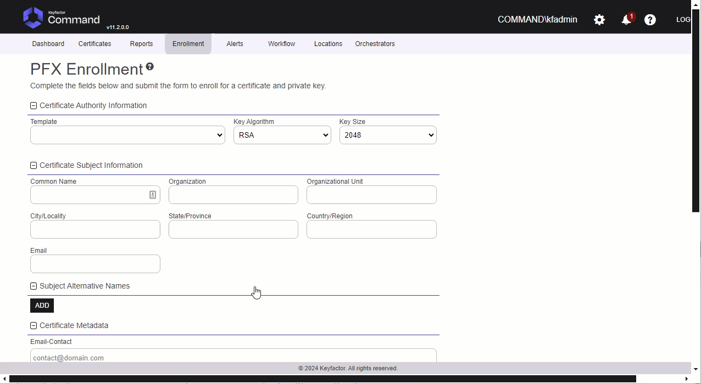
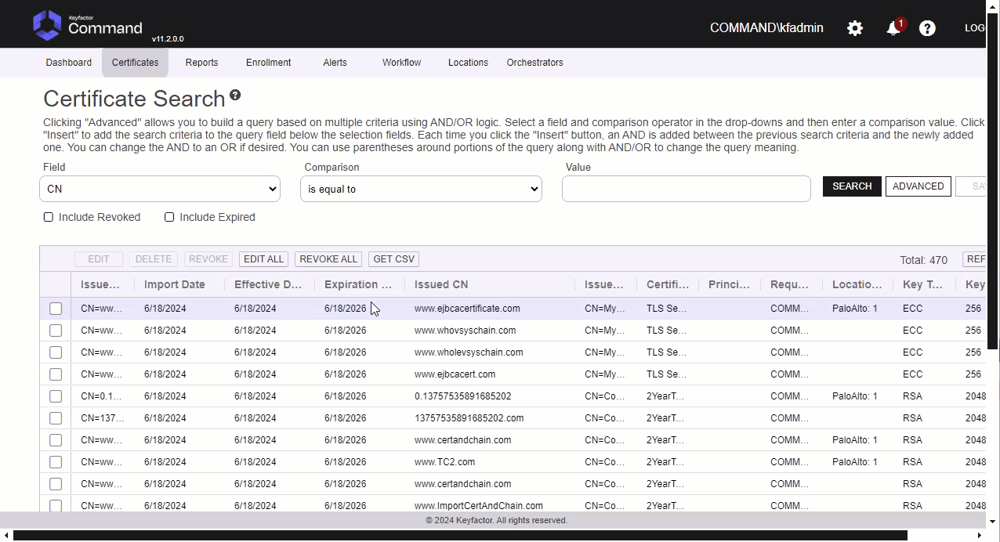
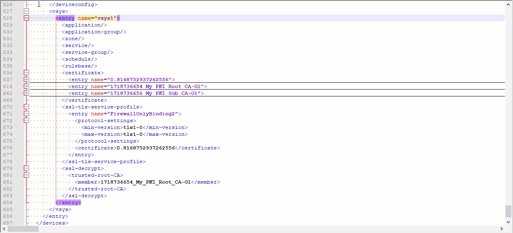
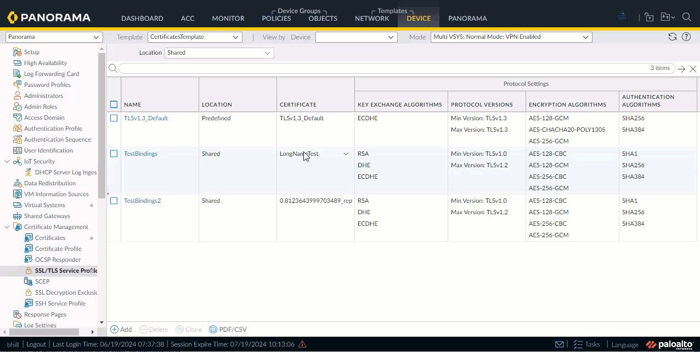
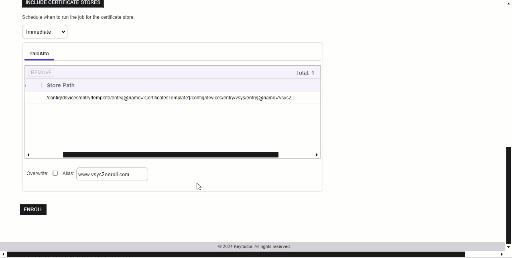
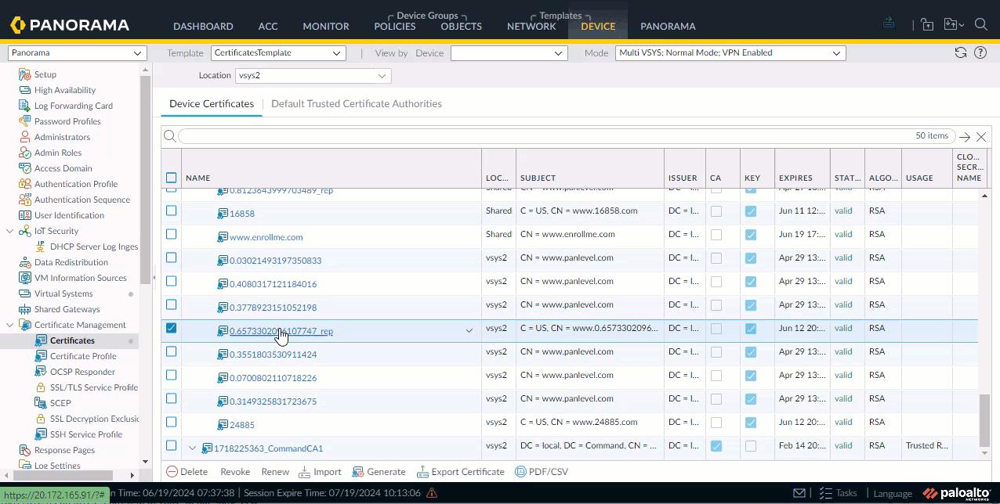

**Palo Alto Orchestrator Device Configuration**

**Overview**

The Palo Alto Orchestrator remotely manages certificates on either the Palo Alto PA-VM Firewall Device or the Panorama.  If using Panorama, it will push changes to all the devices from Panorama.

This agent implements three job types – Inventory, Management Add, and Management Remove. Below are the steps necessary to configure this Orchestrator.  It supports adding certificates with or without private keys.

NOTE: Palo Alto does not support incremental certificate inventory. If you have large numbers of certificates in your environment it is recommended to limit the frequency of inventory jobs to 30 minutes or more.

**1. Create the New Certificate Store Type for either the PA-VM Firewall Device or Panorama**

In Keyfactor Command create a new Certificate Store Type similar to the one below:

#### STORE TYPE CONFIGURATION
SETTING TAB  |  CONFIG ELEMENT	| DESCRIPTION
------|-----------|------------------
Basic |Name	|Descriptive name for the Store Type.  PaloAlto can be used.
Basic |Short Name	|The short name that identifies the registered functionality of the orchestrator. Must be PaloAlto
Basic |Custom Capability|You can leave this unchecked and use the default.
Basic |Job Types	|Inventory, Add, and Remove are the supported job types. 
Basic |Needs Server	|Must be checked
Basic |Blueprint Allowed	|Unchecked
Basic |Requires Store Password	|Determines if a store password is required when configuring an individual store.  This must be unchecked.
Basic |Supports Entry Password	|Determined if an individual entry within a store can have a password.  This must be unchecked.
Advanced |Store Path Type| Determines how the user will enter the store path when setting up the cert store.  Freeform
Advanced |Supports Custom Alias	|Determines if an individual entry within a store can have a custom Alias.  This must be Required
Advanced |Private Key Handling |Determines how the orchestrator deals with private keys.  Optional
Advanced |PFX Password Style |Determines password style for the PFX Password. Default

#### CUSTOM FIELDS FOR STORE TYPE
NAME          |  DISPLAY NAME	| TYPE | DEFAULT VALUE | DEPENDS ON | REQUIRED |DESCRIPTION
--------------|-----------------|-------|--------------|-------------|---------|--------------
ServerUsername|Server Username  |Secret |              |Unchecked    |Yes       |Palo Alto Api User Name
ServerPassword|Server Password  |Secret |              |Unchecked    |Yes       |Palo Alto Api Password
ServerUseSsl  |Use SSL          |Bool   |True          |Unchecked    |Yes       |Requires SSL Connection
DeviceGroup   |Device Group     |String |              |Unchecked    |No        |Device Group on Panorama that changes will be pushed to.

#### ENTRY PARAMETERS FOR STORE TYPE
NAME          |  DISPLAY NAME	| TYPE           | DEFAULT VALUE | DEPENDS ON | REQUIRED WHEN |DESCRIPTION
--------------|-----------------|----------------|-------------- |-------------|---------------|--------------
TlsMinVersion |TLS Min Version  |Multiple Choice |               |Unchecked    |No             |Min TLS Version for the Binding (,tls1-0,tls1-1,tls1-2) note first multiple choice item is empty
TlsMaxVersion |TLS Max Version  |Multiple Choice |               |Unchecked    |No             |Max TLS Version for the Binding (,tls1-0,tls1-1,tls1-2,max) note first multiple choice item is empty
TlsProfileName|TLS Profile Name |String          |               |Unchecked    |No             |Name of the binding to deploy certificate to
ServerUseSsl  |Use SSL          |Bool            |True           |Unchecked    |Yes            |Requires SSL Connection

**2. Register the PaloAlto Orchestrator with Keyfactor**
See Keyfactor InstallingKeyfactorOrchestrators.pdf Documentation.  Get from your Keyfactor contact/representative.

**3. Create a Palo Alto Certificate Store within Keyfactor Command**

In Keyfactor Command create a new Certificate Store similar to the one below

#### STORE CONFIGURATION 
CONFIG ELEMENT	|DESCRIPTION
----------------|---------------
Category	|The type of certificate store to be configured. Select category based on the display name configured above "PaloAlto".
Container	|This is a logical grouping of like stores. This configuration is optional and does not impact the functionality of the store.
Client Machine	|The hostname of the Panorama or Firewall.  Sample is "keyfactorpa.eastus2.cloudapp.azure.com".
Store Path	|If Panorama it is the name of the Template in Panorama if Firewall then "/"
Orchestrator	|This is the orchestrator server registered with the appropriate capabilities to manage this certificate store type. 
Inventory Schedule	|The interval that the system will use to report on what certificates are currently in the store. 
Use SSL	|This should be checked.
User	|ApiUser Setup for either Panorama or the Firewall Device
Password |Api Password Setup for the user above

#### API User Setup Permissions in Panorama or Firewall Required
Tab          |  Security Items	
--------------|--------------------------
Xml Api       |Report,Log,Configuration,Operational Requests,Commit,Export,Import
Rest Api      |Objects/Devices,Panorama/Scheduled Config Push,Panorama/Templates,Panorama/Template Stacks,Panorama/Device Groups,System/Configuration,Plugins/Plugins
*** 

#### TEST CASES
Case Number|Case Name|Store Path|Enrollment Params|Expected Results|Passed|Screenshots
-----------|----------|----------------------|--------------|---------------|---------------|----------------|
TC1|Firewall Enroll No Bindings|/config/shared|Alias=TC1|Cert and Chain Installed on Firewall|True|
TC2|Firewall Remove No Bindings|/config/shared|Alias=TC1|Cert Removed From Firewall|True|
TC3|Firewall Enroll Bindings|/config/shared|Alias=TC3,TLS Min Version=tls1-0,TLS Max Version=max,TLS Profile Name=FirewallOnlyBinding|Cert added to Firewall and Bound to TLS Profile|True|
TC4|Firewall Remove Bound Certificate|/config/shared|N/A|Will not Remove Bound certificate Error Occurs|True|
TC5|Firewall One Click Renew Bound Cert|/config/shared|N/A|Renews cert create with new name bind.  Leave old one around.|True|
TC6|Firewall Configure Renew Bound Cert|/config/shared|N/A|Renews cert create with new name bind.  Leave old one around.|True|
TC7|Firewall Invalid Store Path|/config|N/A|Errors out with Invalid path.|True|
TC8|Firewall Inventory|/config/shared|N/A|Job Completes with Inventory of certificates from Firewall.|True|
TC9|Panorama Template Enroll No Bindings|/config/devices/entry[@name='localhost.localdomain']/template/entry[@name='CertificatesTemplate']/config/shared|Alias=TC9|Cert and Chain Installed on Panorama Template and pushed to the firewall.|True|
TC10|Panorama Template Remove No Bindings|/config/devices/entry[@name='localhost.localdomain']/template/entry[@name='CertificatesTemplate']/config/shared|Alias=TC9|Cert Removed From Panorama and pushed to firewalls|True|
TC11|Panorama Template Enroll Bindings|/config/devices/entry[@name='localhost.localdomain']/template/entry[@name='CertificatesTemplate']/config/shared|Alias=TC11,TLS Min Version=tls1-0,TLS Max Version=max,TLS Profile Name=TestBindings|Cert added to Pan Template, Bound to TLS Profile and pushed to firewalls|True|
TC12|Panorama Template Remove Bound Certificate|/config/devices/entry[@name='localhost.localdomain']/template/entry[@name='CertificatesTemplate']/config/shared|N/A|Will Not Remove Certificate because it is bound.  Error will show.|True|
TC13|Panorama Template One Click Renew Bound Cert|/config/devices/entry[@name='localhost.localdomain']/template/entry[@name='CertificatesTemplate']/config/shared|N/A|Renews cert create with new name bind.  Leave old one around.  Push to Firewalls|True|
TC14|Panorama Template Configure Renew Bound Cert|/config/devices/entry[@name='localhost.localdomain']/template/entry[@name='CertificatesTemplate']/config/shared|N/A|Renews cert create with new name bind.  Leave old one around.|True|
TC15|Panorama Template Invalid **Template** in Store Path|/config/devices/entry[@name='localhost.localdomain']/template/entry[@name='CertificatesTemplate1']/config/shared|N/A|Errors out saying template does not exist|True|
TC16|Panorama Template Invalid Store Path|/config/devices[@name='CertificatesTemplate1']/config/shared|N/A|Errors out saying invalid path|True|
TC17|Panorama Template Inventory|/config/devices/entry[@name='localhost.localdomain']/template/entry[@name='CertificatesTemplate']/config/shared|N/A|Job Completes with Inventory of certificates from Panorama Template.|True|
TC18|Panorama Enroll No Bindings|/config/panorama|Alias=TC18|Cert and Chain Installed on Panorama|True|
TC19|Panorama Remove No Bindings|/config/panorama|Alias=TC19|Cert Removed From Panorama|True|
TC20|Panorama Remove No Bindings|/config/panorama|Alias=TC20,TLS Min Version=tls1-0,TLS Max Version=max,TLS Profile Name=PanLevelBindings|Cert added to Panorama and Bound to TLS Profile|True|
TC21|Panorama Remove Bound Certificate|/config/panorama|N/A|Will not Remove Bound certificate Error Occurs|True|
TC22|Panorama One Click Renew Bound Cert|/config/panorama|N/A|Renews cert create with new name bind.  Leave old one around.|True|
TC23|Panorama Configure Renew Bound Cert|/config/panorama|N/A|Renews cert create with new name bind.  Leave old one around.|True|
TC24|Panorama Invalid Store Path|/panorama|N/A|Errors out with Invalid path.|True|
TC25|Panorama Inventory|/config/panorama|N/A|Job Completes with Inventory of certificates from Panorama.|True|